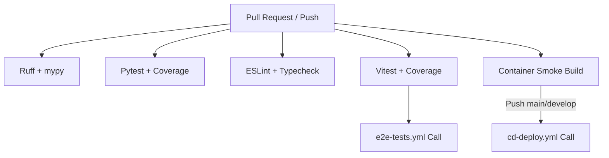

# Especificação Técnica: Workflow `ci-pr-validation.yml`

> **Módulo:** [ci-cd](index.md) | [ci-cd-pipeline-flow](../../4-explanation/architecture/ci-cd-pipeline-flow.md)
> **Workflow:** `.github/workflows/ci-pr-validation.yml`

---

## 1. Visão Geral

O workflow **`ci-pr-validation.yml`** é o portão de entrada principal (Gatekeeper) de integração contínua. Ele executa em todos os Pull Requests e em pushes para as branches `develop` e `main`.

---

## 2. Gatilhos (Triggers)

- `pull_request`: Em qualquer abertura ou atualização de PR direcionado a `develop` ou `main`.
- `push`: Em commits diretos ou merges nas branches `develop` e `main`.

---

## 3. Jobs e Responsabilidades

### 3.1 `backend-checks`
- Executa linter `Ruff` e checagem estrita de tipos `mypy`.
- Verifica se há migrações pendentes no Django (`python manage.py makemigrations --check`).
- Executa a suíte de testes `pytest` com relatório de cobertura `Codecov`.

### 3.2 `frontend-checks`
- Executa verificação de tipos `tsc --noEmit` e linter no TypeScript.
- Executa suíte de testes de unidade e integração `Vitest`.
- Garante o isolamento de mocks sob `isolate: false`.

### 3.3 `docker-smoke-build`
- Compila a imagem Docker do backend sem realizar autenticação ou push no Google Artifact Registry.
- Executa teste de fumaça (smoke test) garantindo que o container inicia com sucesso na porta 8080.

---

## 4. Segurança e Permissões

- **Leitura Apenas (`contents: read`)**: Em Pull Requests, o workflow não possui permissões de escrita ou acesso a credenciais de deploy na nuvem.
- **Chamada ao CD**: Em eventos de `push` aprovado em `develop` ou `main`, invoca o workflow `cd-deploy.yml` via `workflow_call`.
