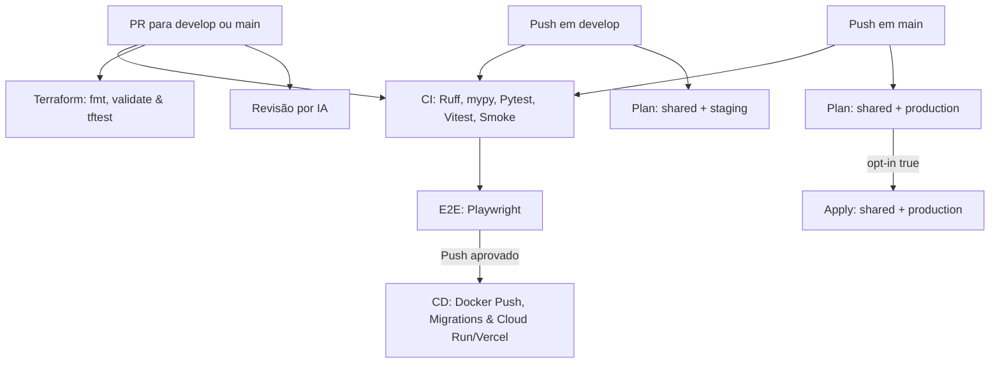

# 🔁 Arquitetura e Fluxo da Pipeline GitOps (CI/CD)

> **Versão:** 4.0 | **Última atualização:** 9 de agosto de 2026
> **Relacionados:** [ADR-025](../adr/025-terraform-iac-architecture.md) | [ADR-026](../adr/026-gitops-branching-and-deployment-strategy.md) | [ADR-027](../adr/027-terraform-state-topology.md) | [ci-cd-index](../../3-reference/ci-cd/index.md) | [testing-index](../../3-reference/testing/index.md)

---

## 1. Visão Geral

O **Wedding Management System** adota uma arquitetura modular de **GitOps e CI/CD** para garantir que todas as alterações de código, infraestrutura e banco de dados passem por validações automatizadas antes de atingir os ambientes de Staging ou Produção.

A pipeline separa claramente quatro responsabilidades:
1. **CI (Validação)**: Executada em PRs sem publicar artefatos ou acessar credenciais da nuvem.
2. **CD (Entrega da Aplicação)**: Publica imagens e atualiza o Cloud Run/Vercel somente após merges em `develop` ou `main`.
3. **Terraform (Infraestrutura IaC)**: Gerencia 3 roots independentes (`shared`, `staging`, `production`) com travas de segurança.
4. **Revisão por IA**: Analisa o SHA de cada commit nos PRs em busca de violações arquiteturais.

---

## 2. Estratégia de Branches e Ambientes

- **Pull Requests (Validação Isola)**: Executam apenas gates de leitura sem acesso ao backend remoto do Terraform ou credenciais da nuvem.
- **Branch `develop` (Staging/Preview)**: Representa o ambiente de homologação. Dispara o CD de staging no Cloud Run e Vercel e gera os planos do Terraform.
- **Branch `main` (Produção)**: Representa o ambiente produtivo. Dispara o CD de produção e gera planos do Terraform (com opt-in para apply).

---

## 3. Matriz de Specifications Técnicas de Workflows

As especificações detalhadas de cada workflow reutilizável do GitHub Actions sob `.github/workflows/` estão modularizadas nas seguintes notas de referência:

| Workflow | Especificação Técnica | Foco |
|:---|:---|:---|
| `ci-pr-validation.yml` | **[ci-pr-validation-spec](../../3-reference/ci-cd/ci-pr-validation-spec.md)** | Linting, checagem de tipos, Pytest, Vitest, migrations check e smoke test. |
| `cd-deploy.yml` | **[cd-deploy-spec](../../3-reference/ci-cd/cd-deploy-spec.md)** | Build & Push no Artifact Registry, Migrations no Neon DB, Cloud Run e Vercel. |
| `terraform-ci.yml` & `staging-pipeline.yml` | **[terraform-pipelines-spec](../../3-reference/ci-cd/terraform-pipelines-spec.md)** | Validação dos 3 roots, planejamento de state e opt-in de apply em produção. |
| `ai-code-review.yml` | **[ai-code-review-spec](../../3-reference/ci-cd/ai-code-review-spec.md)** | Auditoria automatizada de código por SHA e suporte via `@opencode`. |
| `e2e-tests.yml` | **[e2e-testing-spec](../../3-reference/testing/e2e-testing-spec.md)** | Execução distribuída em shards do Playwright. |
| MOC Completo | **[ci-cd/index.md](../../3-reference/ci-cd/index.md)** | Índice técnico de todos os workflows do repositório. |

---

## 4. Gates de Qualidade

| Gate | Critério | Especificação Técnica |
|:---|:---|:---|
| Documentação | `make check-docs` sem links quebrados | [documentation-standards](../../3-reference/architecture-standards/documentation-standards.md) |
| Terraform | `fmt`, `validate` nos três roots e `terraform test` nativo | [terraform-testing-spec](../../3-reference/testing/terraform-testing-spec.md) |
| Backend | Ruff, mypy, checks Django, migrations e Pytest com cobertura | [backend-testing-spec](../../3-reference/testing/backend-testing-spec.md) |
| Frontend | Lint, type-check, Vitest, MSW e build | [frontend-testing-spec](../../3-reference/testing/frontend-testing-spec.md) |
| E2E | Duas shards Playwright Chromium | [e2e-testing-spec](../../3-reference/testing/e2e-testing-spec.md) |

---

## 5. ADRs Relacionados

- [ADR-025: Terraform e GitOps Multi-Cloud](../adr/025-terraform-iac-architecture.md)
- [ADR-026: Branches e Staging](../adr/026-gitops-branching-and-deployment-strategy.md)
- [ADR-027: Topologia de States Terraform](../adr/027-terraform-state-topology.md)
