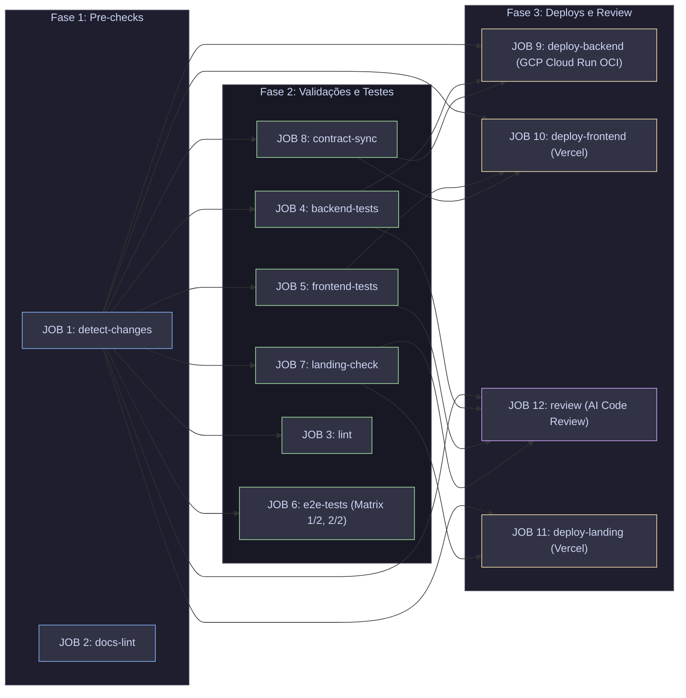

# 🔁 Especificação da Pipeline de CI/CD — Wedding Management System

> **Versão:** 2.0 | **Última atualização:** 1 de agosto de 2026

---

## 1. Visão Geral do Workflow

**Propósito:** Garantir a qualidade de código, integridade de contratos OpenAPI/Orval, suíte de testes (unitários, integração e E2E selecionados @smoke/@critical) e entrega contínua (CD) desacoplada para GCP Cloud Run e Vercel.

**Eventos Gatilho:** `push` na branch `main` e `pull_request` apontando para `main`.

**Recursos de Infraestrutura:** GitHub Actions Runners (`ubuntu-latest`), GCP Cloud Run, Google Artifact Registry (`us-central1`), Vercel.

---

## 2. Fluxo de Execução (Mermaid Diagram)

---

## 3. Matriz de Jobs & Dependências (1 a 12)

| ID | Nome do Job | Propósito | Dependências (`needs`) | Contexto de Execução |
|:---|:---|:---|:---|:---|
| **JOB 1** | `detect-changes` | Filtra caminhos alterados (`backend`, `frontend`, `landing`). | Nenhuma | `ubuntu-latest` (paths-filter v3) |
| **JOB 2** | `docs-lint` | Valida integridade de links markdown e anotações atômicas. | Nenhuma | Composite Action `setup-python-uv` |
| **JOB 3** | `lint` | Análise estática (Ruff, mypy, Oxlint, tsc). | `detect-changes` | Composite Actions `setup-python-uv` / `setup-node-pnpm` |
| **JOB 4** | `backend-tests` | Migrations dry-run + Pytest com cobertura XML. | `detect-changes` | Composite Action `setup-python-uv` |
| **JOB 5** | `frontend-tests` | Vitest + React Testing Library + teste isolamento mocks. | `detect-changes` | Composite Action `setup-node-pnpm` |
| **JOB 6** | `e2e-tests` | Playwright E2E em matriz sharded (1/2 e 2/2). | `detect-changes` | Django local `runserver 8000` + Playwright |
| **JOB 7** | `landing-check` | Validação de tipos Astro e build estático. | `detect-changes` | Composite Action `setup-node-pnpm` (`landing`) |
| **JOB 8** | `contract-sync` | Valida sincronização entre schema Django Ninja e Orval. | `detect-changes` | Composite Actions `setup-python-uv` & `setup-node-pnpm` |
| **JOB 9** | `deploy-backend` | BuildX OCI com cache `type=gha`, Artifact Registry e Cloud Run. | `detect-changes`, `backend-tests`, `contract-sync` | Workload Identity Federation (WIF) + Docker BuildX |
| **JOB 10** | `deploy-frontend` | Deploy do aplicativo React no Vercel (Preview/Prod). | `detect-changes`, `frontend-tests`, `contract-sync` | Vercel CLI via PNPM |
| **JOB 11** | `deploy-landing` | Deploy da Landing Page Astro no Vercel (Preview/Prod). | `detect-changes`, `landing-check` | Vercel CLI via PNPM |
| **JOB 12** | `review` | Revisão estática de código automatizada em PRs via IA. | `detect-changes`, `backend-tests`, `frontend-tests`, `landing-check` | OpenCode + DeepSeek modelo v4-pro |

---

## 4. Abstrações de Ambiente (Composite Actions)

- **`setup-python-uv` (`.github/actions/setup-python-uv/`)**:
  - Python 3.12 via `astral-sh/setup-uv@v5`.
  - Cache automático atrelado ao `backend/uv.lock`.
- **`setup-node-pnpm` (`.github/actions/setup-node-pnpm/`)**:
  - PNPM 9.15.0 via `pnpm/action-setup@v4`.
  - Node.js lido de forma declarativa de `${working-directory}/.nvmrc` (`24.18.0`).
  - Cache robusto de `node_modules` com chave composta:
    `key: node-modules-${{ runner.os }}-${{ inputs.working-directory }}-${{ inputs.pnpm-version }}-${{ hashFiles(...) }}`.

---

## 5. Requisitos de Segurança & Contratos

### Variáveis & Secrets Exigidos

| Tipo | Nome | Propósito | Escopo |
|:---|:---|:---|:---|
| Secret | `GCP_WIF_PROVIDER` | Provedor do Workload Identity Federation no GCP | Job 9 (`deploy-backend`) |
| Secret | `GCP_WIF_SERVICE_ACCOUNT` | Service Account com permissão `Artifact Registry Writer` e `Cloud Run Admin` | Job 9 (`deploy-backend`) |
| Secret | `DATABASE_URL` | URL de conexão PostgreSQL (Neon) em produção/migrations | Job 9 (`deploy-backend`) |
| Secret | `SECRET_KEY` | Chave secreta de runtime Django | Job 9 (`deploy-backend`) |
| Secret | `R2_ACCESS_KEY_ID` | Access Key ID para armazenamento de contratos/arquivos no Cloudflare R2 | Job 9 (`deploy-backend`) |
| Secret | `R2_SECRET_ACCESS_KEY` | Secret Access Key do Cloudflare R2 | Job 9 (`deploy-backend`) |
| Secret | `R2_BUCKET` | Nome do bucket R2 para uploads de produção | Job 9 (`deploy-backend`) |
| Secret | `R2_ENDPOINT_URL` | Endpoint customizado da API S3-compatible do Cloudflare R2 | Job 9 (`deploy-backend`) |
| Secret | `VERCEL_TOKEN` | Token de autenticação da CLI do Vercel | Jobs 10 & 11 |
| Secret | `VERCEL_ORG_ID` | Identificador da organização Vercel | Jobs 10 & 11 |
| Secret | `VERCEL_PROJECT_ID_FRONTEND` | ID do projeto Frontend no Vercel | Job 10 |
| Secret | `VERCEL_PROJECT_ID_LANDING` | ID do projeto Landing no Vercel | Job 11 |
| Secret | `CODECOV_TOKEN` | Token para upload de cobertura de código | Jobs 4 & 5 |

---

## 6. Gates de Qualidade & Erros Comuns

### Gates de Validação

| Gate | Critério de Aceitação | Recuperação em Caso de Falha |
|:---|:---|:---|
| **Documentation Integrity** | Zero links quebrados em `docs/` (`make check-docs`) | Rodar `python3 scripts/validate_docs_links.py` e ajustar o caminho. |
| **API Contract Sync** | Diff zero no schema `openapi.json` e hooks Orval | Executar `make sync-api` e comitar as alterações. |
| **Backend Migrations** | `makemigrations --check --dry-run` zerado | Executar `uv run python manage.py makemigrations` na pasta `backend/`. |
| **Mock Isolation** | Nenhum `vi.mock('@/api/generated')` fora do `test-setup.ts` | Centralizar todos os mocks Orval em `test-setup.ts` via `registerMockHook`. |

---

## 7. ADRs Relacionados

- [ADR-006: Service Layer Architecture](../adr/006-service-layer.md) — Separação estrita entre endpoints e lógica de negócio.
- [ADR-011: BaseModel e Validação em Save](../adr/011-basemodel-save-full-clean.md) — Regra de integridade do modelo Django.
- [ADR-012: Orval Contract-Driven Frontend](../adr/012-orval-contract-driven-frontend.md) — Geração estritamente tipada de hooks a partir do OpenAPI schema (`contract-sync`).
- [ADR-013: Migração DRF para Django Ninja](../adr/013-migrate-drf-to-ninja.md) — Escolha do framework de API com schema OpenAPI embutido.
- [ADR-018: Playwright E2E Testing](../adr/018-playwright-e2e-testing.md) — Testes de ponta a ponta em sharding no CI.
- [ADR-021: Padrão de Comentários e Docstrings](../adr/021-padrao-comentarios-docstrings.md) — Diretrizes de documentação de código.
