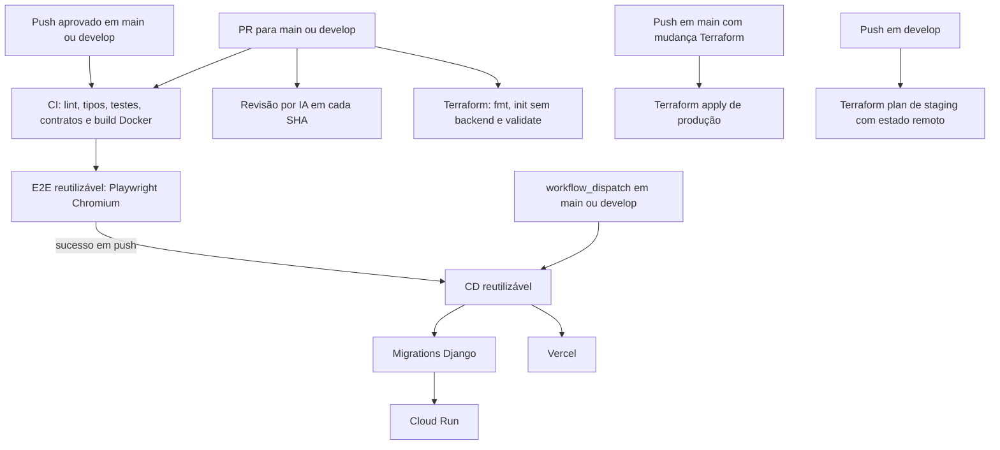

# 🔁 Especificação da Arquitetura Modular de CI/CD — Wedding Management System

> **Versão:** 3.1 | **Última atualização:** 3 de agosto de 2026
> **Relacionados:** [ADR-025](../adr/025-terraform-iac-architecture.md) | [ADR-026](../adr/026-gitops-branching-and-deployment-strategy.md) | [gitops-sprint-workflow](../../1-tutorials/gitops-sprint-workflow.md)

---

## 1. Visão Geral

As pipelines separam validação, deploy da aplicação e gestão da infraestrutura:

1. **CI** valida código, contratos, testes e a imagem do backend sem publicar artefatos.
2. **CD** é um workflow reutilizável chamado pela CI somente após um `push` aprovado em `main` ou `develop`. Também aceita execução manual, restrita a essas branches.
3. **Terraform** valida configuração de PR sem credenciais; operações com estado remoto e WIF ocorrem apenas em branches protegidas.
4. **Revisão por IA** roda em cada SHA enviado ao PR, sem usar labels como estado.

---

## 2. Gatilhos e Escopos

| Workflow | Gatilho | Escopo de caminhos | Responsabilidade |
|:---|:---|:---|:---|
| **[ci-pr-validation.yml](../../../.github/workflows/ci-pr-validation.yml)** | `pull_request` e `push` em `main`/`develop` | Filtros internos para `backend/**`, `frontend/**`, `landing/**`, manifests compartilhados e arquivos da própria CI | Ruff format/lint, mypy, Pytest, migrations check, Vitest com cobertura, isolamento de mocks, Astro, contratos OpenAPI/Orval e build Docker sem push. Em `push`, chama o CD somente após sucesso dos gates. |
| **[docs-ci.yml](../../../.github/workflows/docs-ci.yml)** | `pull_request` e `push` em `main`/`develop` | `docs/**`, Markdown, workflow de docs, `Makefile` e validador de links | Executa `make check-docs`. |
| **[e2e-tests.yml](../../../.github/workflows/e2e-tests.yml)** | `workflow_call` pela CI | Alterações em backend, frontend ou no próprio workflow, detectadas pela CI | Executa Playwright em Chromium, dividido em duas shards, sobre Uvicorn ASGI; seu sucesso é obrigatório antes do CD automático. |
| **[ai-code-review.yml](../../../.github/workflows/ai-code-review.yml)** | PR para `main`/`develop`: `opened`, `synchronize`, `reopened` | Todo o diff do PR | Executa OpenCode em cada novo SHA; não cria nem consulta a label `ai-reviewed`. |
| **[cd-deploy.yml](../../../.github/workflows/cd-deploy.yml)** | `workflow_call` após CI de `push`; `workflow_dispatch` guardado | Filtros internos para backend, frontend e landing; execução manual implanta todos os componentes | Publica backend no Artifact Registry, migra o banco antes do Cloud Run e implanta frontend/landing na Vercel. Não roda em PR. |
| **[terraform-ci.yml](../../../.github/workflows/terraform-ci.yml)** | PR e `push` em `main`/`develop` | `terraform/**` e workflows Terraform/staging | Sempre executa `fmt`, `init -backend=false` e `validate`, sem OIDC. Somente `push` em `main` autentica com WIF, gera um plano salvo e aplica exatamente esse plano em produção. |
| **[staging-pipeline.yml](../../../.github/workflows/staging-pipeline.yml)** | `push` em `develop`; `workflow_dispatch` | Todos os pushes em `develop` | Autentica com WIF e executa um plano real de staging. Não roda em PR e não aplica mudanças. |

O `workflow_dispatch` do CD não executa deploy fora de `main` ou `develop`. Pull requests nunca recebem a identidade de deploy.

---

## 3. Fluxo de Validação e Deploy

### Pull request

- A CI executa apenas os jobs relacionados aos caminhos alterados; mudanças nos workflows e composite actions acionam seus consumidores.
- O backend é compilado com `docker build`, sem login no Artifact Registry e sem publicação da imagem.
- O E2E cobre somente Chromium e integra o gate da CI.
- Cada evento `synchronize` inicia uma nova revisão por IA para o SHA atual.
- Mudanças Terraform usam `terraform init -backend=false`; portanto, não acessam o state remoto nem solicitam token OIDC.

### Push em branch protegida

- A CI executa os gates e chama `cd-deploy.yml` apenas após todos os jobs obrigatórios terem sucesso.
- `develop` seleciona o GitHub Environment `Preview`; `main`, `Production`.
- O backend publica `us-central1-docker.pkg.dev/<project_id>/wedding-management-repo/wedding-api:<sha>` e usa os serviços `wedding-api-staging` ou `wedding-api`.
- Antes de atualizar o serviço no Cloud Run, o CD executa `python manage.py migrate --noinput` com as variáveis do ambiente selecionado.
- O frontend e a landing usam preview em `develop` e produção em `main`.

Falha em qualquer gate impede a chamada automática do CD. A execução manual existe para recuperação operacional, mas mantém a restrição de branch e os mesmos ambientes.

---

## 4. Terraform e Concorrência de State

Pull requests fazem apenas validação local e não disputam o lock do backend remoto. As operações que acessam state ficam separadas por branch:

- `push` em `main`: `terraform-ci.yml` salva o plano de `environments/production.tfvars` e aplica exatamente esse artefato local.
- `push` em `develop`: `staging-pipeline.yml` calcula o plano com `environments/staging.tfvars`.

Os workflows não executam planos remotos concorrentes para o mesmo PR. A pipeline de staging não aplica infraestrutura automaticamente.
As operações remotas de staging e produção compartilham o grupo de concorrência `terraform-remote-state`, evitando disputa pelo lock entre branches.

---

## 5. Autenticação, Secrets e Configuração

O GitHub autentica no GCP por Workload Identity Federation. O provider aceita somente execuções de `main`/`develop` originadas dos workflows CI, CD, Terraform ou staging autorizados; PRs não podem representar a Service Account de deploy.

| Nome | Tipo | Uso |
|:---|:---|:---|
| `GCP_WIF_PROVIDER` | Secret | Identificador do provider WIF usado por CD e Terraform autenticado. |
| `GCP_WIF_SERVICE_ACCOUNT` | Secret | Service Account de deploy com permissões mínimas no Artifact Registry, Cloud Run e Terraform. |
| `DATABASE_URL`, `SECRET_KEY` | Secrets do repositório ou Environment `Production` | Banco e chave Django usados nas migrations de produção. |
| `STAGING_DATABASE_URL`, `STAGING_SECRET_KEY` | Secrets do Environment `Preview` | Banco e chave Django exclusivos das migrations de staging. Devem ser cadastrados antes de habilitar deploys em `develop`. |
| `VERCEL_TOKEN` | Secret | Autenticação dos deploys Vercel e do provider Terraform. |
| `VERCEL_ORG_ID`, `VERCEL_PROJECT_ID_FRONTEND`, `VERCEL_PROJECT_ID_LANDING` | Secret | Destinos Vercel da aplicação e da landing. |
| `CLOUDFLARE_API_TOKEN` | Secret | Credencial do provider Cloudflare no Terraform. |
| `CODECOV_TOKEN` | Secret | Upload opcional de cobertura. |
| `DEEPSEEK_API_KEY` | Secret | Revisor de código OpenCode. |

`GCP_PROJECT_ID` não é cadastrado como secret. O CD usa `steps.auth.outputs.project_id`, fornecido pela ação de autenticação, para montar a URL do Artifact Registry. O Terraform recebe o projeto pelos arquivos `.tfvars` versionados.

---

## 6. Gates de Qualidade

| Gate | Critério de aceitação |
|:---|:---|
| Documentação | `make check-docs` sem links quebrados. |
| Contratos | Nenhum diff após exportar OpenAPI e gerar o cliente Orval. |
| Backend | Ruff, mypy, Django checks, migrations e Pytest aprovados. |
| Frontend | Lint, type-check, isolamento de mocks e Vitest com cobertura aprovados. |
| Landing | `astro check` e build aprovados. |
| Container | Build da imagem de produção do backend aprovado sem push em PR. |
| E2E | Duas shards Playwright em Chromium aprovadas. |

---

## 7. ADRs Relacionados

- [ADR-025: Adoção de Terraform e GitOps Multi-Cloud](../adr/025-terraform-iac-architecture.md)
- [ADR-026: Estratégia de Branches, Homologação e Sprints](../adr/026-gitops-branching-and-deployment-strategy.md)
- [ADR-012: Orval Contract-Driven Frontend](../adr/012-orval-contract-driven-frontend.md)
- [ADR-018: Playwright E2E Testing](../adr/018-playwright-e2e-testing.md)
