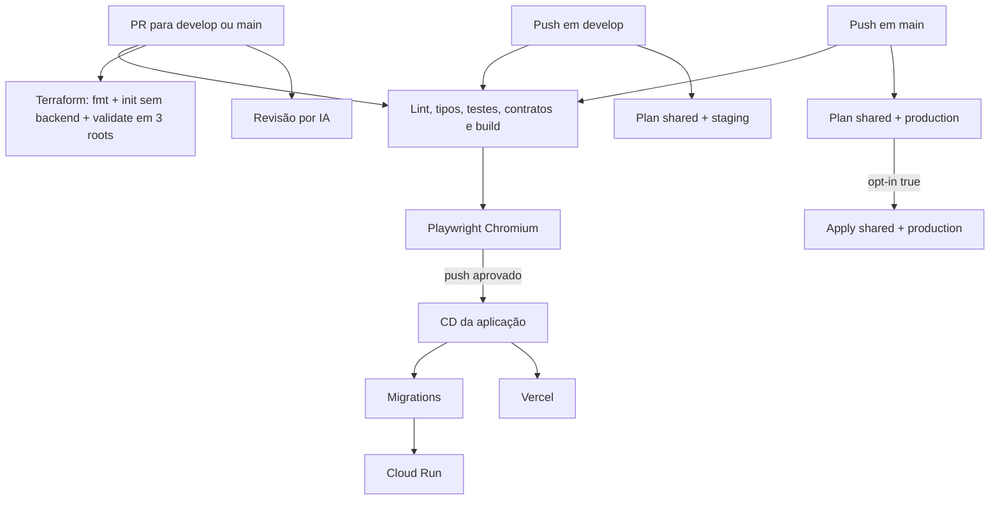

# 🔁 Especificação da Arquitetura Modular de CI/CD — Wedding Management System

> **Versão:** 3.2 | **Última atualização:** 6 de agosto de 2026
> **Relacionados:** [ADR-025](../adr/025-terraform-iac-architecture.md) | [ADR-026](../adr/026-gitops-branching-and-deployment-strategy.md) | [ADR-027](../adr/027-terraform-state-topology.md) | [gitops-sprint-workflow](../../1-tutorials/gitops-sprint-workflow.md) | [terraform-modules-spec](../../3-reference/architecture-standards/terraform-modules-spec.md)

---

## 1. Visão Geral

As pipelines separam validação, release da aplicação e gestão da infraestrutura:

1. **CI** valida código, contratos, testes e imagens sem publicar em Pull Requests.
2. **CD** publica versões da aplicação somente após um `push` validado em `develop` ou `main`.
3. **Terraform** possui três roots e states independentes: `shared`, `staging` e `production`.
4. **Revisão por IA** analisa cada SHA do PR sem usar labels como estado.

---

## 2. Gatilhos e Responsabilidades

| Workflow | Gatilho | Responsabilidade |
|:---|:---|:---|
| **[ci-pr-validation.yml](../../../.github/workflows/ci-pr-validation.yml)** | PR e `push` em `main`/`develop` | Ruff, mypy, Pytest, migrations check, Vitest, builds, contratos e smoke da imagem. Em `push`, chama o CD após todos os gates. |
| **[e2e-tests.yml](../../../.github/workflows/e2e-tests.yml)** | `workflow_call` | Playwright em Chromium e duas shards. |
| **[docs-ci.yml](../../../.github/workflows/docs-ci.yml)** | PR e `push` com documentação | Executa `make check-docs`. |
| **[ai-code-review.yml](../../../.github/workflows/ai-code-review.yml)** | Abertura/atualização de PR | Executa OpenCode para o SHA atual. |
| **[cd-deploy.yml](../../../.github/workflows/cd-deploy.yml)** | `workflow_call` após CI; `workflow_dispatch` | Publica imagens, executa migrations, atualiza revisões Cloud Run e faz deploy Vercel. Não cria IAM público. |
| **[terraform-ci.yml](../../../.github/workflows/terraform-ci.yml)** | PR e `push` com Terraform | PR valida os três roots sem backend/OIDC. Em `main`, planeja `shared` e `production`; aplica os planos salvos somente com opt-in. |
| **[staging-pipeline.yml](../../../.github/workflows/staging-pipeline.yml)** | `push` em `develop`; manual | Planeja `shared` e `staging` nos respectivos states. Nunca aplica. |

Pull Requests nunca recebem a identidade de deploy nem acessam o backend GCS.

---

## 3. Ownership

| Domínio | Terraform | CD/Operador |
|:---|:---|:---|
| GCP compartilhado | Bucket de state, Artifact Registry, WIF, Service Account e IAM | Tokens e aprovação operacional |
| Cloud Run | Serviço-base, recursos, escala, porta, ingress e IAM invoker | Imagem por SHA, env vars, referências de secrets, revisão e tráfego |
| Secret Manager | Containers e IAM por ambiente | Valores e versões dos secrets |
| Cloudflare R2 | Buckets por ambiente | Objetos, access keys e API tokens |
| Vercel | Projetos e `VITE_API_URL` por target/branch | Builds, deployments, aliases e tokens |
| Neon | Fora do escopo da ADR-027 | Projetos, bancos, connection strings e rotação |

Um recurso possui exatamente um state proprietário. O CD não usa mais `--allow-unauthenticated`; o binding público do Cloud Run pertence ao Terraform.

---

## 4. States Terraform

| Root | Prefixo GCS | Conteúdo |
|:---|:---|:---|
| `terraform/shared` | `terraform/shared` | State bucket, Artifact Registry, WIF, deployer IAM e projetos Vercel |
| `terraform/staging` | `terraform/staging` | Cloud Run, Secret Manager/IAM, R2 e variável Vercel de staging |
| `terraform/production` | `terraform/production` | Cloud Run, Secret Manager/IAM, R2 e variável Vercel de produção |

O objeto legado `terraform/state/default.tfstate` permanece somente como backup de migração e nenhum workflow novo aponta para ele.

O backend GCS mantém locking automático. As operações remotas também usam o grupo de concorrência `terraform-remote-state`. Nunca use `-lock=false`, `force-unlock`, `state push -force` ou `init -force-copy` no fluxo normal.

> [!IMPORTANT]
> `TERRAFORM_PRODUCTION_APPLY_ENABLED` deve permanecer ausente ou `false` até os três states serem importados e seus planos não apresentarem criação, alteração, substituição ou remoção inesperada. Consulte o [runbook de adoção](../../2-how-to/ops-troubleshooting/terraform-state-adoption.md).

---

## 5. Fluxo da Aplicação

### Pull request

- Executa somente os jobs relacionados aos caminhos alterados.
- Compila e testa a imagem do backend sem login ou push no Artifact Registry.
- Executa E2E somente em Chromium.
- Valida os três roots Terraform com `init -backend=false`.
- Não publica previews efêmeros nem acessa recursos cloud.

### Push em `develop`

- Usa o GitHub Environment `Preview`, que representa o staging fixo.
- Publica a imagem por SHA, executa migrations no Neon staging e atualiza `wedding-backend-staging`.
- Atualiza os aliases Vercel fixos de staging.
- Planeja os states `shared` e `staging`, sem apply.

### Push em `main`

- Usa o GitHub Environment `Production`.
- Publica a aplicação e executa migrations de produção após os gates.
- Planeja `shared` e `production`.
- Aplica exatamente os planos locais salvos somente quando o opt-in for `true`.

---

## 6. Secrets e Variáveis

Os valores de `DATABASE_URL` e `SECRET_KEY` permanecem no Secret Manager. Terraform gerencia somente os containers e bindings IAM; o CD lê a versão pinada para migrations e entrega referências ao Cloud Run.

Cada GitHub Environment define:

| Variável | Uso |
|:---|:---|
| `GCP_DATABASE_SECRET_ID` | Secret do banco do ambiente |
| `GCP_DATABASE_SECRET_VERSION` | Versão numérica pinada |
| `GCP_DJANGO_SECRET_ID` | Secret Django do ambiente |
| `GCP_DJANGO_SECRET_VERSION` | Versão numérica pinada |
| `GOOGLE_CLIENT_ID` | OAuth do ambiente |

O repositório define `CLOUDFLARE_ACCOUNT_ID` como variável não sensível. Tokens GCP/WIF, Cloudflare e Vercel continuam em GitHub Secrets. As credenciais R2 devem existir nos Environments `Preview` e `Production`; secrets de Environment substituem os repository secrets de mesmo nome.

`TERRAFORM_PRODUCTION_APPLY_ENABLED` é uma repository variable, não um secret. Alterá-la para `true` é uma ação operacional separada do PR e exige planos convergentes.

---

## 7. Gates de Qualidade

| Gate | Critério |
|:---|:---|
| Documentação | `make check-docs` sem links quebrados |
| Terraform | `fmt -check -recursive`, `init -backend=false` e `validate` nos três roots |
| Backend | Ruff, mypy, checks Django, migrations e Pytest |
| Frontend | Lint, type-check, Vitest, isolamento de mocks e build |
| Landing | Astro check e build |
| Container | Build e health check sem publicação no PR |
| E2E | Duas shards Playwright Chromium |

---

## 8. ADRs Relacionados

- [ADR-025: Terraform e GitOps Multi-Cloud](../adr/025-terraform-iac-architecture.md)
- [ADR-026: Branches e Staging](../adr/026-gitops-branching-and-deployment-strategy.md)
- [ADR-027: Topologia de States Terraform](../adr/027-terraform-state-topology.md)
