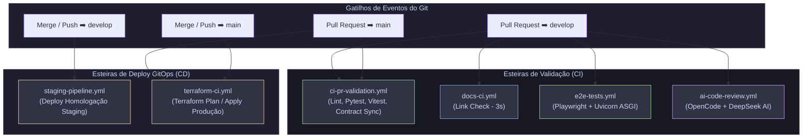

# 🔁 Especificação da Arquitetura Modular de CI/CD — Wedding Management System

> **Versão:** 3.0 | **Última atualização:** 3 de agosto de 2026
> **Relacionados:** [ADR-025](../adr/025-terraform-iac-architecture.md) | [ADR-026](../adr/026-gitops-branching-and-deployment-strategy.md) | [gitops-sprint-workflow](../../1-tutorials/gitops-sprint-workflow.md)

---

## 1. Visão Geral da Arquitetura Modular

O ecossistema de CI/CD do Wedding Management System adota uma **arquitetura de pipelines especializadas e desacopladas**. Em vez de manter um único arquivo monolítico de CI, o sistema é dividido em esteiras focadas com responsabilidades bem definidas, eliminando gargalos de execução, reduzindo o tempo de validação de PRs e garantindo deploys previsíveis via GitOps com Terraform.

### Princípios da Arquitetura Modular:
1. **Desacoplamento por Responsabilidade**: Cada esteira possui gatilhos estritos (`paths`) e roda de forma independente.
2. **Execução Ultra-rápida de Documentação (`docs-ci.yml`)**: Alterações exclusivas na pasta `docs/` executam apenas o linter de documentação em ~3 segundos, sem baixar dependências de código.
3. **Revisão por IA Independente (`ai-code-review.yml`)**: A revisão automatizada por IA roda no momento exato de abertura do PR, sem esperar a conclusão dos testes de código.
4. **Servidor ASGI Concorrente nos Testes E2E (`e2e-tests.yml`)**: O Playwright utiliza um servidor **Uvicorn (ASGI)** multi-thread em ambiente isolado.
5. **GitOps Automatizado com Terraform (`terraform-ci.yml` & `staging-pipeline.yml`)**: O provisionamento de infraestrutura (Cloud Run, R2, Vercel, Artifact Registry) é orquestrado por código e parametrizado em arquivos `.tfvars`.

---

## 2. Visão Topológica de Pipelines (Mermaid Diagram)

---

## 3. Catálogo de Workflows Especializados

| Arquivo Workflow | Propósito & Responsabilidade | Gatilhos (`on`) | Condição de Execução (`paths`) | Tempo Médio |
|:---|:---|:---|:---|:---|
| **[ci-pr-validation.yml](../../../.github/workflows/ci-pr-validation.yml)** | Validação de sintaxe, tipagem estrita (`mypy`), Pytest, Vitest e OpenAPI Contract Sync | `pull_request`, `push` (`develop`, `main`) | Código Backend, Frontend ou Landing | ~1.5 min |
| **[docs-ci.yml](../../../.github/workflows/docs-ci.yml)** | Validação ultra-rápida de links de documentação e anotações atômicas Diátaxis | `pull_request`, `push` (`develop`, `main`) | `docs/**`, `*.md` | **~3 seg** |
| **[e2e-tests.yml](../../../.github/workflows/e2e-tests.yml)** | Testes End-to-End com Playwright (Chromium e Mobile Safari) sobre servidor Uvicorn ASGI | `pull_request`, `push` (`develop`, `main`) | `backend/**`, `frontend/**` | ~2 min |
| **[ai-code-review.yml](../../../.github/workflows/ai-code-review.yml)** | Revisão automatizada de código por IA (OpenCode + DeepSeek v4) | `pull_request` (`opened`, `synchronize`) | Qualquer alteração no PR | Imadiato ao abrir |
| **[staging-pipeline.yml](../../../.github/workflows/staging-pipeline.yml)** | Deploy automatizado no ambiente de **Homologação Privado** (Staging) | `push` (`develop`, `staging`) | Módulo Terraform & Staging | ~2 min |
| **[terraform-ci.yml](../../../.github/workflows/terraform-ci.yml)** | Execução do `terraform plan` (em PRs) e `terraform apply` (no merge da `main`) | `pull_request`, `push` (`main`) | `terraform/**` | ~2 min |

---

## 4. Abstrações Reutilizáveis (Composite Actions)

Para manter a consistência e o reuso de código entre as esteiras, utilizamos **Composite Actions** em `.github/actions/`:

- **`setup-python-uv` (`.github/actions/setup-python-uv/`)**:
  - Instalação e cache automatizado do Python 3.12+ e `uv` (gerenciador de pacotes atrelado ao `backend/uv.lock`).
- **`setup-node-pnpm` (`.github/actions/setup-node-pnpm/`)**:
  - Instalação declarativa do Node.js (`.nvmrc`) e PNPM 9.15+ com cache de `node_modules`.

---

## 5. Requisitos de Segurança & Autenticação (WIF)

O deploy na nuvem é realizado sem chaves estáticas de longa duração na CI/CD. Utilizamos **Workload Identity Federation (WIF)** no GCP:

| Secret | Propósito | Escopo |
|:---|:---|:---|
| `GCP_WIF_PROVIDER` | Identificador OIDC do Workload Identity Federation | `terraform-ci.yml`, `staging-pipeline.yml` |
| `GCP_WIF_SERVICE_ACCOUNT` | Email da Service Account com permissões `Cloud Run Admin` e `Artifact Registry Writer` | `terraform-ci.yml`, `staging-pipeline.yml` |
| `CLOUDFLARE_API_TOKEN` | Token da API do Cloudflare para gerenciamento dos buckets R2 | Passado como `TF_VAR_cloudflare_api_token` |
| `VERCEL_TOKEN` | Token da API da Vercel para gerenciamento dos projetos frontend | Passado como `TF_VAR_vercel_api_token` |
| `CODECOV_TOKEN` | Token de upload de métricas de cobertura do Pytest | `ci-pr-validation.yml` |
| `DEEPSEEK_API_KEY` | Chave de API para o revisor de código IA | `ai-code-review.yml`, `opencode-assistant.yml` |

---

## 6. Gates de Qualidade & Regras de Integridade

| Gate | Critério de Aceitação | Ação em Caso de Falha |
|:---|:---|:---|
| **Documentation Integrity** | Zero links quebrados em `docs/` (`make check-docs`) | Corrigir os caminhos dos arquivos markdown citados. |
| **API Contract Sync** | Diff zero no schema `openapi.json` e hooks Orval | Executar `make sync-api` localmente e comitar os hooks gerados. |
| **Backend Migrations** | `makemigrations --check --dry-run` zerado no Django | Executar `uv run python manage.py makemigrations` na pasta `backend/`. |
| **Playwright Sharding** | Suíte de testes E2E aprovada nas shards 1/2 e 2/2 | Baixar o artefato `playwright-report` gerado pelo workflow. |

---

## 7. ADRs Relacionados

- [ADR-025: Adoção de Terraform e GitOps Multi-Cloud](../adr/025-terraform-iac-architecture.md)
- [ADR-026: Estratégia de Branches, Homologação e Sprints](../adr/026-gitops-branching-and-deployment-strategy.md)
- [ADR-012: Orval Contract-Driven Frontend](../adr/012-orval-contract-driven-frontend.md)
- [ADR-018: Playwright E2E Testing](../adr/018-playwright-e2e-testing.md)
