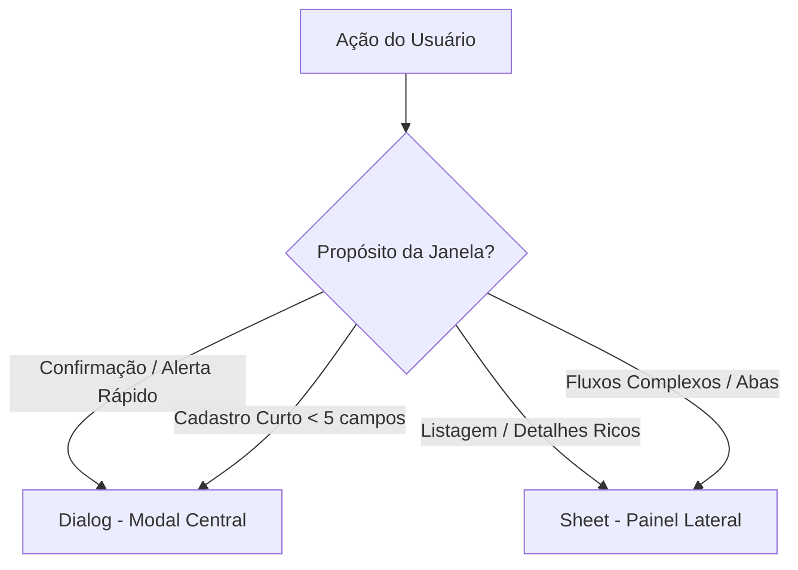

# Racional do Sistema de Design (Sim, Aceito!)

Este documento detalha o racional arquitetural, a psicologia das cores, a ergonomia visual e a matriz de decisão de UX adotada no sistema **Sim, Aceito!**.

---

## 1. Ergonomia e Mitigação de Fadiga Visual

O sistema foi desenhado especificamente para cerimonialistas e planejadores de casamentos que utilizam a plataforma durante **6 a 10 horas diárias**.

- **Aura Violeta (Sofisticação & Calma):** O violeta (`#7C3AED`) transmite criatividade e sofisticação — alinhado ao universo de eventos — sem a infantilidade de tons vibrantes ou a frieza de azuis corporativos.
- **Redução de Ofuscamento (Eye-Friendly):** Em vez de cinzas puros e brancos estourados (`#FFFFFF`), o modo claro utiliza superfícies levemente arroxeadas (`#FAFAFB` e `#F5F3FF`) para suavizar a luz emitida pela tela.
- **Leitura Numérica de Alta Densidade:** O uso da fonte `JetBrains Mono` em valores financeiros e datas garante alinhamento vertical perfeito em tabelas e faturas.

---

## 2. Matriz Decisória de UX: Dialog vs Sheet

As janelas de sobreposição são divididas estritamente com base no propósito e na densidade de dados:

### Dialog (Modal Centralizado)
- **Propósito:** Exigir atenção total do usuário para uma ação rápida ou confirmação de segurança.
- **Tamanho:** Pequeno (`sm`) a médio (`md`).
- **Casos de Uso:** Confirmar exclusão, cadastro de categoria rápida, mensagens de erro transacionais.

### Sheet (Painel Lateral / Drawer)
- **Propósito:** Leitura ou edição detalhada sem perder o contexto visual da página principal.
- **Comportamento:** Desliza da lateral direita (`side="right"`) com rolagem vertical dedicada. Em telas móveis, expande para tela cheia.
- **Casos de Uso:** Detalhes de despesas (`ExpenseDetailSheet`), visualização de contratos e anexos PDF, listas de pendências do Dashboard.

---

## 3. Cards de KPI no Dashboard

Os indicadores do Dashboard seguem a estrutura híbrida para maximizar a densidade de informação:

1. **Dado Principal:** Valor financeiro em reais (BRL) em fonte mono.
2. **Indicador de Volume:** Número bruto de itens pendentes.
3. **Estado Dinâmico de Alerta:**
   - **Erro (`destructive` / Vermelho):** Aplicado se volume de atrasos/vencidos > 0.
   - **Alerta (`warning` / Amarelo):** Aplicado a pendências de médio prazo.
   - **Neutro:** Borda sutil quando não há pendências.

---

## 4. Referência do Spec Normativo

Para visualizar os tokens de design normativos parseáveis por agentes de IA e a especificação de componentes, consulte o arquivo oficial na raiz do repositório: [DESIGN.md](../../../DESIGN.md).
