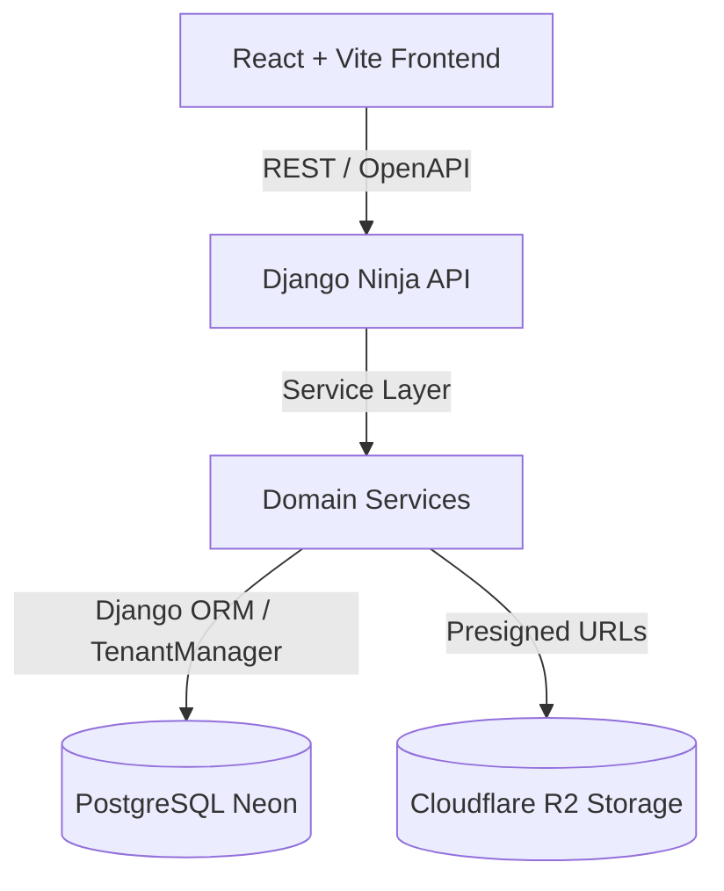

# Arquitetura do Sistema: Visão Geral (System Overview)

> **Módulo:** [system-overview](system-overview.md)
> **Relacionados:** [multi-tenancy-strategy](multi-tenancy-strategy.md) | [service-layer-pattern](service-layer-pattern.md) | [smart-dumb-components](smart-dumb-components.md) | [auth-jwt-flow](auth-jwt-flow.md)

---

## Visão Geral da Arquitetura Fullstack

O **Wedding Management System** é uma plataforma multi-tenant SaaS concebida para assessores de eventos e noivos gerenciarem orçamentos, logística de contratos, fornecedores e cronogramas de casamentos.

---

## Pilares Tecnológicos

| Camada | Tecnologia | Função Principal |
| :--- | :--- | :--- |
| **Backend Framework** | Python 3.12 + Django + Django Ninja | API REST fortemente tipada com schemas Pydantic e sem DRF. |
| **Arquitetura Backend** | Service Layer Pattern | Endpoints em `api.py` nunca contêm lógica de negócio; chamam `services.py`. |
| **Isolamento de Dados** | Multi-Tenancy pragmático | `Company` é o tenant root; models herdam de `TenantModel` (ADR-009, ADR-016). |
| **Frontend UI** | React 18/19 + Vite + TypeScript | SPA de alta performance com Tailwind CSS v4 e shadcn/ui. |
| **Contratos e API Client**| Orval + TanStack Query | Geração automática de hooks TypeScript a partir do OpenAPI da API. |
| **Formulários** | `react-hook-form` + `zod` | Validação de schemas no cliente alinhada com as mensagens da API. |
| **Infraestrutura** | PostgreSQL (Neon) + Cloudflare R2 | Banco relacional serverless e armazenamento seguro via Presigned URLs (ADR-004). |
