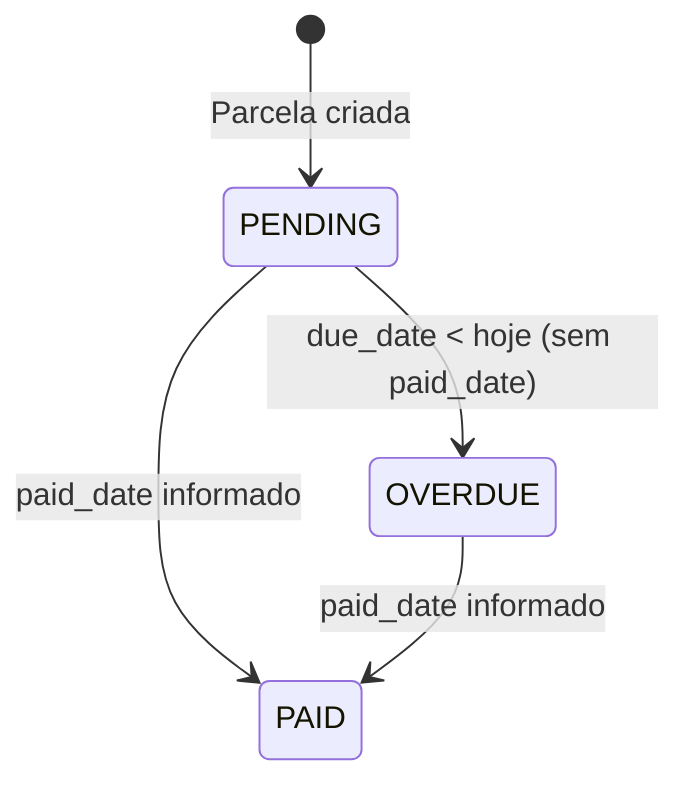

# Regra de Negócio: Lógica de Vencimento e Parcelamento de Despesas

> **Módulo:** [finances-domain](../../domains/finances-domain.md) | [installment-model](../../../3-reference/models/finances/installment-model.md)
> **Código:** `backend/apps/finances/services/installment_service.py`
> **Testes:** `backend/apps/finances/tests/services/test_installment_service.py`

---

## 1. Geração Automática de Parcelas (Tolerância Zero - ADR-010)

Ao criar uma `Expense` parcelada:
1. O valor total é dividido pelo número de parcelas `N`.
2. As primeiras `N-1` parcelas recebem o valor arredondado para duas casas decimais.
3. A última parcela absorve a diferença exata de centavos para garantir que a soma das parcelas seja estritamente igual a `expense.total_amount`.

---

## 2. Transição de Status para OVERDUE

- Parcelas com `status='PENDING'` cuja `due_date < hoje` e `paid_date is None` são marcadas como `OVERDUE`.
- A transição é executada via comando de gerenciamento agendado `python manage.py mark_overdue_installments`.
- O status da `Expense` pai é recalculado automaticamente em função do status das parcelas filhas.

