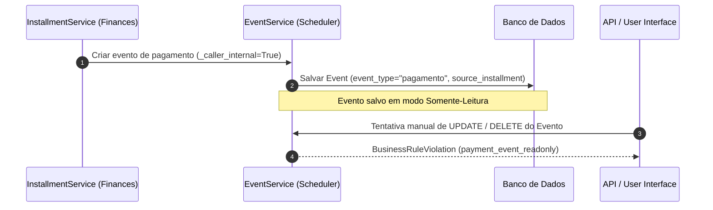

# Regra de Negócio: Imutabilidade de Eventos de Pagamento e Data Inicial (BR-S01 / BR-S02)

> **Módulo:** [scheduler-domain](../../domains/scheduler-domain.md) | [finances-domain](../../domains/finances-domain.md)
> **Código:** `backend/apps/scheduler/services/events.py`, `frontend/src/features/scheduler/components/events/ReadOnlyEventDetails.tsx`
> **Testes:** `backend/apps/scheduler/tests/services/test_event_service.py`

---

## 1. Imutabilidade de Eventos de Pagamento (BR-S01)

Eventos de compromisso com `event_type = "pagamento"` representam parcelas financeiras (`Installment`) espelhadas na agenda:

- **Origem Exclusiva:** São gerados automaticamente de forma exclusiva por chamadas de serviços internos do sistema (`_caller_internal=True`).
- **Bloqueio de Criação Manual:** Tentativas de criar manualmente um evento do tipo `pagamento` via API ou formulários disparam `BusinessRuleViolation` (`payment_event_readonly`).
- **Bloqueio de Edição e Exclusão:** Tentativas de editar ou deletar manualmente um evento de pagamento disparam `BusinessRuleViolation` (`payment_event_readonly`). O usuário deve realizar qualquer alteração na parcela correspondente no módulo `finances`.
- **Padrão de UX Frontend:** No frontend React, clicar em um evento de pagamento abre o modal `ReadOnlyEventDetails.tsx`, que omite botões de edição/exclusão e orienta o usuário a acessar a aba de Finanças.

---

## 2. Trava de Data Inicial no Passado e Exceção de Templates (BR-S02)

Na criação manual de compromissos via API (`EventService.create`):

- **Data Inicial:** A data de início (`start_time`) não pode ser anterior à data corrente (`timezone.localdate()`), disparando `BusinessRuleViolation` (`event_start_time_in_past`).
- **Exceção Controlada (`_allow_historical_start=True`):** Apenas chamadas originadas pela aplicação de templates de cronograma de casamento (`WeddingService`) podem salvar eventos com marcos retroativos.
