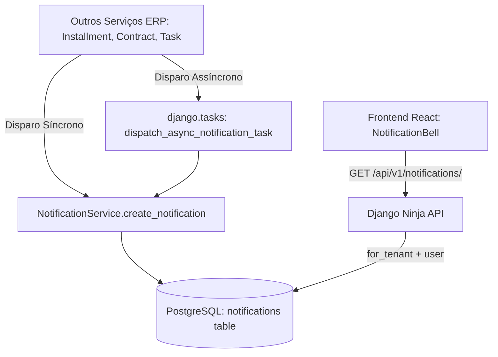

# Domínio: Notificações In-App (`notifications`)

> **Módulo:** [system-overview](../architecture/system-overview.md) | [in-app-notifications-rules](../business-rules/notifications/in-app-notifications-rules.md)
> **Código:** `backend/apps/notifications/`

---

## 1. Visão Geral do Domínio

O domínio de **Notificações In-App (`notifications`)** é o módulo responsável por centralizar a comunicação de eventos do ERP para os usuários do sistema.

Ele gerencia alertas sobre parcelas de despesas prestes a vencer (`UPCOMING_INSTALLMENT`), parcelas em atraso (`OVERDUE_INSTALLMENT`), contratos próximos da expiração (`EXPIRING_CONTRACT`), prazos de tarefas (`TASK_DEADLINE`) e atualizações de casamentos.

---

## 2. Responsabilidades Principais

1. **Centralização de Comunicação In-App**: Criação de notificações visíveis no sino (bell icon) do painel web.
2. **Dupla Interface de Criação**:
   - **Síncrona (`create_notification`)**: Para disparos diretos durante a execução de serviços em tempo real.
   - **Assíncrona (`create_async_notification`)**: Para disparos em background via tarefas agendadas (`django.tasks` / Cloud Scheduler).
3. **Isolamento Estrito de Multi-Tenancy**: Garantia de que cada notificação pertença a uma empresa (`Company`) e seja visível exclusivamente para o seu usuário destinatário (`User`).
4. **Ancoragem de Entidades ERP**: Associação dinâmica com recursos alvo (Parcelas, Despesas, Tarefas, Contratos ou Casamentos) através de `target_type` e `target_id`.

---

## 3. Arquitetura de Componentes

---

## 4. Documentação Relacionada

- **Modelo de Dados:** [notification-model](../../3-reference/models/notifications/notification-model.md)
- **Regras de Negócio:** [in-app-notifications-rules](../business-rules/notifications/in-app-notifications-rules.md)
- **Fluxo de CI/CD & Async:** [ci-cd-pipeline-flow](../architecture/ci-cd-pipeline-flow.md)
