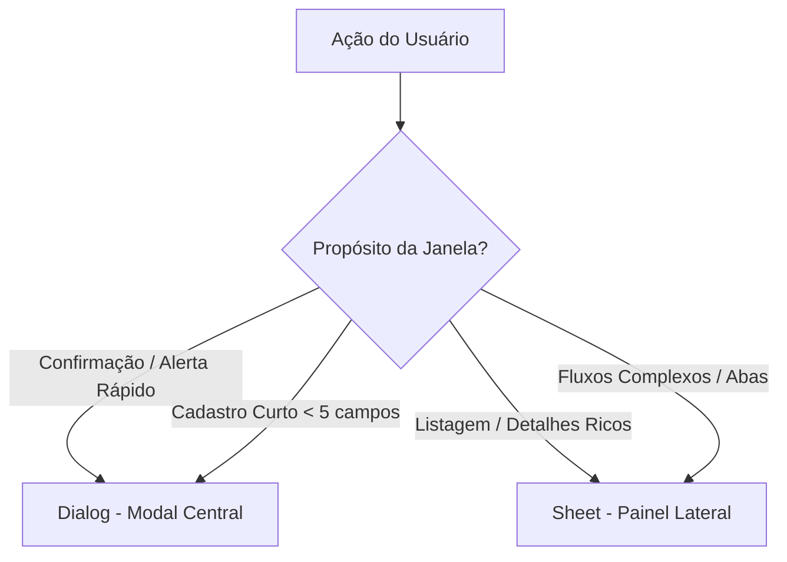

# Diretrizes de Design do Sistema (Aura Wedding ERP)

Este documento estabelece a especificação do sistema de design, tokens visuais, padrões de interação (UX/UI) e regras de desenvolvimento frontend adotados no **Aura Wedding ERP**, servindo como guia oficial para novas implementações, refatorações e geração de interfaces por agentes.

---

## 🎨 1. Atmosfera e Tokens Visuais (Design System)

O design do sistema foi planejado para cerimonialistas que passam de **6 a 10 horas diárias** na plataforma. A interface é focada em contrastes modernos, sofisticação e redução de fadiga visual.

### Tons & Atmosfera
- **Refinado e Calmo**: O uso do violeta transmite criatividade e sofisticação (adequado ao universo de casamentos) sem ser infantil.
- **Redução de Fadiga**: Em vez de tons puramente cinzas, o modo claro utiliza fundos levemente arroxeados (`#F5F3FF` ou `#FAFAFB`) para suavizar a luz emitida pela tela.
- **Suavidade nos Cantos**: Uso generoso de cantos arredondados (`border-radius: 0.5rem` ou `rounded-lg` / `rounded-xl`).
- **Sombras Sutis**: Camadas com opacidade muito baixa (`shadow-soft` para elevação discreta de cards, sem agressividade visual).

### Tipografia
- **Títulos/Displays (Font Display)**: `Plus Jakarta Sans Variable` — fonte geométrica, calorosa e moderna para cabeçalhos e títulos de seção.
- **Corpo do Texto (Font Sans)**: `IBM Plex Sans Variable` — desenhada especificamente para UIs de alta densidade de dados, maximizando a legibilidade.
- **Dados/Valores (Font Mono)**: `JetBrains Mono Variable` — excelente para alinhar colunas numéricas, tabelas financeiras, datas e faturas.

### Paleta de Cores (Eye-Friendly)
- **Aura (Primária - Violeta)**:
  - Dominante (Light): `#7C3AED` (`aura-600` / `--primary`) - Botões principais, logos e links.
  - Dominante (Dark): `#8B5CF6` (`aura-500`) — ajustada para manter contraste em fundos escuros.
  - Hover: `#6D28D9` (`aura-700`)
  - Superfície Clara: `#F5F3FF` (`aura-50` / `--secondary`)
- **Superfícies de Fundo (Surfaces)**:
  - Modo Claro: Fundo `#FAFAFB` com cards e painéis em `#FFFFFF`.
  - Modo Escuro (Dark Mode): Fundo `#09090B` (`surface-dark`) com painéis e tabelas em `#18181B` (`surface-darkSecondary`).
- **Status (Badges de Feedback)**:
  Deve-se usar **fundos pastel claríssimos com texto escuro** para badges de status de alta legibilidade:
  - **Sucesso (`success`)**: `#009688` (Ex: Badge "Pago" = fundo teal claríssimo + texto teal escuro).
  - **Aviso (`warning`)**: `#FFC107` (Ex: Badge "Pendente" = fundo amarelo claro + texto âmbar).
  - **Erro/Destrutivo (`destructive`)**: `#E91E63` (Ex: Badge "Vencida" = fundo rosa claro + texto rosa escuro).
  - **Info**: `#03A9F4` (Ex: Badge "Planejando" = fundo azul claro + texto azul escuro).
  
  **Modo Escuro (Dark)**: As variantes de cor no tema escuro são ajustadas para maior contraste:
  - `--destructive`: `#F87171` | `--success`: `#34D399` | `--warning`: `#FBBF24` | `--info`: `#38BDF8`

---

## 📐 2. Padrões de Navegação Contextual: Dialog vs Sheet

As janelas de sobreposição são divididas estritamente com base no **propósito** e na **densidade de dados**:



### 1. Dialog (Modal Centralizado)
* **Objetivo:** Exigir atenção total e imediata do usuário, interrompendo o fluxo atual para uma ação transacional rápida ou aviso crítico.
* **Tamanho Máximo:** `sm` (pequeno) a `md` (médio) no desktop.
* **Casos de Uso:**
  - Formulários de criação rápida (ex: cadastrar nova categoria de orçamento, nova tarefa simples).
  - Modais de confirmação de segurança (ex: "Excluir Fornecedor").
  - Alertas de erros críticos da API ou validações rápidas.

### 2. Sheet (Painel Lateral / Drawer)
* **Objetivo:** Permitir a leitura, comparação ou edição detalhada de dados sem que o usuário perca o senso de localização (contexto de fundo) na página principal.
* **Comportamento:** Desliza da lateral direita (`side="right"`), ocupando altura cheia (`h-full` ou `max-h-100vh`) com rolagem vertical dedicada.
* **Responsividade:** Em celulares (Mobile), expande automaticamente para ocupar a largura inteira (comportando-se como uma transição de página natural).
* **Casos de Uso:**
  - Visualização de detalhes de entidades ricas (ex: `ExpenseDetailSheet`, mostrando dados, parcelas e histórico da despesa).
  - Detalhes de contratos (ex: exibição do documento, assinaturas e status).
  - Pré-visualização rápida das listas pendentes originadas do Dashboard.

---

## 📊 3. Grid de KPIs do Dashboard e Status Dinâmicos

Os indicadores macro do Dashboard seguem a **Abordagem Híbrida**, desenhada para maximizar a densidade de informações e a ação ágil.

```
+------------------------------------------+
| 💳 Parcelas Vencidas                     |
|                                          |
|  R$ 12.350,00         [ Ícone / Alerta ] |
|                                          |
|  [ 2 parcelas em atraso ]     [Ver] (link|
+------------------------------------------+
```

### Estrutura dos Cards
1. **Título e Ícone**: Indicação clara do domínio operacional.
2. **Dado Principal (Destaque)**: Valor financeiro em reais (BRL) ou contagem bruta em tipagem mono (`JetBrains Mono Variable`).
3. **Indicador de Volume (Urgência)**: Contagem exata de itens sob aquela métrica.
4. **Atalho de Ação Rápida ("Ver")**: Um link/botão discreto que ativa diretamente a barra lateral ou modal correspondente.

### Estados de Alerta Dinâmicos
Os cards alteram sua estilização com base na gravidade operacional do momento:
- **Estado de Erro (Vermelho/Urgente)**: Aplicado quando o volume de pendências é **maior que zero** em métricas de risco imediato (ex: *Parcelas Vencidas* ou *Tarefas Atrasadas*).
  - Classes aplicadas: Borda vermelha (`border-red-200` ou `border-destructive`), destaque de texto em vermelho (`text-destructive`), e badge de ação necessária.
- **Estado de Atenção (Amarelo/Alerta)**: Aplicado a métricas que representam negociações pendentes de médio prazo (ex: *Contratos Pendentes*).
  - Classes aplicadas: Borda amarela/âmbar (`border-amber-200`), texto em destaque âmbar.
- **Estado Neutro**: Quando não há nenhuma pendência ativa, o card reverte para a paleta padrão de bordas sutis (`border-zinc-200` ou `border-zinc-800` no escuro), com textos secundários discretos.

---

## ⚡ 4. Micro-interações e Usabilidade (UX)
- **Respiro e Espaçamento**: Espaço negativo generoso entre seções (padding/margin consistentes de `p-6` ou `p-8` em layouts principais). Não comprima elementos.
- **Hierarquia Visual**: Títulos claros, subtítulos sutis. O olho do usuário deve ser guiado naturalmente pela tela.
- **Transições Suaves**: Estados de hover (como em linhas de tabela, botões ou cards) devem utilizar transição suave de 150ms (`transition-all duration-150 ease-in-out`).
- **Highlights de Foco**: Efeito de highlight violeta suave no hover de linhas de tabelas (`hover:bg-[#F5F3FF]` ou equivalente dark).
- **Personalidade no Detalhe**: Toques sutis de violeta em locais pontuais (borda do item ativo do menu, glow de botões primários focados, etc.).
- **Feedback Visual**:
  - **Toasts**: Notificações rápidas no canto inferior direito com animação de slide-in.
  - **Loading States**: Componentes de skeleton com shimmer effect sutil enquanto os dados carregam.

---

## 🛠️ 5. Padrões de Implementação Visual (Frontend)

As regras arquiteturais completas de desenvolvimento frontend estão definidas no **`AGENTS.md`** e na skill **`wedding-frontend`** (formulários, ícones, consumo de API, nomenclatura). Esta seção cobre apenas as regras com impacto visual direto:

### Composição de Componentes (shadcn/ui)
- **Proibido Alterar Componentes Base**: Nunca edite diretamente os arquivos em `src/components/ui/`.
- **Customização por Composição**: Toda variação visual deve ser feita via classes Tailwind no elemento pai ou props de composição (`className="border-dashed bg-muted/50"`).

### Estilização (Tailwind CSS v4)
- **Sem Estilos Inline**: Proibido `style={{ ... }}`, exceto para variáveis CSS dinâmicas ou cálculos de layout em tempo de execução. Use classes utilitárias do Tailwind para todo o restante.
