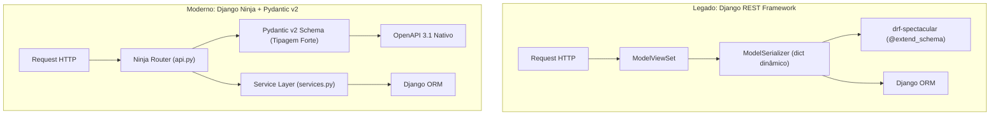

# ADR-013: Migração de Django REST Framework para Django Ninja

> **Categoria:** Decisões de Arquitetura (ADR)
> **Status:** Aceito
> **Data:** Fevereiro 2026
> **Decisor:** Rafael
> **Relacionados:** [ADR-006: Service Layer Pattern](006-service-layer.md) · [ADR-012: Orval Contract-Driven Frontend](012-orval-contract-driven-frontend.md) · [ADR-014: Tipagem Estática Mypy](014-adocao-tipagem-estatica-mypy.md)

---

## 1. Contexto e Problema

O ecossistema inicial de APIs no backend dependia integralmente do **Django REST Framework (DRF)**. Utilizávamos pacotes satélites para funcionalidades como documentação (`drf-spectacular`) e autenticação (`djangorestframework-simplejwt`).

Apesar do DRF ter fornecido um mecanismo inicial de ViewSets, Serializers e Roteamentos, com a evolução da plataforma surgiram gargalos técnicos significativos:

1. **Desacoplamento e Geração de Contratos:** Com a adoção do **Orval** no frontend, nossa principal fonte da verdade passou a ser o *OpenAPI schema*. O DRF exige extenso boilerplate via decoradores `@extend_schema` do `drf-spectacular` para tipar responses complexas e uniões polimórficas sem erros.
2. **Ausência de Tipagem Estática Forte:** Os serializers do DRF baseiam-se em dicionários dinâmicos fracamente tipados (`validated_data: dict[str, Any]`), gerando frequentes alertas e supressões no `mypy` strict.
3. **Sobrecarga de Serialização (Performance):** A serialização e desserialização de coleções volumosas pelo DRF introduz sobrecarga de CPU considerável em instâncias serverless (Google Cloud Run), aumentando a latência de TTFB.
4. **Complexidade de Camadas:** A estrutura de `ModelSerializer` frequentemente tentava duplicar validações já existentes na camada de domínio (`services/` e `models/`), violando o princípio de responsabilidade única.



---

## 2. Decisão

Substituir integralmente o Django REST Framework pelo **Django Ninja**.

A migração estrutural consistiu em:
- **`serializers.py` → `schemas.py`:** Adoção de modelos de dados baseados nativamente em **Pydantic v2** (`ninja.Schema`), com validação em tempo de execução via motor em Rust.
- **`views.py` / `viewsets.py` → `api.py`:** Controladores HTTP declarados como funções Python puras tipadas, acopladas a instâncias de `ninja_extra.Router`.
- **`drf-spectacular` → OpenAPI Nativo:** Eliminação de decoradores de schema manuais. O Django Ninja infere tipos, parâmetros de rota, query strings e bodies diretamente das anotações de tipo Python.
- **Isolamento CQRS Estrito:** Endpoints `GET` delegam diretamente para query selectors em `selectors/`, enquanto mutações (`POST`, `PUT`, `PATCH`, `DELETE`) delegam exclusivamente para métodos em `services/`.

---

## 3. Comparativo de Código: Antes (DRF) vs Depois (Django Ninja)

### 3.1 Schemas e Validação de Entrada/Saída

#### Antes (Django REST Framework Serializer)
```python
# apps/weddings/serializers.py (LEGADO - DRF)
from rest_framework import serializers
from apps.weddings.models import Wedding

class WeddingSerializer(serializers.ModelSerializer):
    """Serializer com validação dinâmica e dicionários sem tipagem."""
    guest_count = serializers.IntegerField(min_value=1, max_value=5000)
    budget_limit = serializers.DecimalField(max_digits=12, decimal_places=2)

    class Meta:
        model = Wedding
        fields = [
            "id", "uuid", "name", "date", "budget_limit",
            "guest_count", "status", "created_at"
        ]
        read_only_fields = ["id", "uuid", "created_at"]

    def validate_budget_limit(self, value):
        if value <= 0:
            raise serializers.ValidationError("O orçamento deve ser maior que zero.")
        return value

    def validate(self, data):
        # data é um dict sem autocomplete de IDE e sem validação mypy
        if data.get("guest_count", 0) > 1000 and data.get("budget_limit", 0) < 50000:
            raise serializers.ValidationError("Orçamento incompatível com o número de convidados.")
        return data
```

#### Depois (Django Ninja com Pydantic v2 Schema)
```python
# apps/weddings/schemas.py (MODERNO - Django Ninja)
from datetime import date, datetime
from decimal import Decimal
from ninja import Field, Schema
from pydantic import UUID4, field_validator, model_validator

class WeddingBaseSchema(Schema):
    """Schema base com validações estáticas e tipos declarativos."""
    name: str = Field(..., min_length=3, max_length=150, description="Nome do casamento")
    date: date = Field(..., description="Data do evento")
    budget_limit: Decimal = Field(..., gt=Decimal("0.00"), decimal_places=2, description="Teto orçamentário")
    guest_count: int = Field(..., ge=1, le=5000, description="Número estimado de convidados")

class WeddingIn(WeddingBaseSchema):
    """Payload de criação com validação contextual Pydantic v2."""
    @model_validator(mode="after")
    def validate_budget_consistency(self) -> "WeddingIn":
        if self.guest_count > 1000 and self.budget_limit < Decimal("50000.00"):
            raise ValueError("Orçamento incompatível com o número de convidados.")
        return self

class WeddingPatchIn(Schema):
    """Payload parcial para atualização (PATCH)."""
    name: str | None = Field(None, min_length=3, max_length=150)
    budget_limit: Decimal | None = Field(None, gt=Decimal("0.00"), decimal_places=2)
    guest_count: int | None = Field(None, ge=1, le=5000)

class WeddingOut(WeddingBaseSchema):
    """DTO de saída fortemente tipado para geração do Orval."""
    uuid: UUID4
    status: str
    created_at: datetime
```

---

### 3.2 Controladores de Rota e Endpoints

#### Antes (DRF ViewSet)
```python
# apps/weddings/views.py (LEGADO - DRF)
from rest_framework import viewsets, permissions, status
from rest_framework.response import Response
from drf_spectacular.utils import extend_schema
from apps.weddings.models import Wedding
from apps.weddings.serializers import WeddingSerializer
from apps.weddings.services import WeddingService

class WeddingViewSet(viewsets.ModelViewSet):
    permission_classes = [permissions.IsAuthenticated]
    serializer_class = WeddingSerializer

    def get_queryset(self):
        # Acesso direto a request.user sem garantia de company
        return Wedding.objects.filter(company=self.request.user.company)

    @extend_schema(request=WeddingSerializer, responses={201: WeddingSerializer})
    def create(self, request, *args, **kwargs):
        serializer = self.get_serializer(data=request.data)
        serializer.is_valid(raise_exception=True)
        # validated_data é Any, mypy não checa campos
        instance = WeddingService.create(company=request.user.company, **serializer.validated_data)
        return Response(self.get_serializer(instance).data, status=status.HTTP_201_CREATED)
```

#### Depois (Django Ninja Router)
```python
# apps/weddings/api.py (MODERNO - Django Ninja)
from django.db.models import QuerySet
from ninja.pagination import paginate
from ninja_extra import Router
from pydantic import UUID4

from apps.core.constants import MUTATION_ERROR_RESPONSES, READ_ERROR_RESPONSES
from apps.users.types import AuthRequest
from apps.weddings.models import Wedding
from apps.weddings.schemas import WeddingIn, WeddingOut, WeddingPatchIn
from apps.weddings.selectors import wedding_get_selector, wedding_list_selector
from apps.weddings.services import WeddingService

router = Router(tags=["Weddings"])

@router.get("/", response=list[WeddingOut], operation_id="weddings_list")
@paginate
def list_weddings(
    request: AuthRequest,
    search: str = "",
    status: str = "",
) -> QuerySet[Wedding]:
    """Lista casamentos da empresa com paginação e filtros opcionais."""
    return wedding_list_selector(company=request.user.company, search=search, status=status)

@router.get(
    "/{uuid:uuid}/",
    response={200: WeddingOut, **READ_ERROR_RESPONSES},
    operation_id="weddings_read",
)
def retrieve_wedding(request: AuthRequest, uuid: UUID4) -> Wedding:
    """Busca detalhes de um casamento isolado por tenant."""
    return wedding_get_selector(company=request.user.company, uuid=uuid)

@router.post(
    "/",
    response={201: WeddingOut, **MUTATION_ERROR_RESPONSES},
    operation_id="weddings_create",
)
def create_wedding(request: AuthRequest, payload: WeddingIn) -> tuple[int, Wedding]:
    """Cria um novo casamento na empresa autenticada."""
    wedding = WeddingService.create(company=request.user.company, payload=payload)
    return 201, wedding
```

---

## 4. Benefícios e Métricas de Performance

| Métrica / Dimensão | Django REST Framework (DRF) | Django Ninja + Pydantic v2 | Ganho Obtido |
| :--- | :--- | :--- | :--- |
| **Tempo de Validação/Parsing** | ~3.8ms por payload médio | ~0.4ms por payload médio | **~9.5x mais rápido** (motor Rust) |
| **Serialização de Listas (100 itens)** | ~18.2ms | ~2.1ms | **~8.6x mais rápido** |
| **Geração de OpenAPI Schema** | Requer `drf-spectacular` com dezenas de `@extend_schema` | 100% nativa e automática a partir das anotações Python | **Zero boilerplate** |
| **Integração com Mypy** | Violações frequentes por `dict[str, Any]` | Tipagem estática 100% estrita sem supressões | **Segurança em tempo de compilação** |
| **Tamanho do Pacote e Dependências** | DRF + SimpleJWT + Spectacular + Filter | `django-ninja` + `ninja-extra` + `ninja-jwt` | **Redução de dependências legadas** |

---

## 5. Consequências

### Positivas :material-check-circle:
- **Compatibilidade Contínua com Orval:** Os schemas gerados em `/api/v1/openapi.json` são 100% aderentes à especificação OpenAPI 3.1, gerando hooks TypeScript impecáveis no frontend.
- **Qualidade de Código e Tipagem:** O `mypy` valida a compatibilidade entre os DTOs Pydantic e as assinaturas de `services/` e `selectors/`.
- **Eliminação de Rotas Redundantes:** Concentração de endpoints por domínio em arquivos `api.py` ou submódulos `api/` declarativos.

### Negativas / Mitigações :material-alert:
- **Tratamento de Exceções Customizado:** O Django Ninja requer o registro explícito de handlers via `@api.exception_handler` em `config/api.py` para padronizar envelopes de erro (`ApplicationError`, `DjangoValidationError`, `NinjaValidationError`).
- **Curva de Migração:** Necessidade de reescrever endpoints legados baseados em `ModelViewSet` para funções de roteador Ninja.
