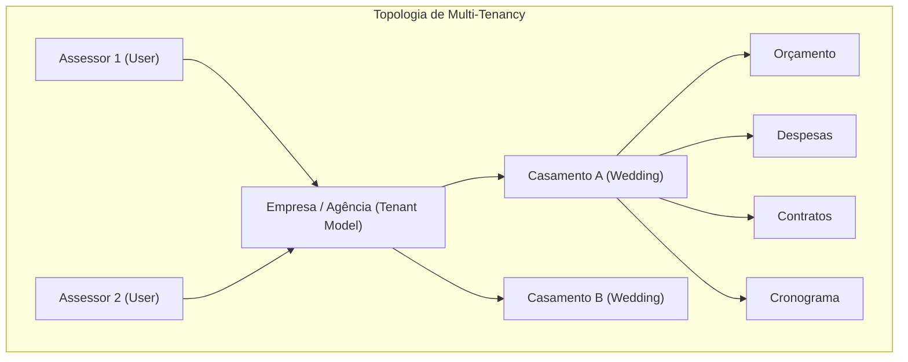

# ADR-016: Multi-tenancy Pragmático e Orientado a Organização

> **Categoria:** Decisões de Arquitetura (ADR)
> **Status:** Aceito
> **Data:** Fevereiro 2026
> **Decisor:** Rafael
> **Relacionados:** [ADR-009: Multitenancy Base](009-multitenancy.md) · [ADR-019: Tenant Validation no Service Layer](019-tenant-validation-service-layer.md) · [Guard-Rail de Isolação Multitenant](../../reference/architecture-standards/guard-rails/tenant-isolation-guard.md)

---

## 1. Contexto e Problema

Originalmente, o sistema utilizava um modelo de isolamento de dados baseado diretamente no usuário (`PlannerOwnedMixin`), onde cada recurso (casamento, orçamento, fornecedor, tarefas) pertencia a um `User` individual.

Essa abordagem inicial gerou limitações arquiteturais e vulnerabilidades críticas:
1. **Inviabilidade de Colaboração em Time:** Impossibilidade de múltiplos assessores da mesma agência compartilharem acesso aos mesmos casamentos sem expor credenciais.
2. **Modelo de Negócio SaaS e Quotas:** Dificuldade em vincular assinaturas de planos Stripe/Asaas e limites de armazenamento a uma entidade corporativa (Empresa) em vez de contas individuais.
3. **Risco de Vazamento Cross-Tenant (IDOR):** Consultas diretas ao ORM sem filtro de tenant explícito (`Model.objects.get(id=...)` ou `filter()`) permitiam que usuários maliciosos manipulassem UUIDs de outras empresas.
4. **Complexidade de Mixins ("Mixin Soup"):** O acúmulo de múltiplos mixins gerava sobreposição de métodos e opacidade no ciclo de vida dos modelos.



---

## 2. Decisão

Implementar uma arquitetura de **Multi-tenancy Pragmático** baseado em **Organizações (`Company`)** com isolamento no nível de linha (*Row-Level Security* lógico no ORM) e validação obrigatória na camada de serviços.

### 2.1 Pilares da Implementação:
1. **Domínio `tenants`:** Aplicação dedicada ao gerenciamento de `Company`, assinaturas e configurações corporativas.
2. **`TenantModel` Abstrato:** Substitui os mixins legados. Todo modelo de domínio herda de `TenantModel`, possuindo uma Foreign Key mandatória para `Company`.
3. **`TenantManager` e `TenantQuerySet`:** Centraliza a filtragem obrigatória via `.for_tenant(company)`, garantindo consultas isoladas e indexadas por `(company, uuid)`.
4. **Validação de Posse (`validate_tenant_ownership`):** Função utilitária que bloqueia a vinculação de entidades filhas pertencentes a empresas distintas dentro de um mesmo fluxo.
5. **Provisionamento Automático (Single-Player UX):** Signal Django no cadastro de `User` dispara o `TenantService`, criando silenciosamente a `Company` padrão do assessor.

---

## 3. Comparativo de Código: Vulnerável vs Seguro

### 3.1 Consultas de Leitura (ORM & Selectors)

#### Inseguro (Sem Isolamento ou com QuerySet Global)
```python
# VULNERÁVEL: Permite vazamento de dados entre empresas distintas (IDOR)
from apps.finances.models import Expense

def get_expense_unsafe(expense_id: str) -> Expense:
    # ❌ NUNCA FAÇA ISSO: Não verifica a qual tenant o registro pertence
    return Expense.objects.get(uuid=expense_id)

def list_expenses_unsafe(user):
    # ❌ Inconsistente: Vincula ao usuário em vez da empresa
    return Expense.objects.filter(wedding__planner=user)
```

#### Seguro (TenantQuerySet + `for_tenant` + Shortcut 404)
```python
# SEGURO: apps/finances/selectors/expense_selectors.py
from django.db.models import QuerySet
from pydantic import UUID4
from apps.core.shortcuts import get_object_or_404_for_tenant
from apps.finances.models import Expense
from apps.tenants.models import Company

def expense_list_selector(company: Company, wedding_id: UUID4 | None = None) -> QuerySet[Expense]:
    """Retorna despesas filtradas rigorosamente pela empresa do usuário."""
    qs = Expense.objects.for_tenant(company).select_related("category", "wedding")
    if wedding_id:
        qs = qs.filter(wedding__uuid=wedding_id)
    return qs

def expense_get_selector(company: Company, uuid: UUID4) -> Expense:
    """Busca despesa isolada por tenant ou levanta ObjectNotFoundError (HTTP 404)."""
    return get_object_or_404_for_tenant(Expense, company, uuid)
```

---

### 3.2 Validação de Relacionamentos Cruzados no Service Layer

#### Proteção com `validate_tenant_ownership`
```python
# apps/finances/services/expense_service.py
from django.db import transaction
from apps.core.shortcuts import validate_tenant_ownership
from apps.finances.models import Expense
from apps.finances.schemas import ExpenseIn
from apps.tenants.models import Company
from apps.weddings.models import Wedding

class ExpenseService:
    @staticmethod
    @transaction.atomic
    def create(company: Company, payload: ExpenseIn) -> Expense:
        """
        Cria uma despesa garantindo a integridade relacional multi-tenant.

        Args:
            company: Empresa proprietária da operação.
            payload: Dados de entrada validados.

        Raises:
            ObjectNotFoundError: Se o casamento ou categoria não pertencerem à empresa.
        """
        # 1. Recupera o casamento garantindo que pertence à mesma empresa
        wedding = Wedding.objects.for_tenant(company).get(uuid=payload.wedding_id)

        # 2. Valida explicitamente a posse do casamento pela empresa
        validate_tenant_ownership(company, wedding)

        # 3. Cria a despesa vinculada estritamente ao tenant
        expense = Expense.objects.create(
            company=company,
            wedding=wedding,
            category_id=payload.category_id,
            name=payload.name,
            amount=payload.amount,
            due_date=payload.due_date,
        )
        return expense
```

---

## 4. Guard-Rails e Auditoria Automatizada

A integridade do isolamento multitenant é auditada continuamente no pipeline de testes:

1. **`test_tenant_isolation.py`:** Testa metaprogramaticamente todos os modelos de domínio herdados de `TenantModel` com duas empresas (`Company A` e `Company B`), validando que `.for_tenant()` e `get_object_or_404_for_tenant()` barram 100% dos acessos cruzados.
2. **`test_security_audit.py`:** Analisa via AST (Abstract Syntax Tree) todas as funções públicas em `services/` para assegurar que declaram o parâmetro mandatrio `company: Company`.

---

## 5. Consequências

### Positivas :material-check-circle:
- **Blindagem Contra IDOR:** Impossibilidade de recuperar ou alterar dados de outros clientes por enumeração de UUID.
- **Preparação SaaS Multi-User:** Permite associar múltiplos usuários a uma mesma agência sem refatoração de banco de dados.
- **Performance Otimizada:** Criação de índices compostos `(company_id, uuid)` e `(company_id, created_at)` que aceleram as consultas de tenant.

### Negativas / Mitigações :material-alert:
- **Sobrecarga de Assinatura:** Todo seletor e método de serviço deve receber obrigatoriamente a instância `company: Company` (mitigado via injeção automática no `request.user.company` dos routers Ninja).
- **Proibição de Métodos Globais:** O uso de `Model.objects.all()` ou `django.shortcuts.get_object_or_404` é terminantemente proibido e reprovado pelo CI.
