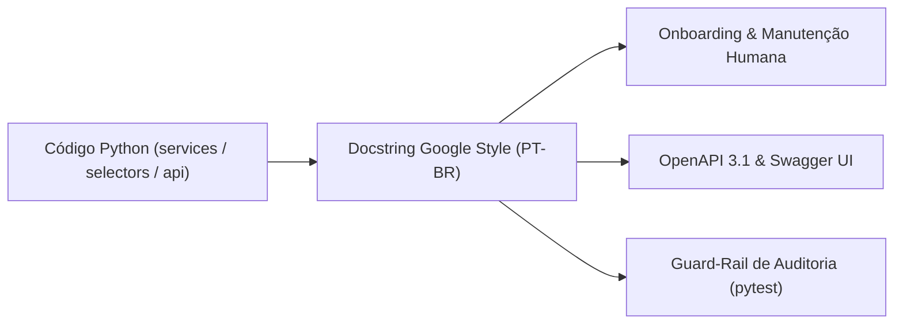

# ADR-021: Padrão de Comentários e Docstrings (Google Style PT-BR)

> **Categoria:** Decisões de Arquitetura (ADR)
> **Status:** 🟢 Vigente
> **Data:** Julho 2026
> **Decisor:** Rafael
> **Relacionados:** [Padrão de Comentários e Docstrings](../../reference/architecture-standards/commenting-standards.md) · [ADR-006: Service Layer Pattern](006-service-layer.md) · [ADR-030: Rich Domain Model e Service Layer](030-rich-domain-model-service-layer.md) · [Convenção de Commits](../../reference/architecture-standards/commit-convention-spec.md)

---

## 1. Contexto e Problema

Com o crescimento do repositório, identificamos inconsistências na documentação do código-fonte:
1. **Mistura de Idiomas e Formatos:** Convivência caótica de docstrings em inglês e português, alternando entre estilos reStructuredText (Sphinx), JSDoc e texto não formatado.
2. **Poluição por Marcadores de Ferramentas:** Presença de comentários com referências explícitas a geradores ou assistentes, gerando ruído e sensação de código descartável.
3. **Ausência de Explicação do "Porquê":** Comentários redundantes que apenas narravam a sintaxe do código (`# itera na lista`), sem esclarecer a regra de negócio subjacente ou a decisão arquitetural.
4. **Falta de Especificação de Exceções e Parâmetros:** Métodos complexos de orquestração financeira sem documentação das exceções lançadas (`Raises:`), dificultando o tratamento de erros nos roteadores.

---

## 2. Decisão

1. **Adoção do Padrão Google Style em Português (PT-BR):** Obrigatório em todos os métodos públicos de `services/`, `selectors/`, `managers.py` e `models/`.
2. **Docstrings Curtas e Semânticas em Endpoints (`api.py`):** O Django Ninja extrai automaticamente a primeira linha da docstring da função para o campo `summary` do OpenAPI/Swagger.
3. **Banimento Estrito de Menções a Ferramentas de IA:** Proibido qualquer referência a nomes de assistentes ou modelos em comentários, docstrings e mensagens de commit.
4. **Foco no "Porquê" (Design Intent):** Comentários inline devem focar exclusivamente em decisões não óbvias, contornos de bugs upstream ou regras de domínio (ex: *tolerância zero financeira*).



---

## 3. Exemplos Reais de Implementação

### 3.1 Método de Domínio na Service Layer (Google Style)

```python
# apps/finances/services/installment_service.py
from decimal import Decimal
from django.db import transaction
from apps.core.exceptions import ValidationError
from apps.finances.models import Installment
from apps.logistics.models import Contract
from apps.tenants.models import Company

class InstallmentService:
    @staticmethod
    @transaction.atomic
    def create_installment(
        company: Company,
        contract: Contract,
        number: int,
        value: Decimal,
        due_date: date,
    ) -> Installment:
        """
        Cria uma nova parcela associada a um contrato logístico.

        Garante a validação de tolerância zero em relação ao valor global
        contratado e bloqueia a criação se ultrapassar o saldo remanescente.

        Args:
            company: Instância da empresa proprietária do registro.
            contract: Contrato de logística ao qual a parcela pertence.
            number: Número ordinal da parcela (ex: 1 para 1ª parcela).
            value: Valor nominal da parcela em moeda corrente.
            due_date: Data limite para o vencimento do pagamento.

        Returns:
            A instância recém-criada de Installment persistida no banco.

        Raises:
            ValidationError: Se o valor da parcela for menor ou igual a zero,
                ou se a data de vencimento for anterior à data do contrato.
            ObjectNotFoundError: Se o contrato não pertencer ao tenant fornecido.
        """
        ...
```

---

### 3.2 Query Selector (Google Style)

```python
# apps/logistics/selectors/contract_selectors.py
from django.db.models import QuerySet
from pydantic import UUID4
from apps.core.shortcuts import get_object_or_404_for_tenant
from apps.logistics.models import Contract
from apps.tenants.models import Company

def contract_list_selector(
    company: Company,
    wedding_id: UUID4 | None = None,
    status: str | None = None,
) -> QuerySet[Contract]:
    """Retorna queryset preguiçoso de contratos filtrados por empresa e filtros opcionais.

    Aplica pré-carregamento de relações (select_related) para fornecedor e casamento,
    otimizando o número de queries no banco de dados (prevenção de problema N+1).

    Args:
        company: Empresa proprietária dos contratos.
        wedding_id: UUID opcional do casamento para isolamento por evento.
        status: Status opcional do contrato (ex: 'DRAFT', 'SIGNED', 'CANCELED').

    Returns:
        QuerySet[Contract]: Queryset chainable otimizado para serialização.
    """
    qs = Contract.objects.for_tenant(company).select_related("supplier", "wedding")
    if wedding_id:
        qs = qs.filter(wedding__uuid=wedding_id)
    if status:
        qs = qs.filter(status=status)
    return qs
```

---

### 3.3 Endpoint Django Ninja (`api.py`)

```python
# apps/logistics/api/contracts.py
@contracts_router.post(
    "/upload-url/",
    response={200: ContractUploadUrlOut, **MUTATION_ERROR_RESPONSES},
    operation_id="logistics_contracts_upload_url",
)
def generate_upload_url(
    request: AuthRequest, payload: ContractUploadUrlIn
) -> ContractUploadUrlOut:
    """Gera uma URL pré-assinada para upload direto de arquivo PDF/imagem para o R2/S3."""
    user = request.user
    res = ContractService.generate_upload_url(
        company=user.company,
        filename=payload.filename,
        wedding_id=payload.wedding_id,
    )
    return ContractUploadUrlOut(**res)
```

---

### 3.4 Rastreabilidade Bidirecional (*Code $\leftrightarrow$ Docs*)

Para assegurar alinhamento perpétuo entre o código-fonte e o repositório de conhecimento sem acoplamento a linhas de arquivo:

1. **Do Código para a Documentação (*Code $\to$ Docs*):**
   Docstrings de classes e métodos que implementam regras complexas ou decisões arquiteturais estruturantes referenciam explicitamente o identificador canônico e o caminho relativo do arquivo Markdown:
   ```python
   def auto_generate_installments(
       company: Company,
       expense: Expense,
       num_installments: int,
       first_due_date: date,
   ) -> list[Installment]:
       """
       Gera automaticamente as parcelas de uma despesa com ajuste na última parcela.

       Regra de Negócio:
           BR-F02 (docs/architecture/business-rules/finances/financial-integrity-rules.md)
       Decisão Arquitetural:
           ADR-030 (docs/architecture/adr/030-rich-domain-model-service-layer.md)
       """
       ...
   ```
   *Guard-Rail:* O script `scripts/validate_docs_links.py` inspeciona continuamente todas as docstrings do backend e falha no CI se qualquer caminho `docs/...` apontar para um arquivo inexistente.

2. **Da Documentação para o Código (*Docs $\to$ Code*):**
   A documentação técnica e as notas de regras de negócio (`BR-XXX`) apontam diretamente para os símbolos canônicos de classes, métodos e testes correspondentes via links Markdown navegáveis:
   ```markdown
   - Implementação: [`InstallmentService.auto_generate_installments()`](../../backend/apps/finances/services/installment_service.py)
   - Teste Automatizado: [`test_installment_tolerance_zero`](../../backend/apps/finances/tests/test_services.py)
   ```

---

## 4. Guia Rápido: Comentários Bons vs Ruins

| Tipo | ❌ Proibido | 🟢 Padronizado |
| :--- | :--- | :--- |
| **Menção a Assistentes** | `# Assistente fix: corrigindo erro de null pointer` | `# Trata caso de borda quando o casamento não possui orçamento cadastrado` |
| **Narração Óbvia** | `# Incrementa a variável i em 1` | `# Avança o ponteiro do cursor para a próxima página de resultados` |
| **Docstrings de Rota** | `"""Endpoint que recebe um post request e salva."""` | `"""Cria contrato logístico e gera despesa vinculada atomicamente."""` |
| **Idioma** | `"""Creates an installment for the tenant."""` | `"""Cria parcela financeira com validação de tolerância zero."""` |

---

## 5. Consequências

### Positivas
- **Documentação OpenAPI Auto-Explicativa:** O Swagger UI reflete fielmente as regras de negócio em português.
- **Auditoria Automatizada no CI:** O teste `backend/apps/core/tests/test_commenting_standards.py` audita o repositório contra palavras-chave proibidas.
- **Redução da Carga Cognitiva:** Novos desenvolvedores entendem imediatamente os parâmetros e exceções esperadas em cada serviço.

### Negativas e mitigações
- **Disciplina Contínua de Code Review:** Exige que revisores e esteiras de lint rejeitem PRs com docstrings incompletas ou fora do padrão.

---

## 6. Referências

1. [Padrão de Comentários e Docstrings](../../reference/architecture-standards/commenting-standards.md)
2. [ADR-006: Service Layer Pattern](006-service-layer.md)
3. [ADR-030: Rich Domain Model e Service Layer](030-rich-domain-model-service-layer.md)
4. [Convenção de Commits](../../reference/architecture-standards/commit-convention-spec.md)
