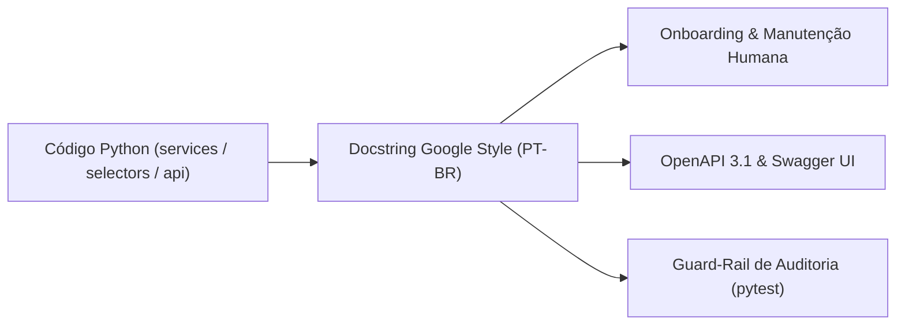

# ADR-021: Padrão de Comentários e Docstrings (Google Style PT-BR)

> **Categoria:** Decisões de Arquitetura (ADR)
> **Status:** Aceito
> **Data:** Julho 2026
> **Decisor:** Rafael
> **Relacionados:** [Padrão de Comentários e Docstrings](../../reference/architecture-standards/commenting-standards.md) · [ADR-006: Service Layer Pattern](006-service-layer.md) · [Convenção de Commits](../../reference/architecture-standards/commit-convention-spec.md)

---

## 1. Contexto e Problema

Com o crescimento do repositório, identificamos inconsistências na documentação do código-fonte:
1. **Mistura de Idiomas e Formatos:** Convivência caótica de docstrings em inglês e português, alternando entre estilos reStructuredText (Sphinx), JSDoc e texto não formatado.
2. **Poluição por Marcadores de Ferramentas:** Presença de comentários com referências explícitas a geradores ou assistentes ("*Generated by Copilot*", "*Bolt Optimization*", "*AI fix*"), gerando ruído e sensação de código descartável.
3. **Ausência de Explicação do "Porquê":** Comentários redundantes que apenas narravam a sintaxe do código (`# itera na lista`), sem esclarecer a regra de negócio subjacente ou a decisão arquitetural.
4. **Falta de Especificação de Exceções e Parâmetros:** Métodos complexos de orquestração financeira sem documentação das exceções lançadas (`Raises:`), dificultando o tratamento de erros nos roteadores.

---

## 2. Decisão

1. **Adoção do Padrão Google Style em Português (PT-BR):** Obrigatório em todos os métodos públicos de `services/`, `selectors/`, `managers.py` e `models/`.
2. **Docstrings Curtas e Semânticas em Endpoints (`api.py`):** O Django Ninja extrai automaticamente a primeira linha da docstring da função para o campo `summary` do OpenAPI/Swagger.
3. **Banimento Estrito de Menções a Ferramentas de IA:** Proibido qualquer referência a nomes de assistentes ou modelos em comentários, docstrings e mensagens de commit.
4. **Foco no "Porquê" (Design Intent):** Comentários inline devem focar exclusivamente em decisões não óbvias, contornos de bugs upstream ou regras de domínio (ex: *tolerância zero financeira*).



---

## 3. Exemplos Reais de Implementação

### 3.1 Método de Domínio na Service Layer (Google Style)

```python
# apps/finances/services/installment_service.py
from decimal import Decimal
from django.db import transaction
from apps.core.exceptions import ValidationError
from apps.finances.models import Installment
from apps.logistics.models import Contract
from apps.tenants.models import Company

class InstallmentService:
    @staticmethod
    @transaction.atomic
    def create_installment(
        company: Company,
        contract: Contract,
        number: int,
        value: Decimal,
        due_date: date,
    ) -> Installment:
        """Cria uma nova parcela financeira vinculada ao contrato logístico.

        Valida as regras de tolerância zero (a soma das parcelas não pode ultrapassar
        o valor total contratado) e previne parcelas com numeração duplicada.

        Args:
            company: Empresa dona do contrato e da operação.
            contract: Instância do contrato logístico associado.
            number: Número ordinal da parcela (ex: 1, 2, 3).
            value: Valor monetário da parcela em reais.
            due_date: Data de vencimento da obrigação financeira.

        Returns:
            Instância de Installment persistida e com status PENDING.

        Raises:
            ValidationError: Se o valor exceder o saldo restante do contrato,
                se a numeração já existir ou se o vencimento for anterior ao contrato.

        Example:
            >>> installment = InstallmentService.create_installment(
            ...     company=user.company,
            ...     contract=contract,
            ...     number=1,
            ...     value=Decimal("1500.00"),
            ...     due_date=date(2026, 12, 1),
            ... )
        """
        # Validação de tolerância zero (BR-FIN03)
        if value <= Decimal("0.00"):
            raise ValidationError("O valor da parcela deve ser estritamente positivo.")

        return Installment.objects.create(
            company=company,
            contract=contract,
            number=number,
            value=value,
            due_date=due_date,
        )
```

---

### 3.2 Query Selector (Google Style)

```python
# apps/logistics/selectors/contract_selectors.py
from django.db.models import QuerySet
from pydantic import UUID4
from apps.core.shortcuts import get_object_or_404_for_tenant
from apps.logistics.models import Contract
from apps.tenants.models import Company

def contract_list_selector(
    company: Company,
    wedding_id: UUID4 | None = None,
    status: str | None = None,
) -> QuerySet[Contract]:
    """Retorna queryset preguiçoso de contratos filtrados por empresa e filtros opcionais.

    Aplica pré-carregamento de relações (select_related) para fornecedor e casamento,
    otimizando o número de queries no banco de dados (prevenção de problema N+1).

    Args:
        company: Empresa proprietária dos contratos.
        wedding_id: UUID opcional do casamento para isolamento por evento.
        status: Status opcional do contrato (ex: 'DRAFT', 'SIGNED', 'CANCELED').

    Returns:
        QuerySet[Contract]: Queryset chainable otimizado para serialização.
    """
    qs = Contract.objects.for_tenant(company).select_related("supplier", "wedding")
    if wedding_id:
        qs = qs.filter(wedding__uuid=wedding_id)
    if status:
        qs = qs.filter(status=status)
    return qs
```

---

### 3.3 Endpoint Django Ninja (`api.py`)

```python
# apps/logistics/api/contracts.py
@contracts_router.post(
    "/upload-url/",
    response={200: ContractUploadUrlOut, **MUTATION_ERROR_RESPONSES},
    operation_id="logistics_contracts_upload_url",
)
def generate_upload_url(
    request: AuthRequest, payload: ContractUploadUrlIn
) -> ContractUploadUrlOut:
    """Gera uma URL pré-assinada para upload direto de arquivo PDF/imagem para o R2/S3."""
    user = request.user
    res = ContractService.generate_upload_url(
        company=user.company,
        filename=payload.filename,
        wedding_id=payload.wedding_id,
    )
    return ContractUploadUrlOut(**res)
```

---

## 4. Guia Rápido: Comentários Bons vs Ruins

| Tipo | ❌ Não Faça (Proibido) | :material-check-circle: Faça (Padronizado) |
| :--- | :--- | :--- |
| **Menção a IA** | `# Copilot fix: corrigindo erro de null pointer` | `# Trata caso de borda quando o casamento não possui orçamento cadastrado` |
| **Narração Óbvia** | `# Incrementa a variável i em 1` | `# Avança o ponteiro do cursor para a próxima página de resultados` |
| **Docstrings de Rota** | `"""Endpoint que recebe um post request e salva."""` | `"""Cria contrato logístico e gera despesa vinculada atomicamente."""` |
| **Idioma** | `"""Creates an installment for the tenant."""` | `"""Cria parcela financeira com validação de tolerância zero."""` |

---

## 5. Consequências

### Positivas :material-check-circle:
- **Documentação OpenAPI Auto-Explicativa:** O Swagger UI reflete fielmente as regras de negócio em português.
- **Auditoria Automatizada no CI:** O teste `backend/apps/core/tests/test_commenting_standards.py` audita o repositório contra palavras-chave proibidas.
- **Redução da Carga Cognitiva:** Novos engenheiros entendem imediatamente os parâmetros e exceções esperadas em cada serviço.

### Negativas / Mitigações :material-alert:
- **Disciplina Contínua de Code Review:** Exige que os revisores humanos e esteiras de lint rejeitem PRs com docstrings incompletas ou fora do padrão.
