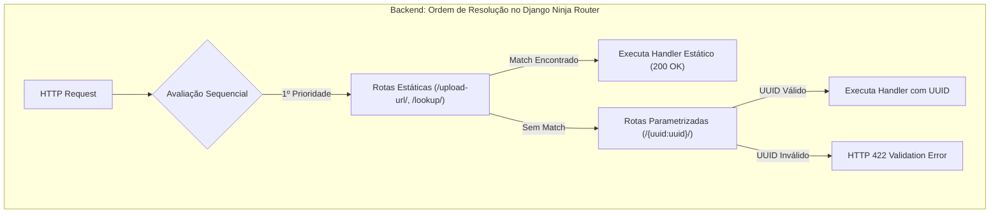

# ADR-022: Otimização de Performance e Ordenação de Rotas Estáticas (Fullstack)

> **Categoria:** Decisões de Arquitetura (ADR)
> **Status:** Aprovado
> **Data:** Fevereiro 2026
> **Decisor:** Rafael
> **Relacionados:** [ADR-013: Migração para Django Ninja](013-migrate-drf-to-ninja.md) · [Referência de API](../../reference/api/index.md) · [Smart vs Dumb Components](../concepts/smart-dumb-components.md)

---

## 1. Contexto e Problema

Identificamos dois gargalos de roteamento e renderização que prejudicavam a performance e a experiência do usuário:

### 1.1 Backend: Colisão de Rotas Dinâmicas no Django Ninja
O Django Ninja avalia os caminhos de rota na **ordem estrita de declaração** no código Python. Quando rotas com parâmetros dinâmicos de caminho (como `/{uuid:uuid}/` ou `/{id}/`) eram declaradas antes de rotas estáticas literais (como `/upload-url/`, `/lookup/`, `/by-month/`), o roteador interceptava as requisições estáticas tentando interpretar palavras como UUIDs, gerando:
- **Erros HTTP 422 Unprocessable Entity:** O validador Pydantic falhava ao converter `"upload-url"` em `UUID4`.
- **Mascaramento de Rotas (Route Shadowing):** Endpoints legítimos ficavam inacessíveis.

### 1.2 Frontend: Sobrecarga de Lazy Loading no SPA
O carregamento de todas as páginas e abas sob demanda com `React.lazy()` e `<Suspense>` gerava:
- **Latência de TTFB:** Cada clique no menu exigia o download de um novo chunk JS da Vercel.
- **Flash de Tela Branca e Spinners Bloqueantes:** O `<Suspense>` desmontava a página anterior, exibindo um spinner centralizado e quebrando a sensação de fluidez do Single Page Application.



---

## 2. Decisão

### 2.1 Backend: Ordenação Mandatória de Rotas Estáticas Antes de Dinâmicas
Em todos os arquivos `api.py` ou módulos sob `apps/*/api/`, os endpoints devem seguir rigorosamente a seguinte convenção de ordem:
1. **Rotas Raiz e Listagens Globais:** `GET /`, `POST /`
2. **Rotas Estáticas e Ações de Coleção:** `POST /upload-url/`, `GET /lookup/`, `GET /by-month/`, `POST /full/`
3. **Rotas Dinâmicas Parametrizadas:** `GET /{uuid:uuid}/`, `PATCH /{uuid:uuid}/`, `DELETE /{uuid:uuid}/`
4. **Sub-rotas Dinâmicas com Ação:** `POST /{uuid:uuid}/upload/`, `POST /{uuid:uuid}/transition-status/`

### 2.2 Frontend: Imports Estáticos para o Fluxo Principal e Skeletons Inline
1. **Imports Estáticos:** Páginas centrais (`DashboardPage`, `WeddingsListPage`, `WeddingDetailPage`, `SchedulerPage`, `SuppliersPage`) e abas do casamento são importadas síncronamente no bundle principal.
2. **Lazy Loading Seletivo:** Restrito a módulos isolados e pesados de terceiros (ex: gerador de PDF) ou rotas raramente acessadas (`ComingSoonPage`, `NotFoundPage`).
3. **Skeletons Inline:** Eliminação de layouts de bloqueio de tela inteira em favor de componentes `<Skeleton>` renderizados no local exato dos dados enquanto o TanStack Query carrega o cache.

---

## 3. Comparativo de Código: Implementação Real

### 3.1 Backend: Ordenação de Rotas em `apps/logistics/api/contracts.py`

#### ❌ Incorreto (Rota Dinâmica Mascara Rota Estática)
```python
# ERRADO: /{uuid}/ declarado antes de /upload-url/
@contracts_router.get("/{uuid:uuid}/", response=ContractOut)
def retrieve_contract(request: AuthRequest, uuid: UUID4):
    ...

# ⚠️ NUNCA SERÁ ALCANÇADO: Requisições POST para /upload-url/ colidem
@contracts_router.post("/upload-url/", response=ContractUploadUrlOut)
def generate_upload_url(request: AuthRequest, payload: ContractUploadUrlIn):
    ...
```

#### :material-check-circle: Correto (Rotas Estáticas Declaradas Primeiro)
```python
# apps/logistics/api/contracts.py (PADRÃO NORMATIVO)
from django.db.models import QuerySet
from ninja_extra import Router
from pydantic import UUID4
from apps.logistics.schemas import (
    ContractIn, ContractOut, ContractPatchIn,
    ContractUploadUrlIn, ContractUploadUrlOut
)

contracts_router = Router(tags=["Logistics"])

# 1. Rota raiz da coleção
@contracts_router.get("/", response=list[ContractOut], operation_id="logistics_contracts_list")
def list_contracts(request: AuthRequest) -> QuerySet:
    ...

# 2. Rotas estáticas literais (Devem vir ANTES das parametrizadas)
@contracts_router.post(
    "/upload-url/",
    response={200: ContractUploadUrlOut},
    operation_id="logistics_contracts_upload_url"
)
def generate_upload_url(request: AuthRequest, payload: ContractUploadUrlIn) -> ContractUploadUrlOut:
    """Gera URL pré-assinada sem colidir com parâmetros de caminho."""
    ...

# 3. Rotas dinâmicas parametrizadas por UUID
@contracts_router.get(
    "/{uuid:uuid}/",
    response={200: ContractOut},
    operation_id="logistics_contracts_read"
)
def retrieve_contract(request: AuthRequest, uuid: UUID4) -> Contract:
    """Busca contrato específico após garantir que não é uma rota estática."""
    ...
```

---

### 3.2 Frontend: Roteamento SPA em `src/AppRoutes.tsx`

```tsx
// frontend/src/AppRoutes.tsx
import { Routes, Route } from "react-router-dom";

// 1. Imports estáticos: fluxo principal instantâneo (0ms de latência)
import { DashboardPage } from "@/features/dashboard/pages/DashboardPage";
import { WeddingsListPage } from "@/features/weddings/pages/WeddingsListPage";
import { WeddingDetailPage } from "@/features/weddings/pages/WeddingDetailPage";
import { LoginPage } from "@/features/auth/pages/LoginPage";

// 2. Lazy loading: apenas telas periféricas e pesadas
import { lazy, Suspense } from "react";
const AdminReportExport = lazy(() => import("@/features/reporting/components/AdminReportExport"));

export function AppRoutes() {
  return (
    <Routes>
      <Route path="/" element={<DashboardPage />} />
      <Route path="/weddings" element={<WeddingsListPage />} />
      <Route path="/weddings/:id/*" element={<WeddingDetailPage />} />
      <Route path="/login" element={<LoginPage />} />
      <Route
        path="/admin/export"
        element={
          <Suspense fallback={<div className="p-4">Carregando módulo...</div>}>
            <AdminReportExport />
          </Suspense>
        }
      />
    </Routes>
  );
}
```

---

## 4. Consequências

### Positivas :material-check-circle:
- **Zero Falsos-Positivos de 422 no Backend:** Rotas como `/presign-upload/`, `/lookup/` e `/by-month/` funcionam com 100% de estabilidade.
- **Navegação Instantânea no Frontend:** Transição de abas e páginas do fluxo central ocorre em 0ms sem flashes de recarregamento.
- **Melhoria nos Índices de Core Web Vitals:** Redução do *Interaction to Next Paint (INP)* e estabilização do *Cumulative Layout Shift (CLS)*.

### Negativas / Mitigações :material-alert:
- **Aumento Marginal do Bundle Inicial:** O pacote JavaScript principal cresceu ~60KB gzipped, totalmente amortizado pelo cache HTTP do navegador.
