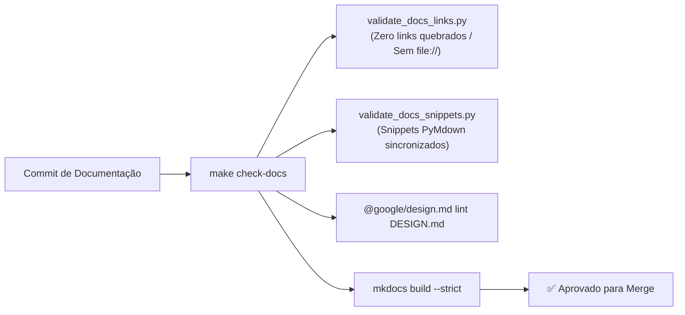

# ADR-028: Adoção do Framework Diatáxis e Padrão de Anotações Atômicas na Documentação

> **Categoria:** Decisões de Arquitetura (ADR)
> **Status:** Aceito
> **Data:** Agosto 2026
> **Decisor:** Rafael
> **Relacionados:** [Padrão de Documentação Diátaxis & Notas Atômicas](../../reference/architecture-standards/documentation-standards.md) · [Como Escrever e Atualizar Docs](../../guides/documentation/write-and-update-docs.md) · [CI/CD Pipelines](../../reference/ci-cd/index.md)

---

## 1. Contexto e Problema

Com o crescimento fullstack da plataforma (Django Ninja, React 19, Orval, Cloudflare R2, Cloud Run, Neon DB, Terraform), a documentação técnica acumulou problemas de sustentabilidade:
1. **Documentos Monolíticos e Desorganizados:** Manuais extensos misturavam tutoriais de instalação, comandos de terminal, diagramas de rede e teoria de domínio em um único arquivo de 1.000 linhas.
2. **Alta Carga Cognitiva:** Engenheiros que precisavam apenas de uma receita rápida de execução de testes precisavam navegar por longas discussões arquiteturais.
3. **Links Quebrados e Desatualização (Code-Drift):** Trechos de código copiados e colados no Markdown ficavam obsoletos após refatorações no backend e frontend.
4. **Alucinações em Agentes de IA:** Contextos inchados e redundantes consumiam tokens excessivos e geravam implementações desalinhadas com o código de produção.

---

## 2. Decisão

Adotamos a combinação formal do **Framework Diatáxis** com a metodologia de **Notas Atômicas (Zettelkasten)**, protegida por **Guard-Rails Automatizados no CI/CD**.

### 2.1 Os 4 Quadrantes Diátaxis

```mermaid
quadrantChart
    title Matriz Diátaxis de Documentação Técnica
    x-axis Teórico (Estudo) --> Prático (Ação)
    y-axis Orientado a Tarefas --> Orientado ao Aprendizado
    quadrant-1 "GUIAS (How-To)
    docs/guides/"
    quadrant-2 "TUTORIAIS (Onboarding)
    docs/onboarding/"
    quadrant-3 "REFERÊNCIA (Specs)
    docs/reference/"
    quadrant-4 "ARQUITETURA (Explicação)
    docs/architecture/"
```

| Quadrante | Diretório | Foco / Objetivo | Estilo de Redação |
| :--- | :--- | :--- | :--- |
| **Onboarding (Tutoriais)** | `docs/onboarding/` | Ensinar iniciantes do zero em um fluxo guiado | Passo a passo, focado na primeira experiência de sucesso. |
| **Guides (How-To)** | `docs/guides/` | Resolver uma tarefa prática e específica do dia a dia | Receitas diretas, comandos e playbooks operacionais. |
| **Reference (Specs)** | `docs/reference/` | Descrever contratos secos, APIs, variáveis e schemas | Tabelas de parâmetros, contratos OpenAPI, módulos IaC. |
| **Architecture (Explicação)** | `docs/architecture/` | Explicar o "porquê", trade-offs e decisões (ADRs) | Conceitos profundos, regras de negócio e diagramas de fluxo. |

---

### 2.2 Regras do Padrão de Anotações Atômicas (Zettelkasten)

1. **Escopo Único (Single Topic):** Cada nota Markdown trata exatamente de **um** conceito, entidade, modelo ou workflow. Se cruzar assuntos, o arquivo deve ser desmembrado.
2. **Cabeçalho Único H1 (`#`):** Cada documento possui estritamente **um único título de nível 1**.
3. **Cabeçalho Padrão de Metadados:**
   ```markdown
   # [Título Claro do Documento]

   > **Categoria:** [Nome do Quadrante / Subpasta]
   > **Relacionados:** [Link para Nota Relacionada](../caminho/outro-doc.md)
   ```
4. **Hubs e Mapas de Conteúdo (MOC):** Todas as notas devem ser registradas no `index.md` de sua pasta e no hub principal [docs/index.md](../../index.md). Documentos órfãos são proibidos.
5. **Transclusão de Código (`--8<--`):** Trechos de código de produção devem ser transcluídos diretamente dos arquivos-fonte usando a extensão PyMdown do MkDocs, prevenindo duplicação e desatualização.

---

## 3. Guard-Rails Automatizados no CI/CD



1. **`validate_docs_links.py`:** Varre todos os arquivos Markdown checando:
   - Inexistência de Wikilinks residuais `[[...]]`.
   - Inexistência de links de máquina local (`file://`).
   - Existência real dos arquivos alvo em todos os links Markdown relativos.
2. **`validate_docs_snippets.py`:** Valida se todas as transclusões `--8<--` apontam para arquivos e tags semânticas existentes no código.
3. **`mkdocs build --strict`:** Garante que a documentação compila sem nenhum aviso (*warning*) do MkDocs Material.

---

## 4. Consequências

### Positivas :material-check-circle:
- **Zero Documentação Obsoleta:** O CI bloqueia PRs se qualquer snippet transcluído ou link relativo quebrar.
- **Navegação Intuitiva:** Desenvolvedores sabem exatamente em qual pasta buscar tutoriais (`onboarding`), receitas (`guides`), contratos (`reference`) ou decisões (`architecture`).
- **Eficiência de Contexto para Agentes:** Subagentes leem notas atômicas cirúrgicas de 50-150 linhas em vez de arquivos monolíticos, aumentando a precisão do código gerado.

### Negativas / Mitigações :material-alert:
- **Múltiplos Arquivos Pequenos:** A estrutura granular exige o uso consistente dos mapas de conteúdo (`index.md`) e busca por texto na IDE.
