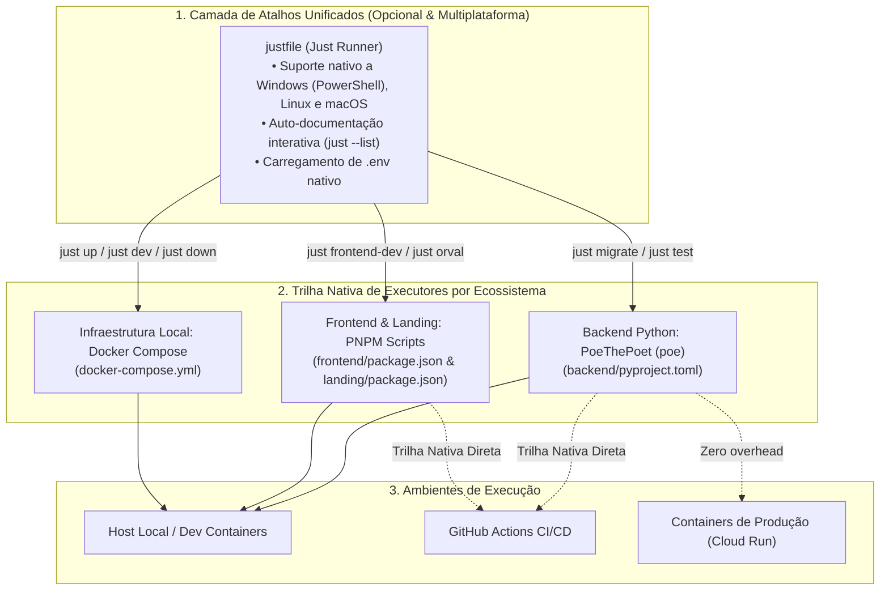

# ADR-029: Adoção do Just como Task Runner Moderno e Padronização de Scripts Multiplataforma

> **Categoria:** Decisões de Arquitetura (ADR)
> **Status:** Aceito
> **Data:** Setembro 2026
> **Decisor:** Rafael
> **Relacionados:** [Guia do Task Runner Just & Trilha Nativa](../../guides/dev-environment/task-runner-just.md) · [Setup do Ambiente Local](../../guides/dev-environment/setup-local-environment.md) · [Pipeline de CI/CD](../concepts/ci-cd-pipeline-flow.md) · [ADR-028: Diátaxis & Notas Atômicas](028-diataxis-atomic-notes.md)

---

## 1. Contexto e Problema

Com a evolução da arquitetura fullstack do **Wedding Management System** (Django Ninja, React 19, Astro, PostgreSQL Neon, Docker Compose e Terraform), o ferramental de automação local acumulou desafios críticos de manutenibilidade e portabilidade:

1. **Incompatibilidade Crônica com Windows:** O `Makefile` legado dependia fortemente de sintaxe específica de shells Unix (`bash`, `sh`), pipes complexos (`|`), variáveis de ambiente inline (`FOO=bar cmd`) e comandos como `grep`, `sed` ou `mkdir -p`. No Windows (PowerShell/CMD), a execução falhava sistematicamente, exigindo que desenvolvedores configurassem ambientes pesados de emulação (WSL2 ou MSYS2/Git Bash) apenas para rodar comandos básicos de desenvolvimento.
2. **Débito Técnico e Acúmulo de Código Shell:** A automação anterior ultrapassava **350 linhas de código** em scripts de automação, com subshells encadeados (`$(...)`), manipulações de strings frágeis e regras de escape complexas que dificultavam a manutenção contínua.
3. **Acoplamento Indevido de Ferramentas:** Os comandos do `Makefile` ocultavam os executores reais por trás de camadas de abstração opacas, dificultando a execução direta de tarefas caso o desenvolvedor não tivesse o utilitário `make` instalado em sua máquina ou ao depurar falhas em ambientes de CI e containers de produção.
4. **Assimetria entre Backend e Frontend:** Enquanto o ecossistema frontend possuía comandos padronizados e declarativos via `package.json` (`pnpm run dev`, `pnpm test`, `pnpm build`), o backend Python dependia de chamadas manuais e longas do Django `manage.py` ou do `pytest` espalhadas no Makefile.

---

## 2. Decisão

Adotamos uma estratégia unificada de automação e atalhos de desenvolvimento baseada em três pilares:



### 2.1 Adoção do Just (`justfile`) como Task Runner Oficial
- O **[Just](https://github.com/casey/just)** passa a ser o orquestrador canônico de tarefas e atalhos na raiz do repositório.
- **Portabilidade de Primeira Classe:** O `justfile` é configurado com:
  ```just
  set dotenv-load := true
  set windows-shell := ["powershell.exe", "-NoLogo", "-Command"]
  ```
  Isso garante que comandos rodem nativamente no Windows via PowerShell sem necessidade de WSL, e em Linux/macOS via shell padrão do sistema operacional.
- **Auto-documentação e Simplicidade:** Executar `just` ou `just --list` exibe instantaneamente o menu categorizado de tarefas com descrições claras e argumentos documentados.

### 2.2 Padronização do Backend com PoeThePoet (`poethepoet`)
- Adotamos o `poethepoet` no `backend/pyproject.toml` (`[tool.poe.tasks]`), conferindo ao backend Python a mesma ergonomia de scripts declarativos presente no `package.json` do Node.js.
- Tarefas como `migrate`, `makemigrations`, `superuser`, `test`, `test-cov`, `lint`, `format`, `mypy`, `seed-db` e `openapi` são declaradas centralizadamente no `pyproject.toml` e invocadas via `uv run poe <task>`.

### 2.3 Garantia de Paridade com a Trilha Nativa Direta
- O `justfile` atua estritamente como **camada fina de atalhos de conveniência**. Todas as tarefas mapeadas no `justfile` delegam diretamente para os comandos nativos das ferramentas subjacentes (`docker compose`, `uv run poe`, `pnpm`).
- **Nenhum desenvolvedor ou pipeline de CI/CD é obrigado a ter o `just` instalado:** a equipe e as esteiras automatizadas possuem total autonomia para invocar a **Trilha Nativa Direta**.

---

## 3. Matriz de Comparação e Equivalência

| Domínio de Execução | Atalho Just (`justfile`) | Trilha Nativa Direta (Sem Just) |
| :--- | :--- | :--- |
| **Ambiente Local** | `just up` | `docker compose up -d backend` |
| **Logs Interativos** | `just dev` | `docker compose up -d backend && docker compose logs -f backend db` |
| **Parar Serviços** | `just down` | `docker compose down` |
| **Reset de Banco** | `just db-reset` | `docker compose down -v db && docker compose up -d backend && docker compose exec backend uv run poe migrate` |
| **Migrações Django** | `just migrate` | `docker compose exec backend uv run poe migrate` |
| **Testes Backend** | `just test` | `docker compose exec backend uv run poe test` |
| **Cobertura Backend** | `just test-cov` | `docker compose exec backend uv run poe test-cov` |
| **Lint & Formatação** | `just format` | `docker compose exec backend uv run poe format` |
| **Frontend Dev** | `just frontend-dev` | `cd frontend && pnpm run dev` |
| **Landing Page Dev** | `just landing-dev` | `cd landing && pnpm run dev` |
| **Sync API & Orval** | `just sync-api` | `docker compose exec backend uv run poe openapi && mv backend/openapi.json openapi.json && cd frontend && pnpm run generate:api` |
| **Testes Frontend** | `just frontend-test` | `cd frontend && pnpm test` |
| **Gate Completo CI** | `just check-ci` | Execução sequencial dos comandos nativos de validação |

---

## 4. Consequências

### Positivas :material-check-circle:
- **Redução de 85% de Código de Automação:** Eliminação de centenas de linhas de shell script imperativo frágil, substituídas por receitas declarativas diretas e enxutas.
- **Paridade Multiplataforma Total:** Engenheiros em Windows, macOS e Linux compartilham exatamente a mesma experiência de desenvolvimento e os mesmos comandos.
- **Zero Overhead em Produção e CI:** A imagem Docker de produção e os workflows do GitHub Actions não necessitam do binário do `just`, pois utilizam os comandos nativos padronizados (`uv run poe` e `pnpm`).
- **Desacoplamento e Manutenibilidade:** Cada ecossistema gerencia suas próprias tarefas de forma isolada (`backend/pyproject.toml` para Python e `frontend/package.json` para Node.js).

### Negativas / Mitigações :material-alert:
- **Ferramenta Adicional no Host (Opcional):** Para utilizar os atalhos unificados do `just`, o desenvolvedor precisa instalar o binário localmente.
  - *Mitigação:* A instalação do `just` é trivial e suportada por todos os gerenciadores de pacotes populares (`winget`, `scoop`, `brew`, `apt`, `pacman` ou `uv tool install rust-just`). Caso o desenvolvedor opte por não instalar, a Trilha Nativa Direta continua 100% suportada e documentada.
