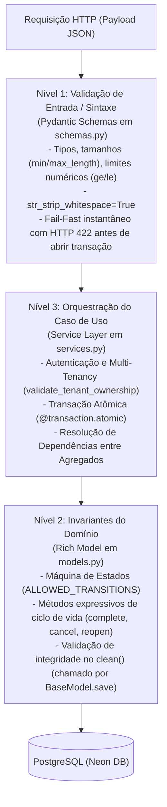

# ADR-030: Rich Domain Model (Active Record Rico) e Service Layer como Casos de Uso

**Status:** Aceito
**Data:** Setembro 2026
**Decisor:** Rafael
**Contexto:** Evolução do padrão de Service Layer e modelo anêmico para Rich Domain Model (Active Record Rico), estabelecendo 3 níveis formais de validação e diretriz pragmática de documentação.

---

## Contexto e Problema

Historicamente, a [ADR-006](006-service-layer.md) estabeleceu a **Service Layer** no backend para combater serializers inchados (*Fat Serializers*). Como consequência, a arquitetura concentrou praticamente 100% da lógica de negócio e validações nos serviços, tornando os modelos do Django meros esquemas de dados de banco (*Anemic Domain Model*).

Essa concentração excessiva causou novos problemas estruturais à medida que a aplicação cresceu:

1. **Entidades Desprotegidas:** Qualquer mutação fora do serviço específico (ex.: scripts de migração, comandos de console, tarefas assíncronas ou Django Admin) podia alterar o estado de entidades para combinações matematicamente ou logicamente inválidas (ex.: concluir um evento no futuro).
2. **Services Inchados e Procedurais:** Services ultrapassaram 400 a 700 linhas de código, misturando validação de tipos primitivos (`if len(str) == 0`), máquinas de estado internas, transações de banco e efeitos colaterais.
3. **Fragilidade na Documentação:** A transclusão exaustiva de trechos de código com faixas numéricas de linha (sintaxe de snippet `:start:end`) gerava quebras e alto custo de manutenção a cada refatoração.

---

## Decisão

Adotamos a transição incremental para o padrão **Rich Domain Model (Rich Active Record)** no Django monólito, estruturando o processamento de dados e validações em **3 Níveis Formais**:

### 1. Separação em 3 Níveis de Validação

| Nível | Responsabilidade | Onde Reside | Comportamento em Falha |
| :--- | :--- | :--- | :--- |
| **Nível 1: Entrada / Sintaxe** | Formato, tipos primitivos, limites de caracteres e números | **Pydantic Schemas (`schemas.py`)** | HTTP `422 Unprocessable Entity` (`validation_error`) emitido na borda da API. |
| **Nível 2: Invariantes de Domínio** | Regras intrínsecas da entidade, ciclo de vida e transições de estado | **Django Models (`models.py`)** | `BusinessRuleViolation` ou `ValidationError` impedindo persistência. |
| **Nível 3: Caso de Uso / Orquestração** | Multi-tenancy, limites transacionais atômicos, agregação e I/O externo | **Service Layer (`services.py`)** | `ObjectNotFoundError` (404), `DomainIntegrityError` (409) ou `BusinessRuleViolation` (422). |

### 2. O Padrão Rich Active Record no Django

No ecossistema Django, os modelos continuam herdando de `BaseModel` / `TenantModel`. A entidade passa a conter métodos expressivos que alteram seu próprio estado em vez de expor atributos para mutação cega externa:

- Métodos canônicos: `instance.complete()`, `instance.cancel()`, `instance.reopen()`, `instance.transition_to(target)`.
- Propriedades de conveniência: `is_completed`, `is_canceled`, `is_in_progress`, `is_past`, `days_until`.
- O método `clean()` atua como a última linha de defesa, garantindo que estados ilegais sejam bloqueados mesmo se houver atribuição direta de atributos antes do `save()`.

### 3. Diretriz Pragmática de Documentação (Desacoplamento de Linhas de Código)

Para mitigar a fragilidade apontada na [ADR-028](028-diataxis-atomic-notes.md), formalizamos que:
- Documentos de Arquitetura e Regras de Negócio devem documentar o **comportamento, as regras, fórmulas e diagramas de estado**.
- Não devem ser utilizadas transclusões com faixas numéricas de linha (evitar faixas `:start:end`).
- O código-fonte real deve ser referenciado via **links diretos para os arquivos e símbolos** (ex.: `[Wedding.clean()](../../../backend/apps/weddings/models.py)`), acompanhado de pequenos exemplos canônicos em blocos Markdown padrão quando necessário.

---

## Consequências

### Positivas :material-check-circle:
- **Entidades Invioláveis:** Nenhum registro pode ser salvo em estado inconsistente em nenhum ponto do sistema.
- **Services Focados e Enxutos:** Redução estimada de 25% a 40% nas linhas dos maiores services, eliminando checagens primitivas e lógicas procedurais.
- **Fail-Fast Eficiente:** Erros sintáticos de entrada são barrados pelo Pydantic antes de abrir conexões de banco de dados e transações.
- **Testabilidade Acelerada:** Regras de domínio podem ser testadas em memória pura sem tocar no banco de dados.
- **Manutenção Sustentável da Documentação:** Refatorações de código não quebram referências documentais nem exigem recontagem de linhas.

### Negativas / Mitigações :material-alert:
- **Curva de Adoção:** Requer disciplina do time para não voltar a colocar lógica intrínseca nos services nem I/O nos models.
- **Migração Incremental:** Adoção módulo a módulo (iniciando por `weddings`, seguido por `logistics` e `finances`).

---

## Referências

- [ADR-006: Service Layer Pattern](006-service-layer.md)
- [ADR-011: BaseModel save() com full_clean()](011-basemodel-save-full-clean.md)
- [ADR-028: Diátaxis e Anotações Atômicas](028-diataxis-atomic-notes.md)
- [Padrão Service Layer](../concepts/service-layer-pattern.md)
- [Ciclo de Vida do Casamento](../business-rules/weddings/wedding-status-lifecycle.md)
