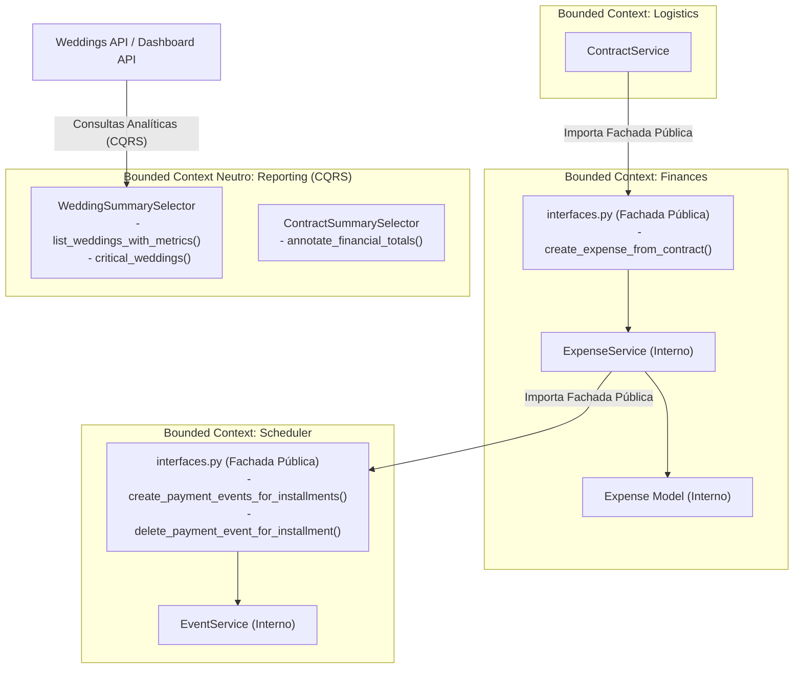

# ADR-031: Comunicação Entre Módulos com DDD Pragmático, Interfaces Públicas e CQRS Reporting

> **Categoria:** Decisões de Arquitetura (ADR)
> **Status:** 🟢 Vigente
> **Data:** Setembro 2026
> **Decisor:** Rafael
> **Relacionados:** [ADR-006: Service Layer Pattern](006-service-layer.md) · [ADR-016: Pragmatic Multi-Tenancy](016-pragmatic-multi-tenancy.md) · [ADR-017: Infraestrutura de Tarefas Assíncronas](017-async-task-infrastructure.md) · [ADR-023: Desacoplamento dos Módulos Core e Extração do Módulo Reporting](023-desacoplamento-modulos-scheduler-finances-weddings.md) · [ADR-030: Rich Domain Model e Service Layer](030-rich-domain-model-service-layer.md)

---

## 1. Contexto e Problema

À medida que o sistema evoluiu como monólito modular, as fronteiras entre os Bounded Contexts principais (`weddings`, `finances`, `logistics`, `scheduler` e `reporting`) começaram a apresentar acoplamentos indesejados:

1. **Vazamento de Modelos Internos:** Serviços de um módulo importavam diretamente modelos (`models.py`) ou serviços (`services.py`) de outros domínios (por exemplo, `ContractService` de logística importando `ExpenseService` e `Installment` de finanças, e `InstallmentService` manipulando instâncias de `SchedulerEvent` diretamente).
2. **Subqueries Cruzadas em Managers de Domínio:** O manager `WeddingQuerySet` continha métodos como `with_metrics()` e `with_critical_metrics()` que executavam subqueries SQL diretas em tabelas de `finances_expense`, `finances_installment` e `scheduler_task`. De forma análoga, `ContractQuerySet.with_totals()` realizava subqueries em despesas e parcelas. Isso violava o princípio de responsabilidade única dos agregados.
3. **Efeitos Colaterais Procedurais e Síncronos:** Operações de ciclo de vida (como o cancelamento de casamentos em `WeddingService.cancel()`) disparavam mutações síncronas imediatas e dispersas em outros domínios sem garantia clara de isolamento transacional.
4. **Ausência de Quality Gate Arquitetural:** Não existia uma ferramenta automatizada no CI/CD capaz de detectar e bloquear importações diretas indevidas entre módulos.

---

## 2. Decisão

Adotamos a arquitetura de **Domain-Driven Design (DDD) Pragmático** para monólito modular, estruturada em **cinco pilares**:



### 2.1 Pilar 1: Fachadas Públicas Síncronas (`interfaces.py`)

- Cada Bounded Context que disponibiliza operações para outros módulos expõe um arquivo `interfaces.py` na raiz do respectivo app (`apps.<contexto>.interfaces`).
- **Regra de Ouro:** É **estritamente proibido** importar `models.py`, `services.py` ou `managers.py` de outro Bounded Context. Toda interação transacional entre módulos DEVE passar exclusivamente pelas funções de alto nível em `interfaces.py`.
- **Reutilização de Contratos:** Para evitar a proliferação de DTOs redundantes, as interfaces reutilizam os esquemas Pydantic existentes (`schemas.py`) ou tipos nativos/UUIDs.

### 2.2 Pilar 2: Tarefas Assíncronas Pós-Commit (`django.tasks`)

- Operações que disparam efeitos colaterais secundários, notificações ou limpeza de recursos não essenciais à confirmação transacional imediata são orquestradas por **tarefas coordenadoras assíncronas**.
- As tarefas são enfileiradas estritamente após a confirmação da transação no banco através do hook do Django:
  ```python
  transaction.on_commit(
      lambda: on_wedding_canceled_task.enqueue(company.id, str(instance.uuid))
  )
  ```
- Isso elimina o risco de efeitos colaterais órfãos caso a transação de banco sofra rollback, além de evitar locks distribuídos.

### 2.3 Pilar 3: CQRS e Agregação Analítica Neutra (`apps/reporting`)

- Adotamos formalmente a **Opção B (Reporting CQRS)**:
  - Os managers de domínio (`WeddingQuerySet`, `ContractQuerySet`) foram expurgados de subqueries e anotações financeiras/agenda. Eles operam estritamente sobre suas próprias tabelas e invariantes.
  - As leituras compostas que agregam múltiplos domínios (como listagem de casamentos com contagem de tarefas atrasadas e parcelas pendentes) residem no app neutro `apps/reporting/selectors/summaries/` (`WeddingSummarySelector`, `ContractSummarySelector`).
  - O endpoint da API em `apps/weddings/api.py` delega a rota `GET /api/v1/weddings/` ao `WeddingSummarySelector.list_weddings_with_metrics`.

### 2.4 Pilar 4: Barreira de Proteção com Import Linter

Configuramos o `import-linter` em `backend/pyproject.toml` com oito contratos estritos de isolamento de Bounded Contexts e pureza arquitetural:

1. **Contratos 1 a 5 (`forbidden` — Domínios de Negócio):** Isolamento mútuo entre `apps.finances`, `apps.logistics`, `apps.scheduler`, `apps.weddings` e `apps.notifications`. Qualquer importação direta de modelos, serviços ou rotas alheias quebra imediatamente o linter. As únicas exceções autorizadas são as fachadas públicas (`interfaces.py`) e DTOs tipados.
2. **Contrato 6 (`forbidden` — Isolamento de Tenants):** `apps.tenants` atua no nível fundacional da arquitetura e é proibido de importar qualquer módulo de negócio (`finances`, `logistics`, `scheduler`, `weddings`, `notifications`, `reporting`).
3. **Contrato 7 (`forbidden` — Isolamento de Users):** `apps.users` atua estritamente na autenticação e gestão de contas, sendo proibido de importar modelos ou serviços de negócio.
4. **Contrato 8 (`forbidden` — Pureza CQRS de Reporting):** O módulo analítico `apps.reporting` é estritamente de leitura (CQRS Query Side) e não pode importar `services` de mutação de nenhum domínio, preservando a imutabilidade e separação de comandos e consultas.

### 2.5 Pilar 5: Quality Gate Integrado ao Pipeline

- Comando no Poe: `poe lint-imports` (executando `lint-imports --no-cache`).
- Comando no Justfile: `just lint-imports`.
- Macro unificado de qualidade: `poe check` (`lint`, `mypy`, `lint-imports`, `test`, `openapi`).
- Step no GitHub Actions: `Import Linter Architectural Guard` no job `lint-and-typecheck`.

---

## 3. Alternativas Rejeitadas

| Alternativa | Motivo da Rejeição |
| :--- | :--- |
| **Opção A (Métricas em weddings/selectors.py)** | Manteria o domínio de casamentos acoplado a modelos de finanças e scheduler para leituras analíticas, violando o princípio de domínio puro. |
| **Domain Events via Event Bus em Memória / Signals** | Signals síncronos dificultam o rastreamento do fluxo, ofuscam erros de transação e violam os guard-rails de código explícito do projeto. |
| **Microserviços / Bancos Separados por Domínio** | Overhead operacional massivo, complexidade de rede desnecessária e custo de infraestrutura desproporcional para o estágio do produto. O monólito modular com contratos estritos oferece o isolamento necessário sem a complexidade de microsserviços. |

---

## 4. Consequências

### Positivas
- **Isolamento Robusto:** Alterações nos modelos ou serviços internos de um módulo não causam efeitos cascata em outros módulos.
- **Domínios Puros:** Os managers de casamentos e logística não realizam mais subqueries em tabelas financeiras ou de agenda.
- **Segurança Transacional:** Efeitos colaterais complexos rodam pós-commit de forma assíncrona, com garantias de retry e sem risco de inconsistência no banco principal.
- **Governança Automatizada:** O CI/CD impede que novos acoplamentos sejam introduzidos acidentalmente.

### Negativas e Mitigações
- **Custo Marginal de Fachadas:** Sempre que um módulo precisar interagir com outro, uma função explícita deve ser exposta em `interfaces.py`. *Mitigação:* As interfaces são simples, focadas em casos de uso reais e reutilizam schemas existentes sem duplicação.
- **Manutenção de Contratos no Linter:** Novas integrações entre módulos exigem atualização controlada de `ignore_imports`. *Mitigação:* O processo é explícito e auditável via revisão de PR.

---

## 5. Referências

- [ADR-006: Service Layer Pattern](006-service-layer.md)
- [ADR-016: Pragmatic Multi-Tenancy](016-pragmatic-multi-tenancy.md)
- [ADR-017: Infraestrutura de Tarefas Assíncronas](017-async-task-infrastructure.md)
- [ADR-023: Desacoplamento dos Módulos Core e Extração do Módulo Reporting](023-desacoplamento-modulos-scheduler-finances-weddings.md)
- [ADR-030: Rich Domain Model e Service Layer](030-rich-domain-model-service-layer.md)
