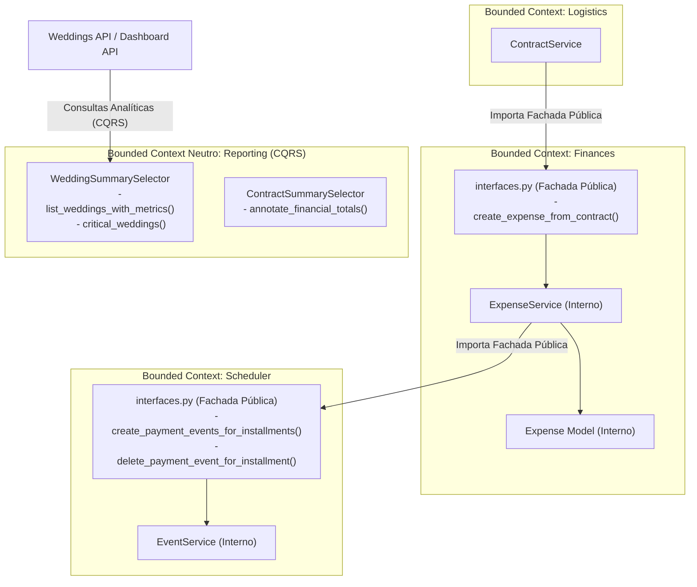

# ADR-031: Comunicação Entre Módulos com DDD Pragmático, Interfaces Públicas e CQRS Reporting

> **Categoria:** Decisões de Arquitetura (ADR)
> **Status:** 🟢 Vigente
> **Data:** Setembro 2026
> **Decisor:** Rafael
> **Relacionados:** [ADR-006: Service Layer Pattern](006-service-layer.md) · [ADR-016: Pragmatic Multi-Tenancy](016-pragmatic-multi-tenancy.md) · [ADR-017: Infraestrutura de Tarefas Assíncronas](017-async-task-infrastructure.md) · [ADR-023: Desacoplamento dos Módulos Core e Extração do Módulo Reporting](023-desacoplamento-modulos-scheduler-finances-weddings.md) · [ADR-030: Rich Domain Model e Service Layer](030-rich-domain-model-service-layer.md)

---

## 1. Contexto e Problema

À medida que o sistema evoluiu como monólito modular, as fronteiras entre os Bounded Contexts principais (`weddings`, `finances`, `logistics`, `scheduler` e `reporting`) começaram a apresentar acoplamentos indesejados:

1. **Vazamento de Modelos Internos:** Serviços de um módulo importavam diretamente modelos (`models.py`) ou serviços (`services.py`) de outros domínios (por exemplo, `ContractService` de logística importando `ExpenseService` e `Installment` de finanças, e `InstallmentService` manipulando instâncias de `SchedulerEvent` diretamente).
2. **Subqueries Cruzadas em Managers de Domínio:** O manager `WeddingQuerySet` continha métodos como `with_metrics()` e `with_critical_metrics()` que executavam subqueries SQL diretas em tabelas de `finances_expense`, `finances_installment` e `scheduler_task`. De forma análoga, `ContractQuerySet.with_totals()` realizava subqueries em despesas e parcelas. Isso violava o princípio de responsabilidade única dos agregados.
3. **Efeitos Colaterais Procedurais e Síncronos:** Operações de ciclo de vida (como o cancelamento de casamentos em `WeddingService.cancel()`) disparavam mutações síncronas imediatas e dispersas em outros domínios sem garantia clara de isolamento transacional.
4. **Ausência de Quality Gate Arquitetural:** Não existia uma ferramenta automatizada no CI/CD capaz de detectar e bloquear importações diretas indevidas entre módulos.

---

## 2. Decisão

Adotamos a arquitetura de **Domain-Driven Design (DDD) Pragmático** para monólito modular, estruturada em **cinco pilares**:


```mermaid
flowchart TD
    subgraph BoundedContextA["Bounded Context: Logistics"]
        CS["ContractService"]
    end

    subgraph BoundedContextB["Bounded Context: Finances"]
        FI["interfaces.py (Fachada Pública)
        - create_expense_from_contract()"]
        ES["ExpenseService (Interno)"]
        EM["Expense Model (Interno)"]
    end

    subgraph BoundedContextC["Bounded Context: Scheduler"]
        SI["interfaces.py (Fachada Pública)
        - create_payment_events_for_installments()
        - delete_payment_event_for_installment()"]
        SS["EventService (Interno)"]
    end

    subgraph ReportingApp["Bounded Context Neutro: Reporting (CQRS)"]
        WSS["WeddingSummarySelector
        - list_weddings_with_metrics()
        - critical_weddings()"]
        CSS["ContractSummarySelector
        - annotate_financial_totals()"]
    end

    CS -->|"Importa Fachada Pública"| FI
    FI --> ES
    ES --> EM
    ES -->|"Importa Fachada Pública"| SI
    SI --> SS

    API["Weddings API / Dashboard API"] -->|"Consultas Analíticas (CQRS)"| WSS
```

### 2.1 Pilar 1: Fachadas Públicas Síncronas (`interfaces.py`)

- Cada Bounded Context que disponibiliza operações para outros módulos expõe um arquivo `interfaces.py` na raiz do respectivo app (`apps.<contexto>.interfaces`).
- **Regra de Ouro:** É **estritamente proibido** importar `models.py`, `services.py` ou `managers.py` de outro Bounded Context. Toda interação transacional entre módulos DEVE passar exclusivamente pelas funções de alto nível em `interfaces.py`.
- **Reutilização de Contratos:** Para evitar a proliferação de DTOs redundantes, as interfaces reutilizam os esquemas Pydantic existentes (`schemas.py`) ou tipos nativos/UUIDs.
- **Gestão Unificada de Contratos de Assessoria:** O contrato de honorários da assessoria é unificado na entidade `Contract` com discriminador `contract_type="PLANNER"` dentro de `apps.contracts`. Todo acesso a partir de `apps.weddings` ocorre compulsoriamente via `apps.contracts.interfaces` (`get_planner_contract_for_wedding`, `save_planner_contract_for_wedding`, `ensure_planner_contract_signed`). É terminantemente proibido importar `Contract` em `apps.weddings`, assegurado por `tach check`.
- **Fonte da Verdade de Clientes (SSOT):** O módulo `apps.clients` é a autoridade central (SSOT) para dados cadastrais de pessoas físicas (`Client`). A ligação associativa com o evento ocorre via `WeddingClient` em `apps.weddings`, que armazena os papéis operacionais (`RoleChoices`) e o indicador de signatário principal (`is_primary_signatory`). A criação ou consulta de clientes na proposta ocorre via `apps.clients.interfaces.get_or_create_client_for_proposal`.

### 2.2 Pilar 2: Tarefas Assíncronas Pós-Commit (`django.tasks` via `interfaces.py`)

- **Descarte do Event Bus Genérico (EDA):** Descartamos formalmente qualquer barramento genérico de eventos EDA (`Event Bus`, signals em memória ou arquivos `events.py` genéricos). Efeitos colaterais secundários, notificações ou limpeza de recursos não essenciais à confirmação transacional imediata são orquestrados por **tarefas assíncronas coordenadas (`django.tasks`)**.
- As tarefas são enfileiradas estritamente após a confirmação da transação no banco através do hook do Django, encapsuladas em funções nas fachadas públicas:
  ```python
  transaction.on_commit(
      lambda: on_wedding_canceled_task.enqueue(company.id, str(instance.uuid))
  )
  ```
- Isso elimina o risco de efeitos colaterais órfãos caso a transação de banco sofra rollback, além de evitar locks distribuídos e indireção excessiva.

### 2.3 Pilar 3: CQRS e Agregação Analítica Neutra (`apps/reporting`)

- Adotamos formalmente a **Opção B (Reporting CQRS)**:
  - Os managers de domínio (`WeddingQuerySet`, `ContractQuerySet`) foram expurgados de subqueries e anotações financeiras/agenda. Eles operam estritamente sobre suas próprias tabelas e invariantes.
  - As leituras compostas que agregam múltiplos domínios (como listagem de casamentos com contagem de tarefas atrasadas e parcelas pendentes) residem no app neutro `apps/reporting/selectors/summaries/` (`WeddingSummarySelector`, `ContractSummarySelector`).
  - O endpoint da API em `apps/weddings/api.py` delega a rota `GET /api/v1/weddings/` ao `WeddingSummarySelector.list_weddings_with_metrics`.

### 2.4 Pilar 4: Barreira de Proteção Arquitetural com Tach

Substituímos o legado `import-linter` pelo **Tach** (linter arquitetural de alta performance baseado em Rust), eliminando centenas de linhas de boilerplate burocrático e supressões manuais (`ignore_imports`).

A governança é declarada de forma declarativa e canônica em `backend/tach.toml`:
1. **Fronteiras e Dependências (`[[modules]]`):** Cada Bounded Context é definido como módulo (`apps.core`, `apps.tenants`, `apps.users`, `apps.clients`, `apps.weddings`, `apps.finances`, `apps.contracts`, `apps.suppliers`, `apps.logistics`, `apps.scheduler`, `apps.notifications`, `apps.reporting`). A opção `exact = true` garante que dependências não declaradas ou declaradas em excesso quebrem imediatamente a validação.
2. **Fachadas Públicas e Shared Kernel (`[[interfaces]]`):** O módulo exportador declara os caminhos expostos (`interfaces.*`, `schemas.*`). A entidade `Wedding` (`apps.weddings.models.Wedding`) atua como Shared Kernel explícito para integridade relacional multitenant.
3. **Controle Estrito de Visibilidade (`visibility`):** Acesso analítico a modelos internos é restrito exclusivamente ao módulo neutro `apps.reporting` (`visibility = ["apps.reporting"]`), e o registro de rotas HTTP é exposto exclusivamente ao gateway `config` (`visibility = ["config"]`).
4. **Encapsulamento de Background Tasks:** Nenhuma tarefa assíncrona (`tasks.py`) é importada diretamente entre módulos; todo disparo ou agendamento é encapsulado em funções de fachada de alto nível (`enqueue_*`) em `interfaces.py`, garantindo execução pós-commit via `transaction.on_commit`.

### 2.5 Pilar 5: Quality Gate Integrado ao Pipeline

- Comando no Poe: `poe lint-imports` e `poe check-arch` (executando `tach check`).
- Comando no Justfile: `just lint-imports` e `just arch`.
- Macro unificado de qualidade: `poe check` (`lint`, `mypy`, `lint-imports`, `test`, `openapi`).
- Step no GitHub Actions: `uv run poe lint-imports` no job de validação de PR.

---

## 3. Alternativas Rejeitadas

| Alternativa | Motivo da Rejeição |
| :--- | :--- |
| **Opção A (Métricas em weddings/selectors.py)** | Manteria o domínio de casamentos acoplado a modelos de finanças e scheduler para leituras analíticas, violando o princípio de domínio puro. |
| **Barramento Genérico de Eventos (Event Bus EDA / Signals)** | Adiciona sobrecarga cognitiva, indireção excessiva e dificulta rastreabilidade de erros em transações. Foi substituído por tarefas explícitas do Django (`django.tasks`) orquestradas pós-commit (`transaction.on_commit`) via fachadas `interfaces.py`. |
| **Microserviços / Bancos Separados por Domínio** | Overhead operacional massivo, complexidade de rede desnecessária e custo de infraestrutura desproporcional para o estágio do produto. O monólito modular com contratos estritos oferece o isolamento necessário sem a complexidade de microsserviços. |
| **Import Linter Legado** | Lento em repositórios médios/grandes, regras duplicadas e verbosas sem tipagem rica e dependência excessiva de listas manuais de `ignore_imports` suscetíveis a drift. |

---

## 4. Consequências

### Positivas
- **Isolamento Robusto:** Alterações nos modelos ou serviços internos de um módulo não causam efeitos cascata em outros módulos.
- **Domínios Puros:** Os managers de casamentos e logística não realizam mais subqueries em tabelas financeiras ou de agenda.
- **Segurança Transacional:** Efeitos colaterais complexos rodam pós-commit de forma assíncrona através de fachadas públicas (`enqueue_*`), sem risco de locks ou inconsistência por rollback.
- **Governança de Alta Velocidade:** `tach check` valida toda a arquitetura em milissegundos no CI/CD e no ambiente local via motor em Rust.
- **Eliminação de Código Morto:** Interfaces públicas e schemas representam a única via de entrada, eliminando métodos órfãos ou duplicações legadas (como `ContractService` unificado em `apps.contracts`).

### Negativas e Mitigações
- **Custo Marginal de Fachadas:** Sempre que um módulo precisar interagir com outro, uma função explícita deve ser exposta em `interfaces.py`. *Mitigação:* As interfaces são simples, focadas em casos de uso reais e reutilizam schemas existentes sem duplicação.
- **Manutenção de tach.toml:** Novos fluxos entre módulos exigem atualização das regras em `tach.toml`. *Mitigação:* O formato TOML com `exact = true` é simples, visual e totalmente autovalidado.

---

## 5. Referências

- [ADR-006: Service Layer Pattern](006-service-layer.md)
- [ADR-016: Pragmatic Multi-Tenancy](016-pragmatic-multi-tenancy.md)
- [ADR-017: Infraestrutura de Tarefas Assíncronas](017-async-task-infrastructure.md)
- [ADR-023: Desacoplamento dos Módulos Core e Extração do Módulo Reporting](023-desacoplamento-modulos-scheduler-finances-weddings.md)
- [ADR-030: Rich Domain Model e Service Layer](030-rich-domain-model-service-layer.md)
