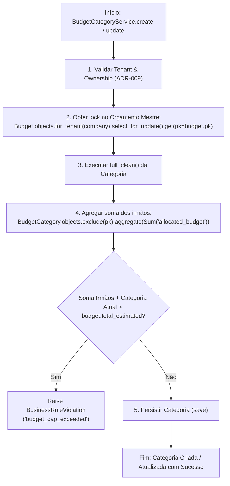

# Distribuição e Alocação de Orçamento por Categoria

> **Categoria:** Regra de Negócio (Domínio Financeiro)
> **Relacionados:** [MOC de Finanças](index.md) · [Regras de Integridade Financeira](financial-integrity-rules.md) · [Benchmark e Média Orçamentária por Assessoria](tenant-budget-benchmark.md) · [Lógica de Parcelas Vencidas](installment-overdue-logic.md) · [Domínio de Finanças](../../domains/finances-domain.md)

---

## 1. Contexto e Invariantes do Domínio

A gestão orçamentária do casamento é estruturada em torno de um **Teto Financeiro Mestre** (`Budget.total_estimated`) e de **Categorias Orçamentárias** (`BudgetCategory.allocated_budget`). A alocação por categoria serve como balizador para que o assessor e o casal monitorem o comprometimento financeiro por segmento (ex.: Espaço e Buffet, Decoração e Flores, Foto & Vídeo).

### Invariantes Fundamentais:
1. **Conservação do Teto Orçamentário (Budget Cap Guard):** A soma dos valores alocados em todas as categorias de um casamento não pode ultrapassar o teto global estimado do orçamento mestre.
2. **Proteção contra Condições de Corrida (TOCTOU):** Mutações de alocação de categoria (`create` e `update`) realizam lock pessimista do registro de orçamento pai via `select_for_update()` antes da soma agregada, prevenindo ultrapassagem de teto por requisições concorrentes.
3. **Idempotência de Categorias Padrão:** Na criação sob demanda do orçamento mestre, são geradas 6 categorias iniciais canônicas com `allocated_budget = Decimal('0.00')`.
4. **Proteção de Exclusão de Categoria (`category_protected_error`):** Uma categoria não pode ser excluída do banco de dados caso possua despesas ativas associadas (`instance.expenses.exists()` ou `category.expenses_count > 0`).

### Fórmulas Matemáticas de Alocação:
Para um casamento com orçamento mestre $T_{\text{estimated}}$ e $M$ categorias orçamentárias onde cada categoria $k$ possui uma verba alocada $A_k$:

\[
\sum_{k=1}^{M} A_k \le T_{\text{estimated}}
\]

Na atualização ou criação da categoria $i$ com nova alocação $A_i$, a validação calcula:

\[
A_{\text{irmãos}} = \sum_{k \ne i} A_k
\]

\[
\text{Margem Disponível} = T_{\text{estimated}} - A_{\text{irmãos}}
\]

\[
\text{Se } (A_{\text{irmãos}} + A_i) > T_{\text{estimated}} \implies \text{Raise } \text{BusinessRuleViolation}(\text{'budget\_cap\_exceeded'})
\]

---

## 2. Diagrama de Fluxo e Validação com Lock Pessimista



---

## 3. Matriz de Regras e Casos de Borda

| Código | Regra de Negócio | Gatilho / Condição | Exceção Lançada | Ação do Sistema |
| :--- | :--- | :--- | :--- | :--- |
| **BR-F04-A** | **Teto de Alocação** | `allocated_siblings + category.allocated_budget > budget.total_estimated` | `BusinessRuleViolation` (`budget_cap_exceeded`) | Bloqueia a criação/edição e impede sobrealocação do orçamento mestre. |
| **BR-F04-B** | **Lock Anti-TOCTOU** | Chamada concorrente a `create` ou `update` de categoria. | Protegido por `select_for_update()` | Serializa as validações e leituras de soma no banco de dados. |
| **BR-F04-C** | **Categorias Padrão Canônicas** | Execução de `BudgetCategoryService.setup_defaults()`. | Nenhuma (Idempotente) | Cria 6 categorias essenciais se não existirem (alocação inicial R$ 0,00). |
| **BR-F04-D** | **Proteção de Despesas Ativas** | Tentativa de deletar categoria que possui despesas ativas vinculadas (`expenses.exists()` ou `expenses_count > 0`). | `DomainIntegrityError` (`category_protected_error`) | Impede deleção física da categoria para evitar despesas órfãs ou corrupção contábil. |

---

## 4. Implementação e Uso do Modelo de Domínio e Serviços

### A. Validação de Teto Orçamentário e Prevenção TOCTOU
A orquestração transacional reside em [`apps/finances/services/budget_category_service.py`](../../../../backend/apps/finances/services/budget_category_service.py):

- `BudgetCategoryService.create()`: Adquire lock pessimista via `select_for_update()` na instância pai do `Budget` antes de calcular a soma das categorias filhas, prevenindo concorrência desordenada.
- `BudgetCategoryService.update()`: Mantém a proteção sob lock e persiste cirurgicamente com `instance.save(update_fields=list(updated_fields))`.
- `_validate_budget_cap(company, category, budget)`: Invariante de negócio que garante $\sum \text{allocated} \le \text{total\_estimated}$.

```python
# Exemplo canônico de trava pessimista e validação de teto:
budget = Budget.objects.for_tenant(company).select_for_update().get(pk=budget.pk)

current_allocated = (
    budget.categories.exclude(pk=category.pk).aggregate(
        total=Coalesce(Sum("allocated_budget"), Decimal("0.00"))
    )["total"]
)

if current_allocated + category.allocated_budget > budget.total_estimated:
    raise BusinessRuleViolation(
        detail="A soma das verbas alocadas ultrapassa o orçamento total do casamento.",
        code="allocated_budget_exceeds_cap",
    )
```

### B. Métodos e Propriedades Reais de Domínio

Seguindo o princípio YAGNI e o modelo de Rich Active Record (ADR-030), apenas propriedades e métodos com consumidores imediatos de produção são mantidos em [`apps/finances/models/budget_category.py`](../../../../backend/apps/finances/models/budget_category.py) e [`apps/finances/models/budget.py`](../../../../backend/apps/finances/models/budget.py):

#### Em `BudgetCategory`:
- `category.total_spent`: Retorna o total efetivamente pago nesta categoria, somando o `amount` das parcelas com status `PAID`. Se disponível, consome a anotação `_total_spent` computada em lote via `BudgetCategoryQuerySet.with_total_spent()`, evitando queries N+1.
- `category.budget_utilization_percent`: Retorna a porcentagem inteira de consumo da verba alocada (`int((total_spent / allocated_budget) * 100)`), retornando 0 se a verba não estiver alocada.
- `category.expenses_count`: Retorna o total de despesas associadas à categoria. Aproveita o atributo anotado `_expenses_count` gerado por `BudgetCategoryQuerySet.with_total_spent()` com fallback sob demanda para `self.expenses.count()`. Utilizado na validação da regra de proteção contra exclusão (**BR-F04-D**).

#### Em `Budget`:
- `budget.total_allocated`: Retorna a soma de todas as verbas alocadas nas categorias deste orçamento. Aproveita o atributo anotado `_total_allocated` gerado por `BudgetQuerySet.with_total_spent()`, com fallback para soma no cache de `prefetch_related` ou query agregada.
- `budget.unallocated_budget`: Saldo do orçamento mestre ainda disponível para distribuição entre categorias (`max(Decimal("0.00"), total_estimated - total_allocated)`).
- `budget.total_overall_spent`: Retorna o total global pago em todas as categorias do orçamento, somando as parcelas `PAID`. Consome a anotação `_total_overall_spent` computada pelo QuerySet.

### C. Geração Idempotente de Categorias Canônicas
- `BudgetCategoryService.setup_defaults(company, budget)`: Cria as 6 categorias padrão essenciais de casamento de forma segura e idempotente caso ainda não existam.

---

## 5. Casos de Teste Automatizados (Pytest)

A suíte de testes unitários em `apps/finances/tests/categories/test_services.py` e `apps/finances/tests/budgets/test_services.py` valida 100% dos fluxos de distribuição:

- `test_create_category_exceeds_budget_cap_raises_error`: Valida a rejeição ao ultrapassar o teto na criação.
- `test_create_category_uses_select_for_update`: Valida o uso de `select_for_update()` para prevenção de race conditions.
- `test_update_category_allocated_budget_exceeds_cap_raises_error`: Valida a rejeição ao extrapolar o teto em atualizações parciais.
- `test_delete_category_with_expenses_fails`: Valida o bloqueio de exclusão quando há despesas associadas (BR-F04-D).
- `test_setup_defaults_creates_six_categories`: Valida criação das 6 categorias canônicas padrão.
- `test_setup_defaults_is_idempotent`: Valida que chamadas subsequentes de setup não duplicam categorias.
