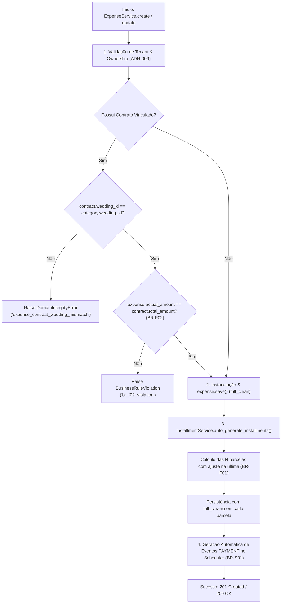

# Regras de Integridade Financeira & Tolerância Zero

> **Categoria:** Regra de Negócio (Domínio Financeiro)
> **Relacionados:** [Catálogo de Regras](../index.md) · [ADR-010: Tolerância Zero](../../adr/010-tolerance-zero.md) · [Distribuição e Alocação de Orçamento por Categoria](budget-category-distribution.md) · [Benchmark e Média Orçamentária por Assessoria](tenant-budget-benchmark.md) · [Lógica de Parcelas Vencidas](installment-overdue-logic.md) · [Domínio de Finanças](../../domains/finances-domain.md)

---

## 1. Princípio da Conservação Centesimal (Tolerância Zero)

No ecossistema do **Wedding Management System**, o dinheiro comprometido e desembolsado é um fato contábil imutável. A plataforma não tolera *drifts* ou perdas de arredondamento cumulativo.

### A Fórmula de Conservação de Centavos
Quando uma despesa é parcelada em $N$ vezes, o valor base de cada uma das $N-1$ primeiras parcelas é arredondado para duas casas decimais, e o valor da **última parcela** absorve o resíduo exato da divisão:

\[
\text{Valor Base} = \text{round}\left(\frac{\text{Total}}{N}, 2\right)
\]
\[
\text{Última Parcela} = \text{Total} - \left(\text{Valor Base} \times (N - 1)\right)
\]

### Exemplo Numérico:
- **Despesa:** R$ 100,00 dividida em 3 parcelas.
- **Parcelas 1 e 2:** R$ 33,33 cada (totalizando R$ 66,66).
- **Parcela 3 (Última):** \(\text{R\$} 100,00 - \text{R\$} 66,66 = \text{R\$} 33,34\).
- **Soma Final:** \(\text{R\$} 33,33 + \text{R\$} 33,33 + \text{R\$} 33,34 = \text{R\$} 100,00\) (**Exatidão Absoluta**).

---

## 2. Diagrama de Fluxo e Validação Transacional



---

## 3. Catálogo de Regras de Integridade

| Código | Nome da Regra | Gatilho / Condição | Exceção Lançada | Ação do Sistema |
| :--- | :--- | :--- | :--- | :--- |
| **BR-F01** | **Tolerância Zero Centesimal de Parcelas** | Criação, redistribuição ou alteração de parcelas onde a soma divirja do total (\(\sum \text{parcelas} \not\equiv \text{actual\_amount}\)). | `ValidationError` em `Expense.clean()` | Garante exatidão centesimal absoluta (\(\sum \text{parcelas} \equiv \text{actual\_amount}\)), absorvendo qualquer resíduo na última parcela. |
| **BR-F02** | **Conformidade com Contrato** | Despesa criada a partir de um contrato com valor divergente (`actual_amount != contract.total_amount`). | `BusinessRuleViolation` (`br_f02_violation`) | Impede discrepância entre o documento jurídico e o registro financeiro. |
| **BR-F03** | **Fronteira Cross-Wedding Guard** | Contrato vinculado pertence a um casamento diferente da categoria orçamentária. | `DomainIntegrityError` (`expense_contract_wedding_mismatch`) | Impede contaminação de dados entre casamentos distintos. |
| **BR-F04** | **Imutabilidade de Parcelas Pagas** | Tentativa de alterar valor total ou redistribuir parcelas de despesa que já tenha parcela `PAID`. | `BusinessRuleViolation` (`amount_change_blocked_by_paid`) | Exige reversão explícita do pagamento antes de qualquer alteração estrutural. |
| **BR-F05** | **Invariante Cronológica de Parcelas** | Alteração de vencimento onde a nova data viola a ordem sequencial entre parcelas vizinhas. | `BusinessRuleViolation` (`due_date_before_previous_installment` / `due_date_after_next_installment`) | Garante ordenação temporal estrita dos vencimentos. |

> **Nota de Relação:** A proteção contra exclusão de categorias orçamentárias que possuam despesas ativas vinculadas é tratada formalmente pela regra **BR-F04-D** em [Distribuição e Alocação de Orçamento por Categoria](budget-category-distribution.md).

---

## 4. Implementação e Uso do Modelo de Domínio e Serviços

### A. Algoritmo de Geração de Parcelas com Tolerância Zero
A geração controlada reside em [`apps/finances/services/installment_service.py`](../../../../backend/apps/finances/services/installment_service.py):

- `InstallmentService.auto_generate_installments(company, expense, num_installments, first_due_date)`: Calcula $N-1$ parcelas de valor base arredondado e absorve a diferença de centavos estritamente na última parcela, garantindo $\sum \text{parcelas} \equiv \text{actual\_amount}$.

```python
# Algoritmo de ajuste centesimal na última parcela (ADR-010 / BR-F01):
base_amount = round(expense.actual_amount / num_installments, 2)
allocated_so_far = base_amount * (num_installments - 1)
last_installment_amount = expense.actual_amount - allocated_so_far
```

### B. Invariantes de Tolerância Zero e Validação com Contrato
Implementadas em [`apps/finances/models/expense.py`](../../../../backend/apps/finances/models/expense.py) e [`apps/finances/services/expense_service.py`](../../../../backend/apps/finances/services/expense_service.py):

- `Expense.clean()`: Para despesas persistidas (`self.pk`), bloqueia qualquer salvamento se a soma real das parcelas divergir de `self.actual_amount` (BR-F01).
- `ExpenseService._validate_br_f02(instance, data)`: Valida se despesas vinculadas a contratos mantêm valor exatamente idêntico a `contract.total_amount`.

### C. Imutabilidade e Proteção Contra Alteração Estrutural
- `ExpenseService.update()` (`PATCH /api/v1/finances/expenses/{uuid}/`): Restrito à atualização de metadados (`name`, `description`, `estimated_amount`, `contract`) e valor total (`actual_amount`). Caso o valor seja alterado e não haja parcelas pagas, redistribui proporcionalmente as parcelas existentes mantendo a quantidade atual (BR-F01). Se houver parcelas com status `PAID`, bloqueia qualquer alteração de montante (`amount_change_blocked_by_paid`). Não aceita parâmetros de cronograma (`num_installments`, `first_due_date`).
- `ExpenseService.renegotiate_installments()` (`POST /api/v1/finances/expenses/{uuid}/renegotiate/`, `operation_id="finances_expenses_renegotiate"`): Caso de uso semântico dedicado exclusivamente à repactuação de cronograma e quantidade de parcelas de uma despesa não liquidada.

---

## 5. Casos de Teste Automatizados (Pytest)

A suíte de testes unitários garante 100% de cobertura dessas regras em `apps/finances/tests/expenses/test_services.py`:

- `test_create_expense_with_contract_amount_mismatch_raises_br_f02`: Valida rejeição quando valor difere do contrato.
- `test_create_expense_cross_wedding_contract_raises_error`: Valida o bloqueio de contratos de outros casamentos.
- `test_redistribute_blocked_when_has_paid_installments`: Valida a proteção imutável de parcelas pagas.
- `test_adjust_installment_due_date_out_of_order_raises_violation`: Valida a invariante cronológica.
