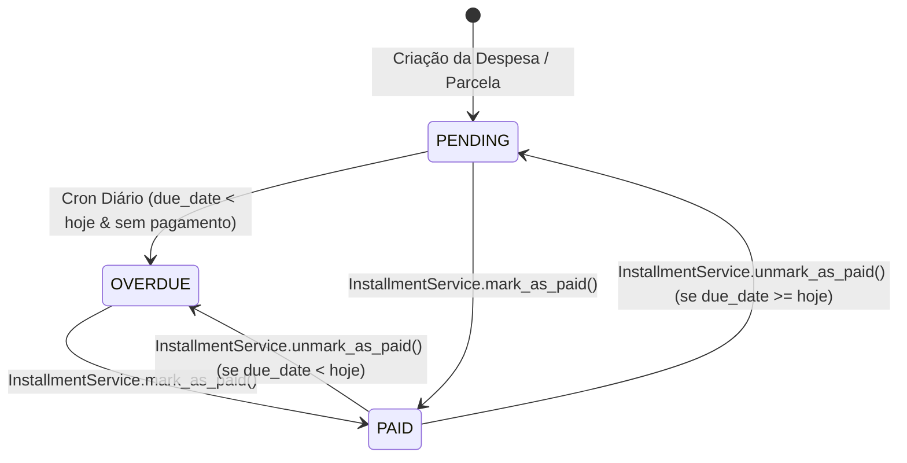
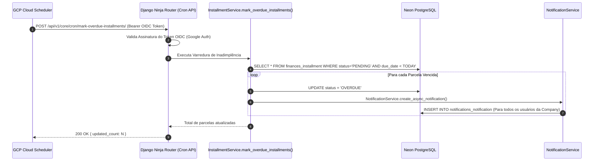

# Regra de Negócio: Lógica de Vencimento e Máquina de Estados de Parcelas

> **Categoria:** Regra de Negócio (Domínio Financeiro & Automação)
> **Relacionados:** [Tolerância Zero](financial-integrity-rules.md) · [Notificações In-App](../notifications/in-app-notifications-rules.md) · [ADR-005: Cloud Scheduler & OIDC](../../adr/005-oidc-scheduler.md) · [Domínio de Finanças](../../domains/finances-domain.md)

---

## 1. Máquina de Estados da Parcela (`Installment.StatusChoices`)

Cada parcela financeira de uma despesa transita por um ciclo de vida rigoroso baseado em eventos do usuário e rotinas temporais do sistema:



---

## 2. Automação de Parcelas Vencidas & Notificações In-App

A transição para o estado `OVERDUE` ocorre diariamente de forma automatizada e serverless:



---

## 3. Matriz de Transições e Regras Operacionais

| Ação / Transição | Pré-condição | Efeito no Banco | Disparo de Efeitos Colaterais |
| :--- | :--- | :--- | :--- |
| **`mark_as_paid`** | Status atual é `PENDING` ou `OVERDUE`. | Define `status = PAID` e `paid_date = date.today()`. | Dispara `expense.full_clean()` para revalidar a consistência contábil da despesa. |
| **`unmark_as_paid`** | Status atual é `PAID`. | Remove `paid_date` e recalcula status (`OVERDUE` se vencida, `PENDING` se futura). | Revalidação contábil da despesa pai. |
| **`mark_overdue`** | Status é `PENDING` e `due_date < date.today()`. | Define `status = OVERDUE` (`skip_clean=True` para performance em lote). | Cria notificações in-app com link direto para `/weddings/{uuid}?tab=finances`. |
| **`adjust`** | Parcela **NÃO** pode estar `PAID`. | Atualiza `amount` ou `due_date`. | Valida se a nova data não viola a cronologia entre parcelas vizinhas. |

---

## 4. Implementação no Código-Fonte Real

### A. Algoritmo de Varredura e Notificação (`installment_service.py`)

```python
--8<-- "backend/apps/finances/services/installment_service.py:559:630"
```

### B. Marcação e Reversão de Pagamento (`installment_service.py`)

```python
--8<-- "backend/apps/finances/services/installment_service.py:305:354"
```

---

## 5. Casos de Teste Automatizados (Pytest)

- `test_mark_overdue_installments_updates_pending_and_notifies`: Valida atualização para `OVERDUE` e geração de notificação in-app para usuários da empresa.
- `test_mark_as_paid_sets_paid_date_and_status`: Valida transição para `PAID` e atribuição da data atual.
- `test_unmark_as_paid_restores_overdue_if_past_due_date`: Valida restauração correta do status para `OVERDUE` quando a data de vencimento já passou.
