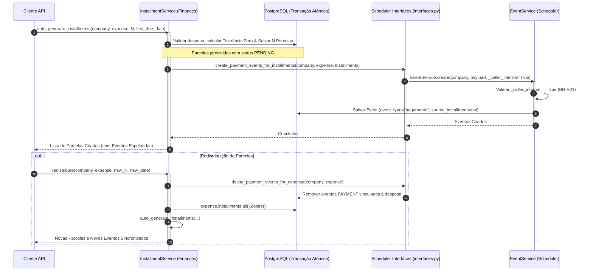

# Integração de Pagamentos com Agenda de Compromissos (BR-S01)

> **Categoria:** Regra de Negócio (Domínio Financeiro & Cronograma)
> **Relacionados:** [Catálogo de Regras](../index.md) · [ADR-031: Comunicação Entre Módulos](../../adr/031-inter-module-communication.md) · [Proteção Somente-Leitura de Pagamentos](../scheduler/payment-event-readonly-guard.md) · [Regras de Integridade Financeira](financial-integrity-rules.md) · [Lógica de Parcelas Vencidas](installment-overdue-logic.md) · [Domínio de Finanças](../../domains/finances-domain.md) · [Domínio de Scheduler](../../domains/scheduler-domain.md)

---

## 1. Contexto e Invariantes do Domínio

No **Wedding Management System**, o planejamento financeiro e o cronograma de eventos convergem através do **Espelhamento Cronológico de Parcelas**. Todo compromisso de pagamento registrado para uma despesa gera uma representação visual na agenda do casamento para que o cerimonialista e os noivos acompanhem os desembolsos críticos.

### Invariantes Fundamentais:
1. **Auto-geração Síncrona via Fachada:** A criação ou parcelamento automático de despesas via `InstallmentService.auto_generate_installments` invoca a fachada pública `apps.scheduler.interfaces.create_payment_events_for_installments` para projetar eventos com `event_type = "pagamento"` no calendário.
2. **Imutabilidade e Somente-Leitura (BR-S01):** Eventos do tipo `pagamento` são gerenciados exclusivamente pelo motor financeiro. Qualquer tentativa de alteração manual ou exclusão direta no calendário é bloqueada.
3. **Isolamento Multitenant (ADR-009 / ADR-016):** Cada evento de pagamento herda o tenant `company` e o `wedding` da despesa pai.
4. **Limpeza Transacional em Cascata:** Se parcelas forem redistribuídas ou excluídas, os eventos de pagamento vinculados são removidos atomicamente antes da reemissão.

### Fórmulas Matemáticas de Agendamento:
Para uma despesa com $N$ parcelas, onde a primeira parcela vence na data $d_{\text{first}}$, a data de vencimento $d_{\text{due}}^{(i)}$ da parcela $i$ e o horário canônico de início do evento $t_{\text{start}}^{(i)}$ são definidos por:

$$d_{\text{due}}^{(i)} = d_{\text{first}} + (i - 1) \times 30\text{ dias}, \quad \forall i \in \{1, \dots, N\}$$

$$t_{\text{start}}^{(i)} = \text{combine}\left(d_{\text{due}}^{(i)}, \text{09:00:00}\right)_{\text{aware}}$$

$$\text{Título} = \text{"Pagamento: "} + \text{expense.name} + \text{" - Parcela "} + i + \text{"/"} + N$$

$$\text{Descrição} = \text{"Valor: R\$ "} + \text{format}(\text{amount}_i, 2) + \text{" — "} + \text{expense.name}$$

---

## 2. Diagrama de Fluxo e Sincronização Transacional



---

## 3. Matriz de Regras e Casos de Borda

| Código | Regra de Negócio | Condição / Gatilho | Exceção / Comportamento | Impacto no Scheduler |
| :--- | :--- | :--- | :--- | :--- |
| **BR-S01-A** | **Auto-Geração Obrigatória** | Geração automática de parcelas via `InstallmentService`. | Sucesso na criação de $N$ eventos `PAYMENT`. | Popula o calendário com título e descrição padronizados às 09:00. |
| **BR-S01-B** | **Guard de Chamada Interna** | Tentativa de criar evento `event_type="pagamento"` com `_caller_internal=False`. | `BusinessRuleViolation('payment_event_readonly')` | Impede criação espúria de eventos financeiros manuais na agenda. |
| **BR-S01-C** | **Cascata em Redistribuição** | Chamada a `InstallmentService.redistribute()` em despesa sem parcelas pagas. | Exclui eventos antigos e gera novos na mesma transação `@transaction.atomic`. | Evita eventos órfãos ou duplicados no calendário do casamento. |
| **BR-S01-D** | **Exclusão de Parcela Individual** | Deleção de parcela via `InstallmentService.delete()`. | `delete_payment_event_for_installment()` remove o evento correspondente. | Mantém o calendário estritamente sincronizado com as parcelas ativas. |

---

## 4. Implementação e Uso do Modelo de Domínio e Serviços

### A. Integração Transacional Finanças-Scheduler via Fachada Pública ([ADR-031](../../adr/031-inter-module-communication.md))
Em conformidade com a [ADR-031](../../adr/031-inter-module-communication.md), o `InstallmentService` **não importa models ou services do scheduler diretamente**. Toda a manipulação de compromissos de pagamento no calendário é delegada à fachada pública [`apps/scheduler/interfaces.py`](../../../../backend/apps/scheduler/interfaces.py):

- `create_payment_events_for_installments(company, expense, installments)`: Projeta eventos de calendário (`event_type="pagamento"`) às 09:00 na data de vencimento de cada parcela, passando `_caller_internal=True`.
- `delete_payment_events_for_expense(company, expense)`: Limpeza atômica de todos os eventos de pagamento vinculados a uma despesa durante a redistribuição.
- `delete_payment_event_for_installment(company, installment)`: Limpeza atômica do evento correspondente na deleção de parcela individual.

```python
# Chamada à fachada pública em apps/finances/services/installment_service.py:
from apps.scheduler.interfaces import create_payment_events_for_installments

create_payment_events_for_installments(
    company=company,
    expense=expense,
    installments=installments,
)
```

### B. Guard Somente-Leitura no Scheduler
O guard reside em [`apps/scheduler/services/events.py`](../../../../backend/apps/scheduler/services/events.py):

- `EventService._validate_payment_event_internal(data, _caller_internal)`: Bloqueia a criação ou edição manual de eventos de pagamento por chamadas externas à API, exigindo que qualquer movimentação se origine estritamente na interface autorizada.

---

## 5. Casos de Teste Automatizados (Pytest)

A suíte de testes unitários em `apps/finances/tests/installments/test_services.py` e `apps/scheduler/tests/appointments/test_services.py` valida 100% dos fluxos de integração:

- `test_auto_generate_creates_payment_events`: Valida criação automática de eventos `PAYMENT` com tipo, título e datas corretas.
- `test_auto_generate_payment_event_values`: Valida descrição com valor monetário e nome da despesa no evento.
- `test_redistribute_cleans_up_payment_events`: Valida remoção dos eventos antigos e criação dos novos na redistribuição.
- `test_delete_installment_cleans_up_payment_event`: Valida deleção do evento atrelado ao apagar uma parcela individual.
- `test_create_payment_event_blocked`: Valida bloqueio de criação manual de eventos `PAYMENT` pela API (`_caller_internal=False`).
- `test_create_payment_event_internal_allowed`: Valida permissão de criação quando `_caller_internal=True`.
