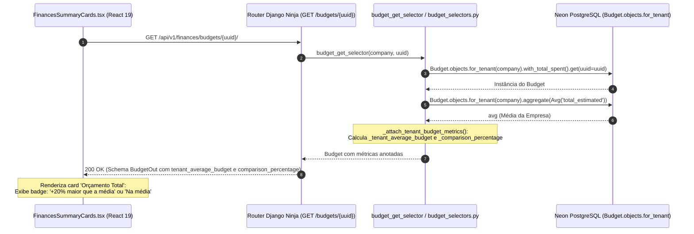

# Benchmark e Média Orçamentária por Assessoria (Tenant Budget)

> **Categoria:** Regra de Negócio (Domínio Financeiro / CQRS)
> **Relacionados:** [Catálogo de Regras](../index.md) · [Regras de Integridade Financeira](financial-integrity-rules.md) · [Distribuição e Alocação de Orçamento por Categoria](budget-category-distribution.md) · [Padrão Query Selectors](../../concepts/query-selectors-pattern.md) · [Domínio de Finanças](../../domains/finances-domain.md)

---

## 1. Contexto e Invariantes do Domínio

Na assessoria de casamentos, um dos maiores desafios do cerimonialista é orientar o casal sobre a razoabilidade do orçamento pretendido em comparação com o perfil de eventos tipicamente atendidos por sua empresa. Casais frequentemente solicitam referências como: *"Nosso orçamento de R$ 80.000 está dentro do padrão dos casamentos que você organiza, ou acima da média?"*

A plataforma atende a essa necessidade através da regra canônica **BR-F06**, implementando uma métrica analítica de **Benchmark Orçamentário por Tenant**:
- O sistema calcula de forma agregada a média aritmética do orçamento total estimado de todos os casamentos da assessoria (`Company`).
- Compara o orçamento estimado do casamento atual com essa média histórica, determinando o desvio percentual relativo.
- Essa métrica é disponibilizada de forma instantânea no painel financeiro, sem persistência em banco de dados e sem efeitos colaterais em tabelas transacionais.

### Invariantes Fundamentais da Regra (BR-F06):
1. **Isolamento Absoluto por Tenant (Multi-Tenancy):** O cálculo da média orçamentária considera única e exclusivamente os orçamentos da mesma assessoria (`Company`). Orçamentos de empresas concorrentes nunca interferem ou vazam no benchmark.
2. **Padrão CQRS (Leitura Desacoplada):** O benchmark é calculado exclusivamente no ciclo de leitura por meio de um seletor de consulta (`apps/finances/selectors/budget_selectors.py`), respeitando a segregação entre escrita e leitura. Não há mutações nem locks em tabelas de escrita.
3. **Precisão Centesimal e Arredondamento:** A média orçamentária é mantida como `Decimal(10, 2)` e o percentual de variação é arredondado para uma casa decimal (`round(..., 1)`).
4. **Resiliência a Casos de Borda:**
   - **Primeiro Casamento do Tenant:** Quando o tenant possui apenas 1 casamento cadastrado, a média equivale exatamente ao valor estimado desse casamento, e o percentual de variação é formalmente `0.0%`.
   - **Orçamentos Zerados ou Nulos:** Se o orçamento do casamento ou a média do tenant forem nulos ou iguais a zero (`Decimal("0.00")`), o desvio percentual é definido com segurança como `None` (omitindo o indicador no frontend).

---

## 2. Formulação Matemática

Para um tenant $T$ que possui um conjunto de $N$ casamentos cadastrados com orçamentos válidos, onde $B_k$ representa o teto estimado (`total_estimated`) do $k$-ésimo casamento:

### A. Média Aritmética do Tenant ($\mu_{\text{tenant}}$)

\[
\mu_{\text{tenant}} = \frac{1}{N} \sum_{k=1}^{N} B_k \quad \forall B_k \in \text{Casamentos da Company } T
\]

No banco de dados relacional, esse valor é obtido via agregação SQL nativa:
```python
avg = Budget.objects.for_tenant(company).aggregate(avg=Avg("total_estimated"))["avg"]
```

### B. Variação Percentual Comparativa ($\Delta\%$)
Dado o orçamento $B_{\text{atual}}$ do casamento em consulta e a média $\mu_{\text{tenant}} > 0$:

\[
\Delta\% = \text{round}\left(\frac{B_{\text{atual}} - \mu_{\text{tenant}}}{\mu_{\text{tenant}}} \times 100, 1\right)
\]

- Se $\Delta\% = 0.0$: O casamento está exatamente na média histórica da assessoria.
- Se $\Delta\% > 0.0$: O casamento possui orçamento superior à média histórica (ex.: $+50.0\%$ maior que a média).
- Se $\Delta\% < 0.0$: O casamento possui orçamento inferior à média histórica (ex.: $-50.0\%$ menor que a média).

---

## 3. Diagrama de Arquitetura e Fluxo CQRS

O benchmark segue o padrão CQRS estabelecido na plataforma, fluindo desde a agregação do seletor até os cartões resumo do frontend:



---

## 4. Matriz de Regras e Casos de Borda

| Código | Regra de Negócio | Gatilho / Condição | Comportamento do Sistema |
| :--- | :--- | :--- | :--- |
| **BR-F06-A** | **Cálculo da Média Ponderada por Tenant** | Consulta a qualquer orçamento via `budget_get_selector` ou `budget_get_for_wedding_selector`. | Executa agregação `Avg("total_estimated")` filtrando estritamente pelo tenant atual (`company`). |
| **BR-F06-B** | **Primeiro Casamento (Base Unicária)** | O tenant possui apenas 1 casamento cadastrado no sistema ($N = 1$). | $\mu = B_1$, $\Delta\% = 0.0$. O frontend exibe *"Na média dos casamentos"*. |
| **BR-F06-C** | **Isolamento de Outros Tenants** | Existência de outros tenants com orçamentos de grandezas díspares no mesmo banco de dados. | Nenhuma interferência. O filtro `for_tenant(company)` isola totalmente o conjunto amostral. |
| **BR-F06-D** | **Média Nula ou Orçamento Zerado** | `total_estimated == 0` ou média $\mu = 0$ ou `None`. | `comparison_percentage = None`. O badge comparativo é omitido no frontend para evitar divisão por zero. |

---

## 5. Implementação no Código-Fonte Real

### A. Seletor de Consulta (`apps/finances/selectors/budget_selectors.py`)
A função utilitária pura do seletor anota as métricas dinamicamente na instância em memória:

```python
def _attach_tenant_budget_metrics(budget: Budget, company: Company) -> None:
    """Calcula e anota a média do orçamento e percentual comparativo do tenant."""
    avg = Budget.objects.for_tenant(company).aggregate(avg=Avg("total_estimated"))[
        "avg"
    ]
    if avg is not None and not isinstance(avg, Decimal):
        avg = Decimal(str(avg))
    budget._tenant_average_budget = avg  # type: ignore[attr-defined]
    if avg and avg > Decimal("0.00") and budget.total_estimated is not None:
        budget._comparison_percentage = round(  # type: ignore[attr-defined]
            float(((budget.total_estimated - avg) / avg) * 100), 1
        )
    else:
        budget._comparison_percentage = None  # type: ignore[attr-defined]
```

### B. Schema Pydantic (`apps/finances/schemas/budget.py`)
O schema de saída [`BudgetOut`](../../../../backend/apps/finances/schemas/budget.py) extrai os atributos anotados de forma transparente via *resolvers*:

```python
class BudgetOut(Schema):
    uuid: UUID4
    wedding: UUID4 = Field(alias="wedding.uuid")
    total_estimated: Decimal
    total_overall_spent: Decimal = Field(default=Decimal("0.00"))
    tenant_average_budget: Decimal | None = None
    comparison_percentage: float | None = None

    @staticmethod
    def resolve_tenant_average_budget(obj: Any) -> Decimal | None:
        val = getattr(obj, "_tenant_average_budget", None)
        if val is not None:
            return Decimal(str(val)) if not isinstance(val, Decimal) else val
        return None

    @staticmethod
    def resolve_comparison_percentage(obj: Any) -> float | None:
        val = getattr(obj, "_comparison_percentage", None)
        if val is not None:
            return float(val)
        return None
```

### C. Apresentação Visual (`FinancesSummaryCards.tsx`)
No frontend React 19 ([`FinancesSummaryCards.tsx`](../../../../frontend/src/features/finances/components/FinancesSummaryCards.tsx)), o card de "Orçamento Total" consome os campos `tenant_average_budget` e `comparison_percentage`, exibindo ícones contextuais e feedback ergonômico:

```tsx
const compPct = budget?.comparison_percentage;
const hasEnoughData = compPct != null;
const isBudgetEqual = hasEnoughData && compPct === 0;
const isBudgetGreater = hasEnoughData && compPct > 0;
const diffPercentage = hasEnoughData ? Math.abs(compPct) : 0;

// Renderização do badge de benchmark:
{hasEnoughData ? (
  <div
    className={`flex items-center gap-1 text-xs font-medium ${
      isBudgetEqual
        ? "text-zinc-500 dark:text-zinc-400"
        : isBudgetGreater
        ? "text-green-600 dark:text-green-400"
        : "text-blue-600 dark:text-blue-400"
    }`}
    title={
      budget?.tenant_average_budget
        ? `Média: ${formatCurrencyBRCompact(Number(budget.tenant_average_budget))}`
        : undefined
    }
  >
    {isBudgetEqual ? (
      <TrendingDown className="w-3 h-3" />
    ) : isBudgetGreater ? (
      <ArrowUpRight className="w-3 h-3" />
    ) : (
      <ArrowDownRight className="w-3 h-3" />
    )}
    <span>
      {isBudgetEqual
        ? "Na média dos casamentos"
        : `${diffPercentage}% ${isBudgetGreater ? "maior" : "menor"} que a média`}
    </span>
  </div>
) : null}
```

---

## 6. Casos de Teste Automatizados (Pytest)

A suíte de testes de seletores em [`backend/apps/finances/tests/test_selectors.py`](../../../../backend/apps/finances/tests/test_selectors.py) garante o correto funcionamento e isolamento do benchmark:

- `test_budget_get_selectors_tenant_average_and_comparison_metrics`:
  - Cria dois casamentos para o mesmo tenant com orçamentos de R$ 30.000 e R$ 10.000 ($\mu = \text{R\$} 20.000$).
  - Cria um casamento em outro tenant com orçamento discrepante de R$ 500.000.
  - Comprova que o primeiro casamento resulta em $+50.0\%$ e o segundo em $-50.0\%$, atestando o isolamento do tenant estranho.
- `test_budget_get_selector_metrics_single_budget`:
  - Comprova que, ao consultar o único orçamento cadastrado de uma assessoria, o percentual de comparação computado é estritamente `0.0`.
