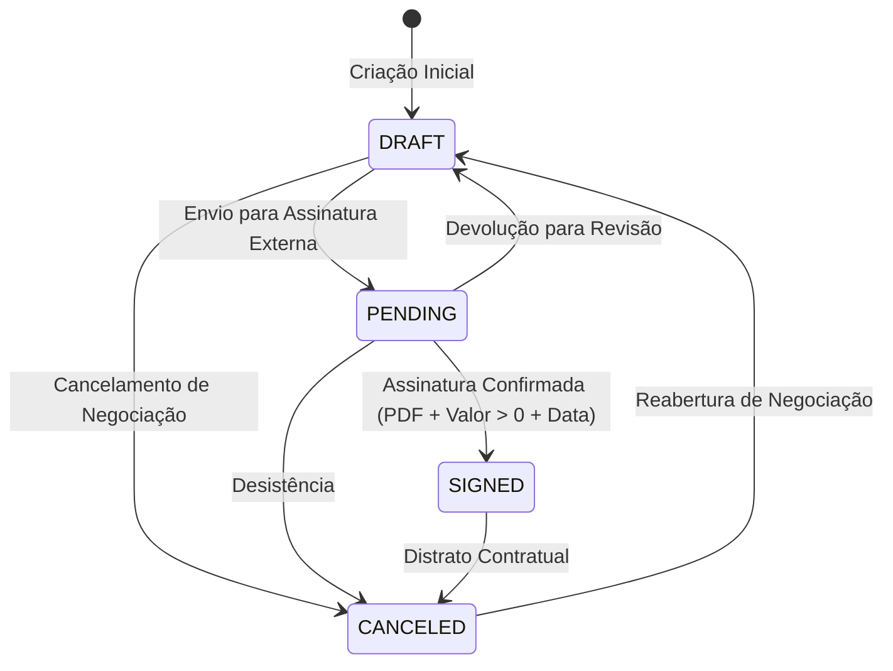
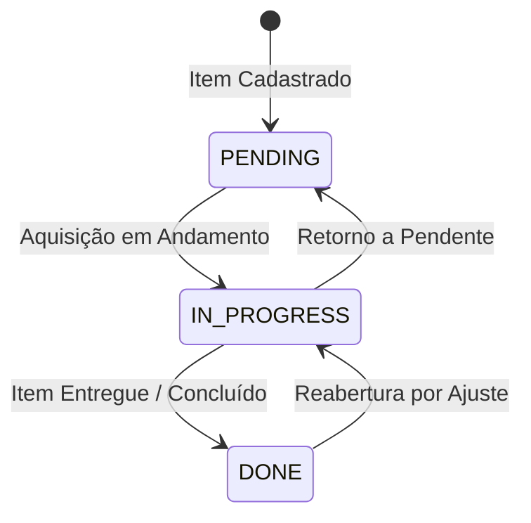

# Máquina de Estados de Contratos e Itens Logísticos

> **Categoria:** Regra de Negócio (Domínio Logístico)
> **Relacionados:** [Hierarquia de Contratos e Aditivos](contract-parent-child-hierarchy.md) · [Validação de CNPJ](cnpj-validation-rules.md) · [Regras de Integridade Financeira](../finances/financial-integrity-rules.md) · [Domínio de Logística](../../domains/logistics-domain.md)

---

## 1. Contexto e Invariantes do Domínio

A gestão de contratos e itens logísticos opera sobre duas **Máquinas de Estados Determinísticas** desacopladas. Enquanto o contrato rege o vínculo jurídico e financeiro com fornecedores, os itens controlam o ciclo operacional de aquisição e entrega física dos bens e serviços no evento.

### Invariantes da Máquina de Contratos (`Contract`):
1. **Transições Canônicas Permitidas (`ALLOWED_TRANSITIONS`):**
   - `DRAFT` (Rascunho) $\rightarrow$ `PENDING`, `CANCELED`.
   - `PENDING` (Pendente de Assinatura) $\rightarrow$ `SIGNED`, `DRAFT`, `CANCELED`.
   - `SIGNED` (Assinado) $\rightarrow$ `CANCELED`.
   - `CANCELED` (Cancelado) $\rightarrow$ `DRAFT`.
2. **Invariantes Estritas do Estado `SIGNED` (BR-L01):** Para formalizar a transição para `SIGNED`, o contrato exige obrigatoriamente:
   - Upload de arquivo válido (`pdf_file` com extensão `.pdf`, `.png`, `.jpg`, `.jpeg` e tamanho $\le 10\text{MB}$ via `MaxFileSizeValidator`).
   - Valor total estritamente positivo ($V_{\text{total}} > 0$).
   - Data de assinatura informada (`signed_date` preenchida).
3. **Desacoplamento de Aquisição e Pagamento (BR-L04):** O status de entrega de um item (`Item.acquisition_status`) evolui de forma independente do pagamento das parcelas financeiras vinculadas.

### Invariantes da Máquina de Itens (`Item`):
- `PENDING` (Pendente) $\longleftrightarrow$ `IN_PROGRESS` (Em Andamento) $\longleftrightarrow$ `DONE` (Entregue/Concluído).

---

## 2. Diagrama de Máquina de Estados (State Diagrams)

### A. Ciclo de Vida do Contrato



### B. Ciclo de Vida do Item Logístico



---

## 3. Matriz de Regras e Casos de Borda

| Código | Regra de Negócio | Gatilho / Condição | Exceção Lançada | Ação do Sistema |
| :--- | :--- | :--- | :--- | :--- |
| **BR-L01-A** | **Arquivo Obrigatório em SIGNED** | Transição para `SIGNED` sem arquivo em `pdf_file`. | `ValidationError` | Bloqueia a formalização sem comprovante digital do contrato. |
| **BR-L01-B** | **Valor Positivo em SIGNED** | Transição para `SIGNED` com `total_amount <= 0`. | `ValidationError` | Impede contratos formalizados com valor nulo ou negativo. |
| **BR-L01-C** | **Data de Assinatura Obrigatória** | Transição para `SIGNED` com `signed_date = None`. | `ValidationError` | Exige o registro temporal do ato de assinatura externa. |
| **BR-L01-D** | **Transição Ilegal de Contrato** | Tentativa de transição não mapeada (ex.: `DRAFT -> SIGNED` direto ou `SIGNED -> DRAFT`). | `BusinessRuleViolation` (`contract_invalid_status_transition`) | Rejeita o salto de estado para garantir a esteira de validação. |
| **BR-L04** | **Independência Operacional** | Mudança no status de aquisição do `Item`. | Nenhuma | Atualiza o progresso logístico sem exigir liquidação financeira prévia. |

---

## 4. Implementação no Código-Fonte Real

### A. Mapeamento de Transições e Validação (`contract.py`)

```python
--8<-- "backend/apps/logistics/models/contract.py:113:166"
```

### B. Validação dos Requisitos de `SIGNED` (`contract.py`)

```python
--8<-- "backend/apps/logistics/models/contract.py:167:180"
```

### C. Método de Transição no Serviço (`contract_service.py`)

```python
--8<-- "backend/apps/logistics/services/contract_service.py:521:562"
```

---

## 5. Casos de Teste Automatizados (Pytest)

A suíte de testes unitários em `apps/logistics/tests/contracts/test_models.py` e `apps/logistics/tests/contracts/test_services.py` valida 100% dos caminhos e bloqueios da máquina de estados:

- `test_valid_transitions`: Valida todas as 7 transições permitidas no ciclo de vida.
- `test_invalid_transitions`: Valida rejeição com `ValidationError` para transições proibidas (ex.: `DRAFT -> SIGNED`, `SIGNED -> DRAFT`, `CANCELED -> SIGNED`).
- `test_signed_without_pdf_fails`: Valida exigência do arquivo PDF para contratos assinados.
- `test_signed_without_positive_amount_fails`: Valida exigência de valor estritamente positivo.
- `test_signed_without_signed_date_fails`: Valida exigência da data de formalização.
- `test_transition_to_signed_without_pdf_raises_error`: Valida propagação de erro de negócio no `ContractService.transition_status`.
