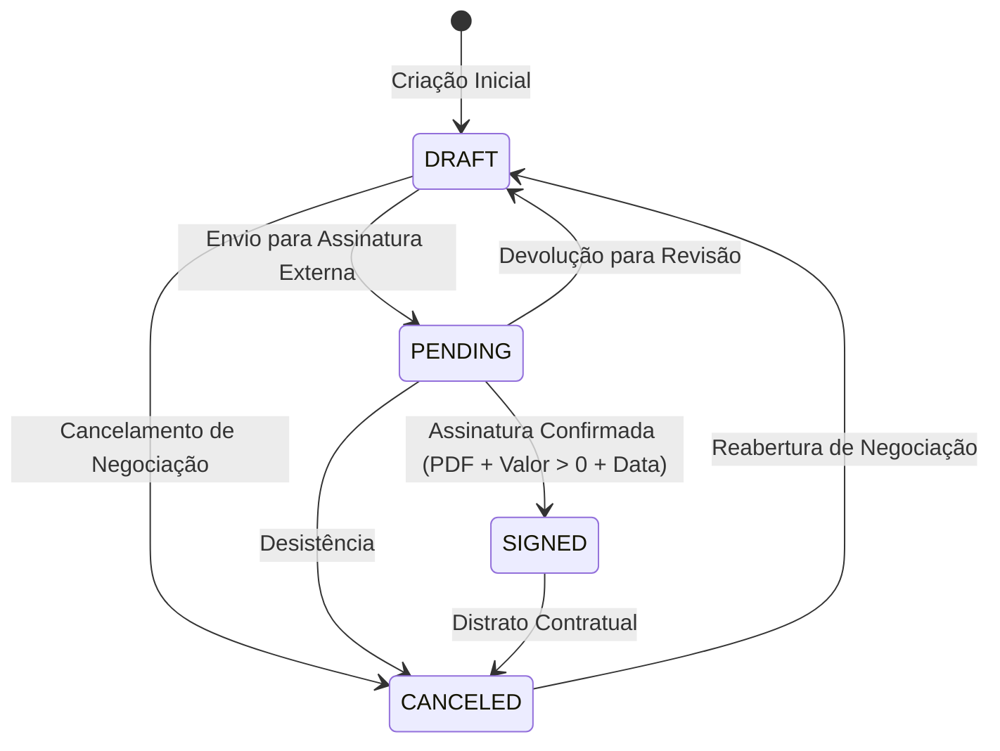
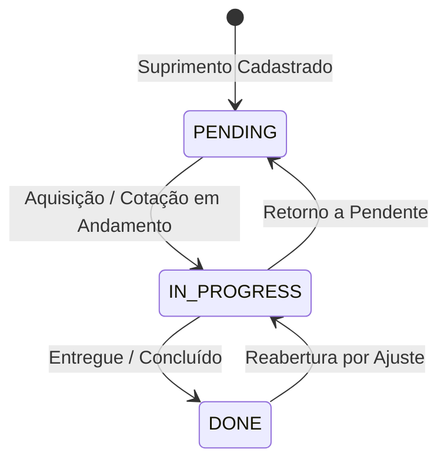

# Máquina de Estados de Contratos e Itens Logísticos

> **Categoria:** Regra de Negócio (Domínio Logístico)
> **Relacionados:** [Catálogo de Regras](../index.md) · [Hierarquia de Contratos e Aditivos](contract-parent-child-hierarchy.md) · [Validação de CNPJ](cnpj-validation-rules.md) · [Regras de Integridade Financeira](../finances/financial-integrity-rules.md) · [Domínio de Logística](../../domains/logistics-domain.md) · [ADR-030: Rich Domain Model e Validação em 3 Níveis](../../adr/030-rich-domain-model-service-layer.md)

---

## 1. Contexto e Invariantes do Domínio

A gestão de contratos e suprimentos logísticos opera sobre máquinas de estados determinísticas desacopladas. Enquanto o contrato rege o vínculo jurídico e financeiro com fornecedores, a entidade `SupplyItem` gerencia o ciclo físico e operacional em **3 dimensões independentes**: escopo, cotação e entrega física.

### Invariantes da Máquina de Contratos (`Contract`):
1. **Transições Canônicas Permitidas (`ALLOWED_TRANSITIONS`):**
   - `DRAFT` (Rascunho) $\rightarrow$ `PENDING`, `CANCELED`.
   - `PENDING` (Pendente de Assinatura) $\rightarrow$ `SIGNED`, `DRAFT`, `CANCELED`.
   - `SIGNED` (Assinado) $\rightarrow$ `CANCELED`.
   - `CANCELED` (Cancelado) $\rightarrow$ `DRAFT`.
2. **Invariantes Estritas do Estado `SIGNED` (BR-L01):** Para formalizar a transição para `SIGNED`, o contrato exige obrigatoriamente:
   - Upload de arquivo válido (`pdf_file` com extensão `.pdf`, `.png`, `.jpg`, `.jpeg` e tamanho $\le 10\text{MB}$ via `MaxFileSizeValidator`).
   - Valor total estritamente positivo ($V_{\text{total}} > 0$).
   - Data de assinatura informada (`signed_date` preenchida).
3. **Desacoplamento de Aquisição e Pagamento (BR-L04):** O status de entrega e escopo de um suprimento (`SupplyItem`) evolui de forma independente do pagamento das parcelas financeiras vinculadas.

### Invariantes das 3 Dimensões de Suprimentos (`SupplyItem`):
- **Dimensão 1: Escopo (`ScopeStatus`):** `DESIRED` (Desejado), `INCLUDED` (Incluído), `DISCARDED` (Descartado).
  - *Regra BR-L06:* Ao transitar ou marcar como `DISCARDED`, o campo `rejection_reason` é estritamente obrigatório no método `clean()`.
- **Dimensão 2: Cotação (`ProcurementStatus`):** `A_COTAR` $\rightarrow$ `EM_NEGOCIACAO` $\rightarrow$ `CONTRATADO`.
- **Dimensão 3: Entrega Física (`DeliveryStatus`):** `PENDING` $\rightarrow$ `DELIVERED` $\rightarrow$ `RETURNED`.
- **Ciclo Operacional de Aquisição (`AcquisitionStatus`):** `PENDING` $\longleftrightarrow$ `IN_PROGRESS` $\longleftrightarrow$ `DONE`.

---

## 2. Diagrama de Máquina de Estados (State Diagrams)

### A. Ciclo de Vida do Contrato


```mermaid
stateDiagram-v2
    [*] --> DRAFT : Criação Inicial
    DRAFT --> PENDING : Envio para Assinatura Externa
    DRAFT --> CANCELED : Cancelamento de Negociação
    PENDING --> SIGNED : Assinatura Confirmada (PDF + Valor > 0 + Data)
    PENDING --> DRAFT : Devolução para Revisão
    PENDING --> CANCELED : Desistência
    SIGNED --> CANCELED : Distrato Contratual
    CANCELED --> DRAFT : Reabertura de Negociação
```

### B. Ciclo de Vida do Suprimento Logístico (`SupplyItem`)


```mermaid
stateDiagram-v2
    [*] --> PENDING : Suprimento Cadastrado
    PENDING --> IN_PROGRESS : Aquisição / Cotação em Andamento
    IN_PROGRESS --> DONE : Entregue / Concluído
    DONE --> IN_PROGRESS : Reabertura por Ajuste
    IN_PROGRESS --> PENDING : Retorno a Pendente
```

---

## 3. Matriz de Regras e Casos de Borda

| Código | Regra de Negócio | Gatilho / Condição | Exceção Lançada | Ação do Sistema |
| :--- | :--- | :--- | :--- | :--- |
| **BR-L01-A** | **Arquivo Obrigatório em SIGNED** | Transição para `SIGNED` sem arquivo em `pdf_file`. | `ValidationError` | Bloqueia a formalização sem comprovante digital do contrato. |
| **BR-L01-B** | **Valor Positivo em SIGNED** | Transição para `SIGNED` com `total_amount <= 0`. | `ValidationError` | Impede contratos formalizados com valor nulo ou negativo. |
| **BR-L01-C** | **Data de Assinatura Obrigatória** | Transição para `SIGNED` com `signed_date = None`. | `ValidationError` | Exige o registro temporal do ato de assinatura externa. |
| **BR-L01-D** | **Transição Ilegal de Contrato** | Tentativa de transição não mapeada (ex.: `DRAFT -> SIGNED` direto ou `SIGNED -> DRAFT`). | `BusinessRuleViolation` (`contract_invalid_status_transition`) | Rejeita o salto de estado para garantir a esteira de validação. |
| **BR-L04** | **Independência Operacional** | Mudança no status de aquisição ou entrega do `SupplyItem`. | Nenhuma | Atualiza o progresso logístico sem exigir liquidação financeira prévia. |
| **BR-L06** | **Justificativa Obrigatória de Descarte** | Definir `scope_status = DISCARDED` sem preencher `rejection_reason`. | `ValidationError` (`rejection_reason`) | Garante histórico e justificativa do descarte do suprimento. |

---

## 4. Implementação e Uso do Modelo de Domínio

### A. Entidade Rica `Contract`
A lógica de transição e invariantes de formalização reside diretamente em [`apps/contracts/models/contract.py`](../../../../backend/apps/contracts/models/contract.py):

- `contract.can_transition_to(target_status)`: Consulta a matriz canônica `ALLOWED_TRANSITIONS`.
- `contract.transition_to(target_status)`: Executa a transição ou dispara `BusinessRuleViolation` (`contract_invalid_status_transition`).
- `contract.send_to_pending()`: Transita para `PENDING`.
- `contract.sign(signed_date=..., pdf_file=...)`: Atribui os dados comprobatórios e transita para `SIGNED`.
- `contract.cancel()`: Distrata o contrato e transita para `CANCELED`.
- `contract.revert_to_draft()`: Retorna o contrato para `DRAFT`.
- `contract._clean_signed_requirements()`: Invariante executada em `clean()`, validando `pdf_file`, `signed_date` e `total_amount > 0`.
- Propriedades com consumidores ativos: `contract.is_addendum` (consumida na UI e serializada em `ContractOut`), `contract.has_file`, `contract.file_name` (propriedades anêmicas de conferência de status como `is_draft`, `is_pending`, `is_signed` e `is_canceled` foram expurgadas em conformidade com YAGNI e ADR-030).

```python
# Exemplo canônico de uso do modelo rico:
contract = contract_get_selector(company=company, uuid=contract_uuid)

if contract.can_transition_to(Contract.StatusChoices.SIGNED):
    contract.sign(signed_date=today, pdf_file=uploaded_file)
    contract.save(update_fields=["status", "signed_date", "pdf_file", "updated_at"])
```

### B. Entidade Rica `SupplyItem`
O ciclo de vida operacional, 3 dimensões e validação de descarte residem em [`apps/logistics/models/item.py`](../../../../backend/apps/logistics/models/item.py):

- `item.can_transition_to(target_status)`: Consulta transições permitidas para aquisição (`PENDING` $\leftrightarrow$ `IN_PROGRESS` $\leftrightarrow$ `DONE`).
- `item.transition_to(target_status)`: Executa a transição ou dispara `BusinessRuleViolation` (`item_invalid_status_transition`).
- `item.start()`: Inicia o processo de aquisição (`IN_PROGRESS`).
- `item.complete()`: Marca o item como concluído/entregue (`DONE`).
- `item.reopen()`: Reabre item concluído para `IN_PROGRESS`.
- `item.revert_to_pending()`: Retorna o item para `PENDING`.
- Invariante de `clean()`: Valida `quantity >= 1`, pertença do `contract` ao mesmo `wedding` e obrigatoriedade de `rejection_reason` quando `scope_status == DISCARDED`.

### C. Orquestração no `ContractService` e `SupplyItemService`
A camada de serviços em [`apps/contracts/services/`](../../../../backend/apps/contracts/services/) (contratos e aditivos) e [`apps/logistics/services/`](../../../../backend/apps/logistics/services/) (suprimentos) orquestra autorização multi-tenant e persistência cirúrgica com `update_fields`:

- `ContractService.transition_status(company, instance, target_status)`: Valida permissão do tenant, executa `contract.transition_to(target)` e persiste. Transições semânticas (`send_to_pending`, `cancel`, `revert_to_draft`) passam por este autômato.
- `ContractService.sign(company, instance, ...)`: Formaliza via `contract.sign(signed_date, pdf_file)`, persistindo `status`, `signed_date` (inclusive preenchida automaticamente com hoje) e `pdf_file`.
- `ContractService.update(company, instance, payload)`: Atualização parcial com travas — `status` e `contract_type` exigem endpoints dedicados (`contract_locked_field_update`); `total_amount` de contrato `SIGNED` só muda via aditivo (`contract_signed_value_locked`, BR-F02).
- `ContractAddendumService.sign/cancel/delete`: Formaliza aditivos com ajuste financeiro síncrono (`add_expense_adjustment_from_addendum`) e evento pós-commit (`on_contract_addendum_signed_task`).
- `ItemService.start(company, instance)` / `complete` / `reopen` / `revert_to_pending`: Orquestração do ciclo operacional do suprimento.

### D. Endpoints Semânticos de API (Django Ninja)
Em conformidade com a ADR-030 e o Rich Domain Model, o roteador canônico expõe ações semânticas diretas (prefixo `/api/v1/contracts/`, tags `Contracts`):
- **Contratos (`apps/contracts/api/contracts.py`, montado em `/api/v1/contracts/`):**
  - `POST /contracts/{uuid}/sign/` (`contracts_sign`)
  - `POST /contracts/{uuid}/transition/` (`contracts_status_transition`, genérico — cobre send-to-pending/cancel/revert-to-draft)
  - `POST /contracts/{uuid}/detach-file/` (`contracts_detach_file`)
  - `POST /contracts/{uuid}/upload-url/` (`contracts_upload_url`) + `POST /contracts/{uuid}/upload/` (`contracts_upload_file`) + `POST /contracts/full/` (`contracts_create_full`)
- **Aditivos:**
  - `POST /contracts/{uuid}/addendums/` (`contracts_addendums_create`)
  - `POST /contracts/{uuid}/addendums/{addendum}/sign/` (`contracts_addendums_sign`)
  - `POST /contracts/{uuid}/addendums/{addendum}/cancel/` (`contracts_addendums_cancel`)
  - `DELETE /contracts/{uuid}/addendums/{addendum}/` (`contracts_addendums_delete`)
- **Suprimentos (`apps/logistics/api/items.py`, prefixo `/api/v1/logistics/items/`):**
  - `POST /items/{uuid}/start/` (`logistics_items_start`)
  - `POST /items/{uuid}/complete/` (`logistics_items_complete`)
  - `POST /items/{uuid}/reopen/` (`logistics_items_reopen`)
  - `POST /items/{uuid}/revert-to-pending/` (`logistics_items_revert_to_pending`)
- **Compatibilidade:** o roteador legado `apps/logistics/api/contracts.py` (`/api/v1/logistics/contracts/`, operações `logistics_contracts_*`) foi removido na Onda 4. Código novo usa exclusivamente o prefixo canônico `/api/v1/contracts/`.

---

## 5. Casos de Teste Automatizados (Pytest)

A suíte de testes unitários em `apps/contracts/tests/test_models.py` e `apps/contracts/tests/test_services.py` valida os caminhos e bloqueios da máquina de estados:

- `test_valid_transitions`: Valida todas as 7 transições permitidas no ciclo de vida da entidade.
- `test_invalid_transitions`: Valida rejeição com `BusinessRuleViolation` (`contract_invalid_status_transition`) para transições proibidas (ex.: `DRAFT -> SIGNED`, `SIGNED -> DRAFT`, `CANCELED -> SIGNED`).
- `test_signed_without_pdf_fails`: Valida exigência do arquivo PDF para contratos assinados via `full_clean()`.
- `test_signed_without_positive_amount_fails`: Valida exigência de valor estritamente positivo.
- `test_signed_without_signed_date_fails`: Valida exigência da data de formalização.
- `test_transition_to_signed_without_pdf_raises_error`: Valida propagação de erro de negócio no `ContractService.transition_status`.
- `test_contract_semantic_lifecycle`: Valida métodos semânticos (`send_to_pending`, `sign`, `cancel`, `revert_to_draft`).
