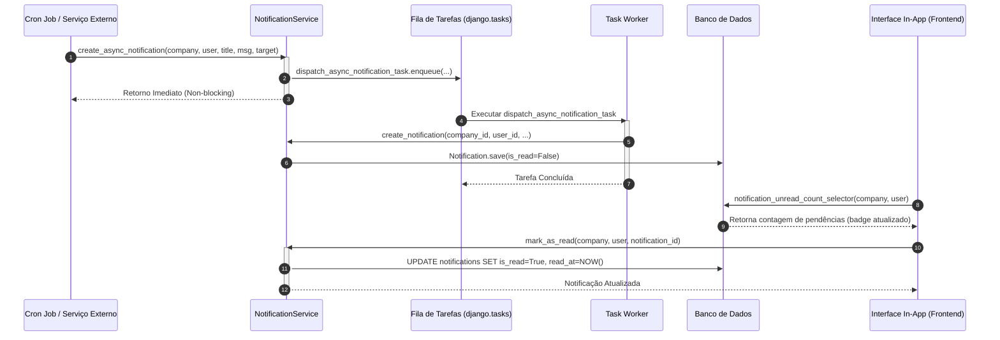

# Regras de Negócio de Notificações In-App

> **Categoria:** Regra de Negócio (Domínio de Notificações)
> **Relacionados:** [Lógica de Parcelas Vencidas](../finances/installment-overdue-logic.md) · [Integração de Pagamentos com Agenda](../finances/payment-schedule-integration.md) · [Domínio de Notificações](../../domains/notifications-domain.md)

---

## 1. Contexto e Invariantes do Domínio

O subsistema de **Notificações In-App** fornece avisos e alertas operacionais em tempo real e em segundo plano para assessores e noivos, assegurando que prazos contratuais, parcelas financeiras e tarefas críticas não sejam perdidos.

### Invariantes Fundamentais (RN-NOTIF):
1. **Isolamento Estrito por Tenant e Destinatário (RN-NOTIF-01):** Toda notificação é criada vinculada obrigatoriamente a uma empresa (`Company`) e a um usuário (`User`). Consultas de contagem e listagem aplicam estritamente `.for_tenant(company).filter(user=user)`.
2. **Resolução Flexível de Identificadores (RN-NOTIF-02):** O serviço aceita parâmetros como instâncias de modelo (`Company`, `User`), inteiros (`pk`) ou strings/UUIDs, resolvendo a entidade de forma segura.
3. **Disparo Assíncrono sem Bloqueio de Requisição (RN-NOTIF-03):** Rotinas em lote (ex.: cron de parcelas vencidas `mark_overdue_installments`) utilizam `create_async_notification`, enfileirando tarefas via `django.tasks` sem degradar a latência das rotinas síncronas.
4. **Ancoragem Polimórfica a Recursos ERP (RN-NOTIF-04):** Notificações suportam metadados de destino (`target_type`, `target_id`, `wedding_id`, `link`), permitindo que a interface frontend redirecione o usuário diretamente para o recurso afetado.
5. **Máquina de Estados de Leitura e Auditoria (RN-NOTIF-05):** Notificações iniciam com `is_read = False` e `read_at = None`. A marcação de leitura define `is_read = True` e carimba `read_at = timezone.now()`. A operação é idempotente.
6. **Operações em Lote e Exclusão Total Segura (RN-NOTIF-06 & RN-NOTIF-07):** Suporta marcação em lote (`bulk_mark_as_read`), exclusão em lote (`bulk_delete`) e limpeza completa (`clear_all`), sempre com filtro estrito de tenant e usuário.

---

## 2. Diagrama de Sequência e Disparo Assíncrono



---

## 3. Matriz de Regras e Casos de Borda

| Código | Regra de Negócio | Gatilho / Condição | Exceção Lançada | Ação do Sistema |
| :--- | :--- | :--- | :--- | :--- |
| **RN-NOTIF-01** | **Validação de Tenant e Usuário** | `user.company_id != company.id`. | `BusinessRuleViolation` | Bloqueia envio de notificação para usuário de outra empresa. |
| **RN-NOTIF-02** | **Leitura Cross-Tenant/User** | Usuário tenta marcar/ler notificação de outro usuário. | `ObjectNotFoundError` | Impede vazamento ou alteração de notificações de terceiros. |
| **RN-NOTIF-03** | **Idempotência de Leitura** | Notificação já lida submetida a `mark_as_read()`. | Nenhuma | Mantém `is_read = True` e preserva o `read_at` original. |
| **RN-NOTIF-04** | **Enfileiramento Assíncrono** | Chamada de `create_async_notification`. | Nenhuma | Despacha para `django.tasks` garantindo resposta rápida da API. |
| **RN-NOTIF-05** | **Limpeza Total Segura** | Execução de `clear_all(company, user)`. | Nenhuma | Deleta atomicamente apenas as notificações pertencentes ao usuário logado. |

---

## 4. Implementação no Código-Fonte Real

### A. Tipos e Modelo de Notificação (`models.py`)

```python
--8<-- "backend/apps/notifications/models.py:9:78"
```

### B. Criação Síncrona e Validação de Tenant (`services.py`)

```python
--8<-- "backend/apps/notifications/services.py:44:106"
```

### C. Criação Assíncrona via Background Task (`services.py`)

```python
--8<-- "backend/apps/notifications/services.py:151:197"
```

### D. Gestão de Leitura e Auditoria Temporal (`services.py`)

```python
--8<-- "backend/apps/notifications/services.py:199:262"
```

---

## 5. Casos de Teste Automatizados (Pytest)

A suíte de testes unitários em `apps/notifications/tests/test_services.py` valida 100% das regras do domínio de notificações:

- `test_create_notification_success`: Valida persistência de notificação com status não lido.
- `test_create_notification_failure_user_company_mismatch`: Valida rejeição quando usuário não pertence à empresa informada.
- `test_create_async_notification_success`: Valida enfileiramento correto via `django.tasks`.
- `test_mark_as_read_success`: Valida alteração de status e registro de timestamp `read_at`.
- `test_mark_as_read_already_read_idempotent`: Valida idempotência preservando o timestamp inicial.
- `test_mark_all_as_read_multitenancy_isolated`: Valida isolamento impedindo leitura de dados de outro usuário.
- `test_bulk_delete_success` e `test_clear_all_success`: Valida operações em lote e limpeza de notificações.
