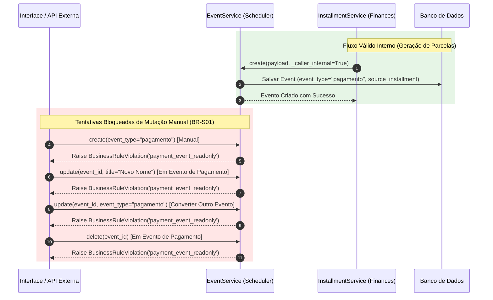

# Proteção Somente-Leitura para Eventos de Pagamento (BR-S01)

> **Categoria:** Regra de Negócio (Domínio de Cronograma & Finanças)
> **Relacionados:** [Integração de Pagamentos com Agenda](../finances/payment-schedule-integration.md) · [Regras de Integridade Financeira](../finances/financial-integrity-rules.md) · [Motor de Recorrência](recurrence-rules-engine.md) · [Domínio de Scheduler](../../domains/scheduler-domain.md)

---

## 1. Contexto e Invariantes do Domínio

No ecossistema do **Wedding Management System**, eventos com `event_type = "pagamento"` não são compromissos comuns de agenda; eles constituem **projeções financeiras contábeis** derivadas das parcelas (`Installment`).

A plataforma aplica o **Princípio da Fonte Única da Verdade (SSOT)**: qualquer alteração de valor, vencimento ou cancelamento deve ser realizada obrigatoriamente no módulo financeiro (`finances`). O módulo de agendamento (`scheduler`) atua estritamente como consumidor e visualizador de leitura.

### Invariantes de Bloqueio Tríplice (BR-S01):
1. **Bloqueio de Criação Manual:** Tentativas de criar diretamente um evento com `event_type="pagamento"` via API ou formulários manuais disparam `BusinessRuleViolation('payment_event_readonly')`. A criação só é permitida através de chamadas internas com a flag de serviço `_caller_internal=True`.
2. **Bloqueio de Edição Manual:** Eventos existentes do tipo `pagamento` têm todos os seus campos blindados contra edição via `EventService.update`. Adicionalmente, nenhum outro evento (reunião, visita, degustação) pode ter seu `event_type` alterado para `"pagamento"`.
3. **Bloqueio de Exclusão Manual:** A exclusão direta de um evento de pagamento via `EventService.delete` é rejeitada com `BusinessRuleViolation('payment_event_readonly')`. A exclusão só ocorre de maneira atômica durante a deleção ou redistribuição da parcela de origem no módulo financeiro.
4. **Padrão de UX no Frontend:** A interface React renderiza um modal específico de somente-leitura (`ReadOnlyEventDetails.tsx`), omitindo ações de mutação e fornecendo atalho de redirecionamento para o módulo de Finanças.

---

## 2. Diagrama de Sequência e Interceptação de Mutações



---

## 3. Matriz de Regras e Casos de Borda

| Código | Regra de Negócio | Gatilho / Condição | Exceção Lançada | Ação do Sistema |
| :--- | :--- | :--- | :--- | :--- |
| **BR-S01-GUARD-01** | **Criação Manual Bloqueada** | `payload.event_type == 'pagamento'` e `_caller_internal == False`. | `BusinessRuleViolation` (`payment_event_readonly`) | Rejeita a criação com mensagem orientativa para usar o módulo financeiro. |
| **BR-S01-GUARD-02** | **Edição de Pagamento Bloqueada** | `instance.event_type == 'pagamento'` no `EventService.update`. | `BusinessRuleViolation` (`payment_event_readonly`) | Impede descolamento entre a data/título do calendário e a parcela real. |
| **BR-S01-GUARD-03** | **Conversão Ilegal de Tipo** | `data.event_type == 'pagamento'` em evento de outro tipo. | `BusinessRuleViolation` (`payment_event_readonly`) | Impede burlar a proteção convertendo eventos comuns em eventos de pagamento. |
| **BR-S01-GUARD-04** | **Deleção Manual Bloqueada** | `instance.event_type == 'pagamento'` no `EventService.delete`. | `BusinessRuleViolation` (`payment_event_readonly`) | Impede apagar o alerta de pagamento sem liquidar ou excluir a parcela financeira. |

---

## 4. Implementação no Código-Fonte Real

### A. Guard de Criação (`events.py`)

```python
--8<-- "backend/apps/scheduler/services/events.py:78:88"
```

### B. Guard de Atualização (`events.py`)

```python
--8<-- "backend/apps/scheduler/services/events.py:137:155"
```

### C. Guard de Exclusão (`events.py`)

```python
--8<-- "backend/apps/scheduler/services/events.py:192:201"
```

---

## 5. Casos de Teste Automatizados (Pytest)

A suíte de testes unitários em `apps/scheduler/tests/appointments/test_services.py` e `apps/finances/tests/installments/test_services.py` valida todas as travas da regra BR-S01:

- `test_create_payment_event_blocked`: Valida rejeição imediata na criação manual com código `payment_event_readonly`.
- `test_create_payment_event_internal_allowed`: Valida sucesso da criação originada de `InstallmentService` com `_caller_internal=True`.
- `test_update_payment_event_blocked`: Valida que alterar o título de um evento de pagamento dispara `payment_event_readonly`.
- `test_update_payment_event_all_fields_blocked`: Valida que qualquer campo (ex.: `start_time`) é bloqueado contra edição.
- `test_update_cannot_change_event_type_to_payment`: Valida bloqueio ao tentar converter um evento tipo `reuniao` para `pagamento`.
- `test_delete_payment_event_blocked`: Valida que a exclusão manual via `EventService.delete` é bloqueada.
