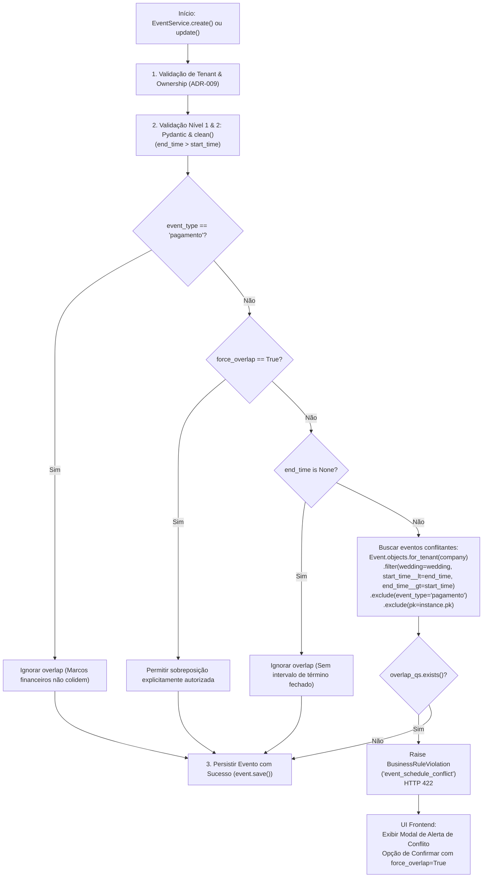

# Detecção e Validação de Conflito de Agenda (Soft Overlap)

> **Categoria:** Regra de Negócio (Domínio de Cronograma / Scheduler)
> **Relacionados:** [MOC de Cronograma (Scheduler)](index.md) · [Proteção Somente-Leitura para Eventos de Pagamento](payment-event-readonly-guard.md) · [Motor de Regras de Recorrência](recurrence-rules-engine.md) · [ADR-030: Rich Domain Model](../../adr/030-rich-domain-model-service-layer.md) · [Domínio de Scheduler](../../domains/scheduler-domain.md)

---

## 1. Contexto e Invariantes do Domínio

No planejamento de casamentos, a gestão do tempo é crítica: múltiplos compromissos (reuniões com fornecedores, visitas técnicas, provas de vestidos e degustações) concorrem pelo cronograma da assessoria e do casal. A sobreposição desavisada de horários pode causar atrasos graves ou ausências em compromissos presenciais.

A plataforma implementa a regra canônica **BR-S03**, que estabelece a detecção de conflitos de horários em nível de casamento (`Wedding`), adotando o padrão de **Validação Suave com Sobrescrita Explícita (*Soft Validation with Override*)**:
- Por padrão, a criação ou atualização de eventos que colidam com outros agendamentos existentes no mesmo casamento é bloqueada preventivamente, retornando HTTP 422 (`event_schedule_conflict`).
- No entanto, a plataforma reconhece que determinados compromissos podem ocorrer em paralelo (por exemplo, recepção simultânea a uma sessão de fotos). Portanto, o usuário pode confirmar a sobreposição enviando a flag explícita `force_overlap: bool = True`, autorizando o agendamento concomitante.

### Invariantes Fundamentais da Regra (BR-S03):
1. **Escopo Estrito por Casamento (`wedding=wedding`):** A verificação de sobreposição ocorre exclusivamente entre eventos do **mesmo casamento**. Compromissos pertencentes a casamentos distintos não geram conflito mútuo nesta validação.
2. **Isolamento Multi-Tenant (`Company`):** Toda consulta de conflito é realizada obrigatoriamente através de `Event.objects.for_tenant(company)`.
3. **Exclusão de Eventos de Pagamento (`event_type != 'pagamento'`):** Projeções de vencimento financeiro (`event_type="pagamento"`, regidas por [BR-S01](payment-event-readonly-guard.md)) são marcos contábeis e não ocupam tempo físico de agenda. Logo, são excluídas da checagem de colisão e nunca impedem nem são impedidas por outros compromissos.
4. **Exclusão de Eventos sem Hora de Término (`end_time is None`):** Eventos pontuais ou marcos de dia inteiro que não especificam `end_time` não produzem intervalo fechado e não disparam colisão de horário.
5. **Auto-Exclusão em Atualizações (`exclude(pk=instance.pk)`):** Durante operações de atualização (`EventService.update`), o próprio evento em edição é excluído da busca, impedindo falsos positivos de conflito consigo mesmo.
6. **Mecanismo de Sobrescrita (*Soft Override*):** Quando `force_overlap = True`, a verificação de sobreposição é intencionalmente ignorada no serviço, permitindo a coexistência dos eventos.

### Formulação Matemática de Conflito de Intervalos
Dados dois intervalos temporais semi-abertos representados por $I_1 = [s_1, e_1)$ e $I_2 = [s_2, e_2)$, onde $s$ representa a data/hora de início (`start_time`) e $e$ a data/hora de término (`end_time`), uma sobreposição estrita ocorre se e somente se:

\[
(s_1 < e_2) \land (e_1 > s_2)
\]

No contexto do Django ORM, ao testar um novo evento proposto com início $s_{\text{proposto}}$ e término $e_{\text{proposto}}$ contra eventos persistidos no banco de dados com início $s_{\text{existente}}$ e término $e_{\text{existente}}$, a cláusula de colisão é estruturada da seguinte forma:

```python
start_time__lt = end_time_proposto,
end_time__gt = start_time_proposto
```

---

## 2. Diagrama de Fluxo e Validação de Conflito de Horário

O diagrama a seguir ilustra a tomada de decisão no Service Layer durante a criação ou atualização de compromissos:



---

## 3. Matriz de Regras e Casos de Borda

| Código | Regra de Negócio | Gatilho / Condição | Exceção Lançada | Ação do Sistema |
| :--- | :--- | :--- | :--- | :--- |
| **BR-S03-A** | **Detecção de Conflito Padrão** | `force_overlap=False`, `end_time` definido, colisão ORM detectada no mesmo casamento. | `BusinessRuleViolation` (`event_schedule_conflict`) | Rejeita a operação com HTTP 422 informando que já existe compromisso no horário. |
| **BR-S03-B** | **Sobrescrita Explícita (*Override*)** | Requisição enviada com `force_overlap=True`. | Nenhuma (Permitido) | Ignora a validação de colisão e autoriza o agendamento simultâneo. |
| **BR-S03-C** | **Isenção de Eventos de Pagamento** | `event_type == 'pagamento'` em qualquer um dos eventos. | Nenhuma (Isento) | Eventos contábeis de pagamento nunca bloqueiam nem são bloqueados por compromissos de agenda. |
| **BR-S03-D** | **Isolamento entre Casamentos Distintos** | Eventos ocorrendo no mesmo horário, porém vinculados a casamentos diferentes. | Nenhuma (Isolado) | O filtro `wedding=wedding` garante que o conflito só é avaliado dentro do escopo do casamento em questão. |
| **BR-S03-E** | **Auto-Exclusão em Atualizações** | Edição de título, local ou dados sem alteração conflituosa de horário no mesmo evento. | Nenhuma (Auto-excluído) | A cláusula `.exclude(pk=instance.pk)` evita que o próprio evento seja considerado colisor de si mesmo. |
| **BR-S03-F** | **Intervalos Tangentes (Sem Sobreposição)** | Evento 1: `10:00 - 11:00`; Evento 2: `11:00 - 12:00`. | Nenhuma (Válido) | Como a condição exige estritamente $s_1 < e_2 \land e_1 > s_2$, o término coincidente com o início subsequente não gera colisão. |

---

## 4. Separação Formal em 3 Níveis (ADR-030)

O ecossistema implementa rigorosamente a validação em 3 níveis formais conforme definido na [ADR-030](../../adr/030-rich-domain-model-service-layer.md):

### Nível 1: Entrada e Sintaxe (Pydantic Schemas)
Nos schemas [`EventIn`](../../../../backend/apps/scheduler/schemas/event.py) e [`EventPatchIn`](../../../../backend/apps/scheduler/schemas/event.py), o Pydantic valida os limites de tipos, strings sem espaços redundantes (`str_strip_whitespace=True`), sanitização e a coerência sintática dos horários:

```python
class EventIn(Schema):
    model_config = ConfigDict(str_strip_whitespace=True)

    wedding: UUID4
    title: str = Field(min_length=1, max_length=255)
    start_time: datetime
    end_time: datetime | None = None
    event_type: str = Field(max_length=50)
    force_overlap: bool = False

    @model_validator(mode="after")
    def validate_event(self) -> "EventIn":
        if self.start_time and self.end_time and self.end_time <= self.start_time:
            raise ValueError(
                "A hora de término não pode ser anterior à hora de início."
            )
        return self
```

### Nível 2: Invariantes Intrínsecas do Modelo (`Event.clean`)
Na entidade [`Event`](../../../../backend/apps/scheduler/models/event.py), o método `clean()` atua como guardião de integridade do banco de dados, sendo invocado automaticamente pelo `BaseModel.save()`:

```python
def clean(self) -> None:
    super().clean()
    if self.end_time and self.start_time and self.end_time < self.start_time:
        raise ValidationError(
            {"end_time": "A hora de término não pode ser anterior à hora de início."}
        )
```

### Nível 3: Orquestração de Caso de Uso e Multi-Tenancy (`EventService`)
A validação de sobreposição exige conhecimento do banco de dados, isolamento multi-tenant por empresa (`Company`) e filtro relacional por casamento (`Wedding`). Essa lógica pertence exclusivamente ao Service Layer em [`apps/scheduler/services/events.py`](../../../../backend/apps/scheduler/services/events.py):

```python
@staticmethod
def _validate_event_overlap(
    *,
    company: Company,
    wedding: Wedding,
    start_time: Any,
    end_time: Any,
    event_type: str,
    force_overlap: bool,
    instance: Event | None = None,
) -> None:
    if (
        event_type != Event.TypeChoices.PAYMENT
        and not force_overlap
        and end_time is not None
    ):
        overlap_qs = (
            Event.objects.for_tenant(company)
            .filter(
                wedding=wedding,
                start_time__lt=end_time,
                end_time__gt=start_time,
            )
            .exclude(event_type=Event.TypeChoices.PAYMENT)
        )
        if instance is not None and instance.pk:
            overlap_qs = overlap_qs.exclude(pk=instance.pk)
        if overlap_qs.exists():
            raise BusinessRuleViolation(
                "event_schedule_conflict",
                message=(
                    "Existe outro compromisso agendado para este "
                    "horário no casamento."
                ),
            )
```

---

## 5. Casos de Teste Automatizados (Pytest)

A suíte de testes unitários em [`backend/apps/scheduler/tests/appointments/test_services.py`](../../../../backend/apps/scheduler/tests/appointments/test_services.py) garante 100% de cobertura das condições da regra BR-S03:

- `test_create_event_overlap_blocked_when_force_overlap_false`: Comprova que a criação de um evento colidente com `force_overlap=False` lança `BusinessRuleViolation('event_schedule_conflict')`.
- `test_create_event_overlap_allowed_when_force_overlap_true`: Valida que o envio de `force_overlap=True` ignora o bloqueio e persiste o evento sobreposto.
- `test_create_event_overlap_ignores_payment_events`: Garante que eventos gerados por parcelas financeiras (`event_type="pagamento"`) não causam conflito com compromissos de agenda.
- `test_create_event_overlap_ignores_different_wedding`: Comprova que compromissos de casamentos distintos no mesmo horário não geram falsos conflitos.
- `test_update_event_overlap_blocked_when_force_overlap_false`: Valida que a edição de horário gerando colisão é bloqueada quando `force_overlap=False`.
- `test_update_event_overlap_allowed_when_force_overlap_true`: Valida que a atualização de evento com colisão é permitida quando `force_overlap=True`.
- `test_update_event_overlap_excludes_self`: Valida que atualizar campos não temporais (como `title` ou `description`) não bloqueia o próprio evento por falsa colisão interna.
