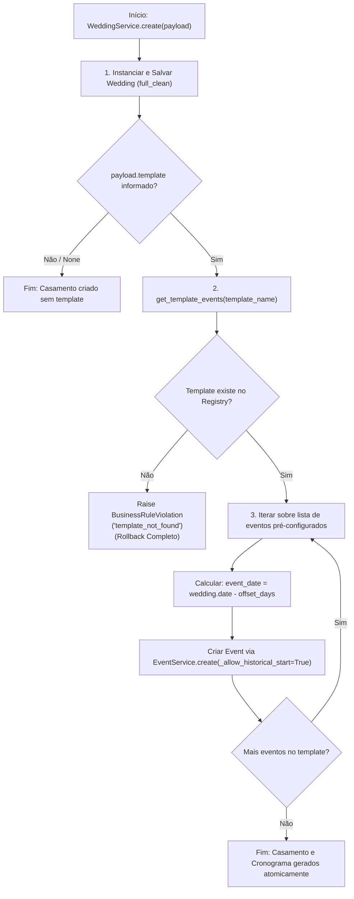

# Aplicação de Templates de Cronograma de Casamento

> **Categoria:** Regra de Negócio (Domínio de Casamentos & Cronograma)
> **Relacionados:** [Ciclo de Vida do Casamento](wedding-status-lifecycle.md) · [Motor de Recorrência](../scheduler/recurrence-rules-engine.md) · [Proteção Somente-Leitura de Pagamentos](../scheduler/payment-event-readonly-guard.md) · [Domínio de Casamentos](../../domains/weddings-domain.md) · [Domínio de Scheduler](../../domains/scheduler-domain.md)

---

## 1. Contexto e Invariantes do Domínio

Ao cadastrar um novo casamento via `WeddingService.create()`, o assessor pode selecionar um **Template de Cronograma Canônico** (ex.: 12 meses religioso, 6 meses praia, 3 meses civil + buffet). O motor de templates calcula e agenda automaticamente marcos essenciais relativos à data do evento.

### Invariantes Fundamentais:
1. **Templates Canônicos Registrados (`TEMPLATES`):**
   - `religious_12m` (12 Meses Religioso): 10 eventos distribuídos entre 365 e 7 dias antes do casamento.
   - `beach_6m` (6 Meses Praia): 8 eventos distribuídos entre 180 e 7 dias antes do casamento.
   - `civil_buffet_3m` (3 Meses Civil + Buffet): 7 eventos distribuídos entre 90 e 3 dias antes do casamento.
2. **Cálculo Relativo por Offset (`offset_days`):** Cada marco define um deslocamento em dias antes da data do casamento ($d_{\text{wedding}}$). O evento é fixado canonicamente às 09:00:00 AM no fuso horário configurado.
3. **Transacionalidade Atômica e Rollback Total:** A criação do casamento e a geração de todos os eventos do template ocorrem sob `@transaction.atomic`. Se qualquer evento falhar, todo o processo é revertido.
4. **Bypass de Início Histórico (`_allow_historical_start=True`):** Se a data do casamento estiver muito próxima e alguns marcos ficarem matematicamente no passado, a flag interna permite o salvamento dos marcos históricos sem disparar a trava de data no passado.

### Fórmulas Matemáticas de Agendamento:
Para um casamento com data $d_{\text{wedding}}$ e um evento de template com deslocamento $\Delta d_{\text{offset}}$:

$$d_{\text{evento}} = d_{\text{wedding}} - \Delta d_{\text{offset}}$$

$$t_{\text{start}} = \text{combine}\left(d_{\text{evento}}, \text{09:00:00}\right)_{\text{aware}}$$

$$\text{Exemplo: } d_{\text{wedding}} = \text{2026-12-15}, \; \Delta d = 180\text{ dias} \implies d_{\text{evento}} = \text{2026-06-18 às 09:00:00}$$

---

## 2. Diagrama de Fluxo e Aplicação de Templates



---

## 3. Matriz de Regras e Casos de Borda

| Código | Regra de Negócio | Gatilho / Condição | Exceção Lançada | Ação do Sistema |
| :--- | :--- | :--- | :--- | :--- |
| **BR-W-TMPL-01** | **Template Inexistente** | `template` informado não consta no `TEMPLATES` registry. | `BusinessRuleViolation` (`template_not_found`) | Aborta a transação e impede a criação de casamento corrompido. |
| **BR-W-TMPL-02** | **Offset Relativo Exato** | Criação com template válido. | Sucesso na criação dos eventos | Aplica o cálculo $d_{\text{wedding}} - \text{offset}$ para cada marco. |
| **BR-W-TMPL-03** | **Marcos Históricos** | Casamento criado com data menor que o offset do evento. | Nenhuma (`_allow_historical_start=True`) | Registra o marco como histórico sem falhar a validação. |
| **BR-W-TMPL-04** | **Isolamento de Templates** | Múltiplas aplicações do mesmo template em casamentos diferentes. | Nenhuma | Garante que dicionários de templates não sofram mutações em memória. |

---

## 4. Implementação no Código-Fonte Real

### A. Catálogo e Registro de Templates (`templates.py`)

```python
--8<-- "backend/apps/scheduler/services/templates.py:156:191"
```

### B. Orquestração no Serviço de Casamentos (`services.py`)

```python
--8<-- "backend/apps/weddings/services.py:192:233"
```

---

## 5. Casos de Teste Automatizados (Pytest)

A suíte de testes unitários em `apps/weddings/tests/test_services.py` valida a aplicação de templates:

- `test_create_wedding_with_religious_12m_template`: Valida criação dos 10 eventos com offsets exatos.
- `test_create_wedding_with_beach_6m_template`: Valida template de 6 meses de praia gerando 8 eventos.
- `test_create_wedding_with_civil_buffet_3m_template`: Valida template de 3 meses civil gerando 7 eventos.
- `test_create_wedding_with_invalid_template_raises`: Valida erro `template_not_found` e rollback total do casamento.
- `test_template_events_are_correctly_offset`: Valida o cálculo matemático dos offsets de cada evento.
- `test_template_does_not_mutate_shared_data`: Valida imutabilidade de templates compartilhados em memória.
