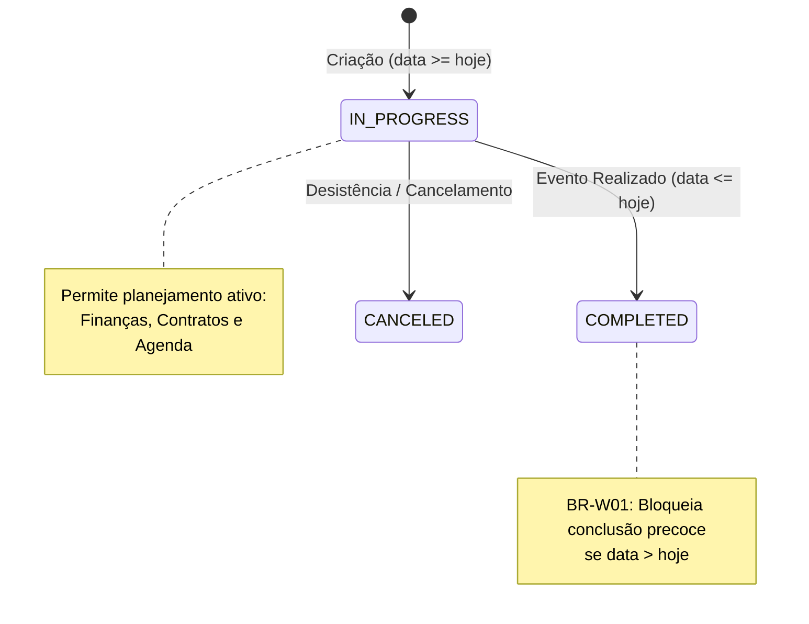

# Ciclo de Vida do Status do Casamento e Validações

> **Categoria:** Regra de Negócio (Domínio de Casamentos)
> **Relacionados:** [Templates de Cronograma](wedding-schedule-templates.md) · [Regras de Integridade Financeira](../finances/financial-integrity-rules.md) · [Máquina de Estados de Contratos](../logistics/contract-state-machine.md) · [Domínio de Casamentos](../../domains/weddings-domain.md)

---

## 1. Contexto e Invariantes do Domínio

A entidade central `Wedding` encapsula o contexto global de cada casal no sistema. Toda a gestão financeira, logística, fornecedores e cronograma orbita em torno do casamento. Seu ciclo de vida e datas possuem regras estritas para evitar fechamento prematuro e contaminação de dados passados.

### Invariantes Fundamentais:
1. **Status Canônicos (`StatusChoices`):**
   - `IN_PROGRESS` (Em Andamento): Status padrão atribuído na criação (`default="IN_PROGRESS"`). Permite planejamento ativo, alocação orçamentária, contratação de serviços e agendamentos.
   - `COMPLETED` (Concluído): Indica que o evento foi realizado com sucesso.
   - `CANCELED` (Cancelado): Indica o encerramento do evento. Mantém o histórico sem deletar os registros vinculados.
2. **Guarda de Conclusão Prematura (BR-W01):** Um casamento só pode ser transitado para `COMPLETED` se a sua data de realização já tiver passado ou for hoje:

   $$d_{\text{wedding}} \le d_{\text{today}}$$

   Tentativas de concluir um casamento com data futura disparam `ValidationError("Não pode marcar como CONCLUÍDO antes da data do casamento")` no método `clean()` do modelo.
3. **Validação de Data Futura no Cadastro:** No cadastro ou alteração de data, a função `validate_future_date` exige que a data do casamento seja maior ou igual à data atual ($d_{\text{wedding}} \ge d_{\text{today}}$).
4. **Proteção na Exclusão (Hard Delete Guard):** A deleção de um casamento através de `WeddingService.delete()` valida os relacionamentos por chave estrangeira. Se existirem contratos ou despesas protegidos (`on_delete=models.PROTECT`), o banco dispara `ProtectedError`, interceptado pelo serviço para levantar `DomainIntegrityError('wedding_protected_error')`.

---

## 2. Diagrama de Estados e Ciclo de Vida



---

## 3. Matriz de Regras e Casos de Borda

| Código | Regra de Negócio | Gatilho / Condição | Exceção Lançada | Ação do Sistema |
| :--- | :--- | :--- | :--- | :--- |
| **BR-W01** | **Conclusão Prematura Bloqueada** | Alterar status para `COMPLETED` quando `wedding.date > timezone.now().date()`. | `ValidationError` | Impede o fechamento indevido de casamentos que ainda não ocorreram. |
| **BR-W02** | **Data Inicial no Futuro** | Criar casamento com `date < timezone.now().date()`. | `ValidationError` (`validate_future_date`) | Bloqueia cadastros retroativos na interface de criação. |
| **BR-W03** | **Proteção de Exclusão** | Exclusão de casamento com contratos ou despesas ativas. | `DomainIntegrityError` (`wedding_protected_error`) | Bloqueia a perda de dados contábeis e contratuais. |
| **BR-W04** | **Ordenação Decrescente** | Listagem padrão via `WeddingQuerySet`. | Nenhuma | Ordena por `-date` (casamentos mais distantes primeiro). |

---

## 4. Implementação no Código-Fonte Real

### A. Modelo de Casamento e Validação no `clean()` (`models.py`)

```python
--8<-- "backend/apps/weddings/models.py:11:69"
```

### B. Proteção contra Deleção em Cascata Indevida (`services.py`)

```python
--8<-- "backend/apps/weddings/services.py:145:189"
```

---

## 5. Casos de Teste Automatizados (Pytest)

A suíte de testes unitários em `apps/weddings/tests/test_models.py` e `apps/weddings/tests/test_services.py` valida o ciclo de vida do casamento:

- `test_status_completed_invalid_future_date`: Valida que casamento futuro NÃO pode ser marcado como `COMPLETED` (BR-W01).
- `test_status_completed_valid_past_date`: Valida que casamento com data passada pode ser concluído com sucesso.
- `test_wedding_date_past_fails`: Valida o validador `validate_future_date` rejeitando datas passadas.
- `test_wedding_date_future_passes`: Valida aceitação de datas futuras.
- `test_delete_wedding_protected_by_contracts`: Valida o disparo de `DomainIntegrityError` na tentativa de deletar casamento com contratos vinculados.
