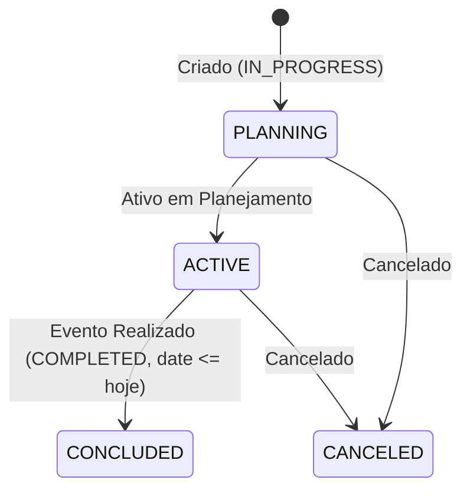

# Regra de Negócio: Ciclo de Vida do Status e Validações do Casamento

> **Módulo:** [weddings-domain](../../domains/weddings-domain.md) | [wedding-model](../../../reference/models/weddings/wedding-model.md)
> **Código:** `backend/apps/weddings/models.py`, `backend/apps/weddings/services.py`


---

## 1. Transição de Status (`StatusChoices`)

A máquina de estados do casamento possui três estados possíveis:



```text
[IN_PROGRESS] -------------> [COMPLETED]
      |
      +--------------------> [CANCELED]
```

- **`IN_PROGRESS` (Em Andamento):** Status padrão atribuído na criação do casamento (`default="IN_PROGRESS"`). Permite planejamento orçamentário, vinculação de contratos, adição de fornecedores e eventos de cronograma.
- **`COMPLETED` (Concluído):** Indica que o casamento foi realizado com sucesso.
  - *Regra de Validação:* O método `clean()` do modelo `Wedding` impede marcar um casamento como `COMPLETED` se a sua data for estritamente posterior à data atual (`date > hoje`).
- **`CANCELED` (Cancelado):** Indica o cancelamento do evento. Inativa alertas operacionais sem apagar o histórico de dados no banco.

---

## 2. Validações na Criação (`validate_future_date`)

- Ao cadastrar ou alterar a data de um casamento (`date`), o validador `validate_future_date` exige que a data seja maior ou igual à data atual (`date >= hoje`). Tentativas de criar um casamento com data no passado disparam `ValidationError("A data do casamento não pode ser no passado.")`.

---

## 3. Proteção e Integridade na Exclusão (`DomainIntegrityError`)

- O método `WeddingService.delete()` valida a posse do tenant e tenta remover o registro.
- Se existirem contratos de logística ou despesas financeiras vinculados ao casamento, o banco de dados bloqueia a exclusão por chave estrangeira (`ProtectedError`).
- O serviço captura o erro e dispara uma exceção tratada de domínio: `DomainIntegrityError` (código `wedding_protected_error`), retornando HTTP 400 com a mensagem *"Não é possível apagar este casamento pois existem contratos ou despesas vinculadas a ele."*.
