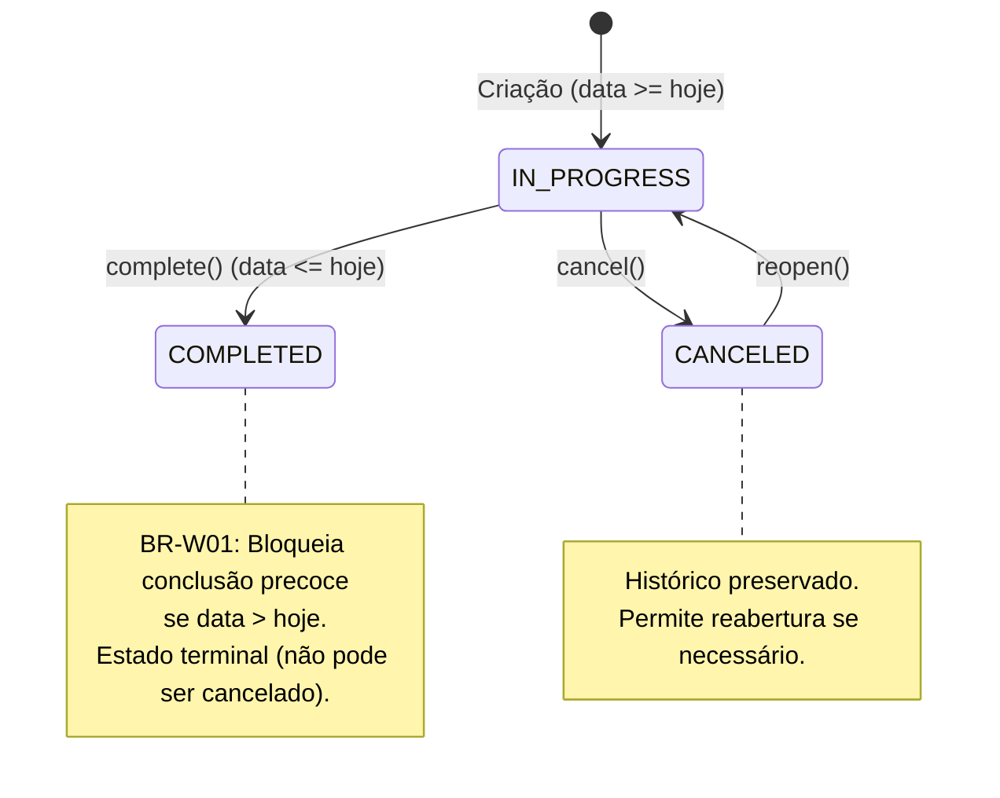

# Ciclo de Vida do Status do Casamento e Validações

> **Categoria:** Regra de Negócio (Domínio de Casamentos)
> **Relacionados:** [ADR-030: Rich Domain Model](../../adr/030-rich-domain-model-service-layer.md) · [Templates de Cronograma](wedding-schedule-templates.md) · [Regras de Integridade Financeira](../finances/financial-integrity-rules.md) · [Máquina de Estados de Contratos](../logistics/contract-state-machine.md) · [Domínio de Casamentos](../../domains/weddings-domain.md)

---

## 1. Contexto e Invariantes do Domínio

A entidade central `Wedding` encapsula o contexto global de cada casal no sistema. Seguindo o padrão **Rich Domain Model (ADR-030)**, a entidade é responsável por gerenciar sua própria máquina de estados, transições válidas e integridade temporal.

### Invariantes Fundamentais:
1. **Status Canônicos (`StatusChoices`):**
   - `IN_PROGRESS` (Em Andamento): Status padrão atribuído na criação (`default="IN_PROGRESS"`). Permite planejamento ativo, alocação orçamentária, contratação de serviços e agendamentos.
   - `COMPLETED` (Concluído): Indica que o evento foi realizado com sucesso. É um estado terminal.
   - `CANCELED` (Cancelado): Indica a suspensão ou cancelamento do evento. Pode ser reaberto para `IN_PROGRESS`.
2. **Guarda de Conclusão Prematura (BR-W01):** Um casamento só pode ser concluído se a sua data de realização já tiver chegado ou for hoje:

   $$d_{\text{wedding}} \le d_{\text{today}}$$

   Tentativas de concluir um casamento futuro disparam `BusinessRuleViolation` (`wedding_premature_completion`) ou `ValidationError` no `clean()`.
3. **Validação de Data Futura no Cadastro (BR-W02):** No cadastro ou alteração da data de casamentos em andamento, a data do casamento deve ser maior ou igual à data atual ($d_{\text{wedding}} \ge d_{\text{today}}$). Casamentos já concluídos ou históricos preservam suas datas passadas com segurança.
4. **Proteção na Exclusão (BR-W03):** A deleção através de `WeddingService.delete()` valida relacionamentos protegidos. Se existirem contratos ou despesas protegidos (`on_delete=models.PROTECT`), o banco dispara `ProtectedError`, convertido em `DomainIntegrityError('wedding_protected_error')`.
5. **Transições Legais de Estado (BR-W05):** Transições ilegais (como tentar cancelar um casamento já concluído ou transitar de cancelado para concluído diretamente) são rejeitadas com `BusinessRuleViolation` (`wedding_invalid_status_transition`).

---

## 2. Diagrama de Estados e Ciclo de Vida



---

## 3. Matriz de Regras e Casos de Borda

| Código | Regra de Negócio | Gatilho / Condição | Exceção Lançada | Ação do Sistema |
| :--- | :--- | :--- | :--- | :--- |
| **BR-W01** | **Conclusão Prematura Bloqueada** | Chamar `complete()` ou alterar status para `COMPLETED` quando `wedding.date > timezone.now().date()`. | `BusinessRuleViolation` (`wedding_premature_completion`) | Impede o fechamento indevido de casamentos que ainda não ocorreram. |
| **BR-W02** | **Data Inicial no Futuro** | Criar casamento em andamento com `date < timezone.now().date()`. | `ValidationError` (`date`) | Bloqueia cadastros retroativos acidentais. |
| **BR-W03** | **Proteção de Exclusão** | Exclusão de casamento com contratos ou despesas ativas. | `DomainIntegrityError` (`wedding_protected_error`) | Bloqueia a perda de dados contábeis e contratuais. |
| **BR-W04** | **Ordenação Decrescente** | Listagem padrão via `WeddingQuerySet`. | Nenhuma | Ordena por `-date` (casamentos mais distantes primeiro). |
| **BR-W05** | **Transição Ilegal de Status** | Transição proibida pela máquina de estados (ex.: `COMPLETED -> CANCELED`). | `BusinessRuleViolation` (`wedding_invalid_status_transition`) | Impede corrupção do histórico do evento. |

---

## 4. Implementação e Uso do Modelo de Domínio

### A. Entidade Rica `Wedding`
A lógica de transição e cálculo reside diretamente em [`apps/weddings/models.py`](../../../../backend/apps/weddings/models.py):

- `wedding.complete()`: Conclui o evento validando que a data já chegou.
- `wedding.cancel(reason=...)`: Cancela o evento caso não esteja concluído.
- `wedding.reopen()`: Retorna um evento cancelado para o status em andamento.
- `wedding.can_transition_to(target_status)`: Consulta a matriz `ALLOWED_TRANSITIONS`.
- `wedding.days_until`: Retorna a quantidade de dias restantes até o casamento em memória.
- `wedding.is_completed`, `wedding.is_canceled`, `wedding.is_in_progress`, `wedding.is_past`: Propriedades de conveniência.

```python
# Exemplo canônico de uso do modelo rico:
wedding = wedding_get_selector(company=company, uuid=uuid)

if wedding.can_transition_to(Wedding.StatusChoices.COMPLETED):
    wedding.complete()
    wedding.save()
```

### B. Orquestração no `WeddingService`
O serviço em [`apps/weddings/services.py`](../../../../backend/apps/weddings/services.py) coordena transações, verificações de tenant e orquestra a persistência:

- `WeddingService.complete(company, instance)`: Caso de uso para conclusão segura.
- `WeddingService.cancel(company, instance, reason)`: Caso de uso para cancelamento.
- `WeddingService.update(company, instance, payload)`: Delega atualizações de status para `instance.transition_to()`.
- `WeddingService.delete(company, instance)`: Trata proteção relacional com o banco.

---

## 5. Casos de Teste Automatizados (Pytest)

A suíte de testes em `apps/weddings/tests/test_models.py` e `apps/weddings/tests/test_services.py` valida o ciclo de vida:

- `test_complete_success_on_wedding_day`: Conclusão na data correta.
- `test_complete_fails_when_date_is_future`: Bloqueio de conclusão prematura (BR-W01).
- `test_clean_blocks_completed_to_canceled`: Bloqueio de transição ilegal (BR-W05).
- `test_cancel_success_from_in_progress`: Cancelamento válido.
- `test_reopen_success_from_canceled`: Reabertura de casamento cancelado.
- `test_delete_wedding_protected_by_contracts`: Disparo de `DomainIntegrityError` na presença de contratos (BR-W03).
