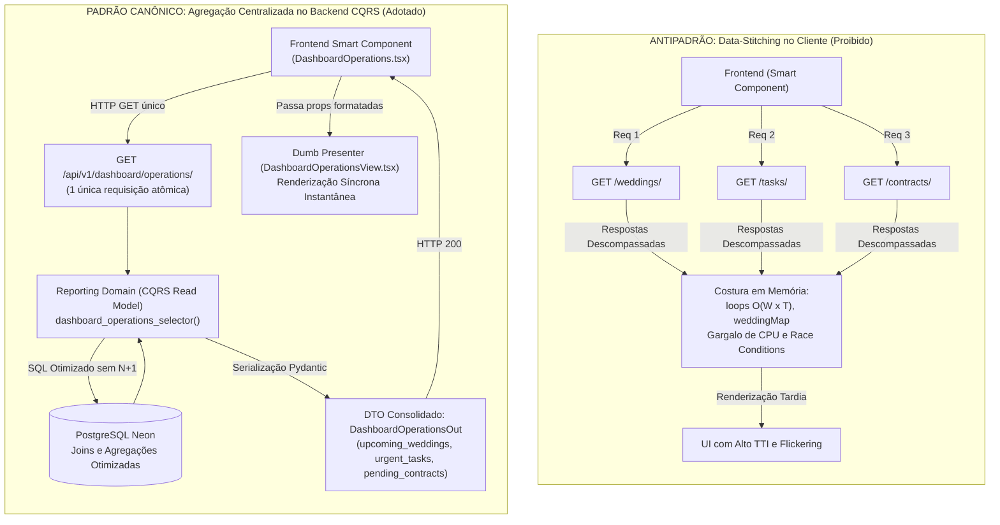

# Padrão Anti-Data-Stitching no Frontend e Centralização CQRS

> **Categoria:** Conceito Arquitetural (Frontend & Reporting)
> **Relacionados:** [ADR-024: Padrão Smart/Dumb no Frontend](../adr/024-padrao-smart-dumb-desacoplamento-componentes-frontend.md) · [ADR-031: Isolamento de Bounded Contexts](../adr/031-inter-module-communication.md) · [Padrão Smart/Dumb Components](smart-dumb-components.md) · [Padrão Query Selectors](query-selectors-pattern.md) · [Reporting Domain](../domains/reporting-domain.md) · [Dashboard Domain](../domains/dashboard-domain.md)

---

## 1. Visão Geral e o Antipadrão de "Data-Stitching"

No desenvolvimento de interfaces ricas para ERPs de eventos, um dos antipadrões mais comuns e prejudiciais à performance é o **Data-Stitching no Frontend** (costura de dados no cliente).

Esse antipadrão ocorre quando a interface precisa exibir uma visão analítica consolidada — como o painel operacional de casamentos, tarefas e contratos — e tenta resolver o problema disparando requisições em leque (*fan-out*) ou cascatas (*waterfalls*) para múltiplos endpoints REST de domínios distintos:

```text
Antipadrão Data-Stitching no Cliente:
GET /api/v1/weddings/          -> baixa 100+ casamentos
GET /api/v1/scheduler/tasks/   -> baixa 500+ tarefas
GET /api/v1/logistics/contracts/ -> baixa 300+ contratos
   └── No Frontend: loops em memória O(W x T), montagem manual de weddingMap,
       filtragem imperativa e ordenação na thread da UI.
```

### Sintomas e Impactos Críticos do Antipadrão

1. **Over-fetching Extremo de Rede:** O cliente transfere centenas de registros completos pela rede móvel apenas para que o frontend filtre e exiba uma lista reduzida dos cinco registros mais urgentes (*Top 5*).
2. **Bloqueio de CPU e Queda de Frames (Jank):** Algoritmos aninhados de junção em memória ($O(W \times T)$) e criação iterativa de dicionários relacionais (`weddingMap: Record<string, string>`) disputam ciclos de CPU com a renderização da interface React.
3. **Condições de Corrida (*Race Conditions*) e Telas Quebradas:** Como as requisições paralelas retornam em tempos desiguais, o estado da interface oscila entre carregamento parcial, inconsistências temporais e múltiplos re-renders desnecessários.
4. **Fragilidade Extrema nos Testes Automatizados:** Os testes unitários do frontend (`Vitest + Testing Library`) tornam-se frágeis e inflados, exigindo mocks extensos de quatro ou cinco hooks de rede distintos para testar um único componente visual.
5. **Violação das Fronteiras de Domínio (ADR-031 no Cliente):** O frontend passa a assumir a responsabilidade indevida de mediar invariantes e relacionamentos entre Bounded Contexts que deveriam ser encapsulados no backend.

---

## 2. Solução Técnica: Centralização CQRS no Backend (`apps/reporting`)

Em estrita conformidade com a [ADR-031](../adr/031-inter-module-communication.md) e a [ADR-024](../adr/024-padrao-smart-dumb-desacoplamento-componentes-frontend.md), o sistema adota uma política de **Tolerância Zero ao Data-Stitching no Frontend**.

Toda e qualquer agregação de dados analíticos, composição multi-domínio ou ordenação cruzada entre entidades pertence **exclusivamente ao backend**, no Bounded Context de **Reporting** ([`backend/apps/reporting/`](../../../backend/apps/reporting/)).

### Pilares da Arquitetura Centralizada

- **Execução Otimizada no Banco de Dados:** As agregações, contagens e cruzamentos utilizam o motor relacional do PostgreSQL (Neon DB) com índices compostos, funções agregadas (`Count`, `Sum`), filtros condicionais (`filter=Q(...)`) e subqueries coalescidas (`Subquery` + `Coalesce`).
- **Sub-Seletores Especializados:** Módulos em [`apps/reporting/selectors/summaries/`](../../../backend/apps/reporting/selectors/summaries/) (`financial.py`, `task.py`, `contract.py`) resolvem dimensões analíticas em queries SQL únicas sem N+1.
- **DTOs Consolidados e Tipados:** O endpoint expõe um DTO Ninja/Pydantic sob medida (ex: `DashboardOperationsOut`, `DashboardSummaryOut`, `ContractDetailAggregateOut`), já projetado com os nomes das entidades relacionadas embutidos (`wedding_name`, `supplier_name`).
- **Requisição Atômica Única:** O frontend dispara **1 única requisição HTTP** e recebe os dados prontos para renderização imediata, sem waterfalls ou loops de costura.

---

## 3. Diagrama: Antipadrão vs Arquitetura CQRS Canônica



---

## 4. Sinergia entre Padrões: ADR-024 e ADR-031

A proibição do Data-Stitching no frontend estabelece uma ponte arquitetural vital entre o frontend e o backend:

| Dimensão | Bounded Contexts & CQRS ([ADR-031](../adr/031-inter-module-communication.md)) | Smart/Dumb Components ([ADR-024](../adr/024-padrao-smart-dumb-desacoplamento-componentes-frontend.md)) |
| :--- | :--- | :--- |
| **Responsabilidade** | Backend orquestra joins multi-domínio no módulo de Reporting. Nenhum domínio operacional conhece tabelas de outro. | Frontend apenas consome o hook gerado do DTO analítico. Nenhuma View costura IDs entre entidades. |
| **Fronteiras** | Bounded Contexts isolados comunicam-se via interfaces públicas ou Reporting CQRS. | Dumb Views recebem modelos enriquecidos já contendo campos textuais derivados (`wedding_name`). |
| **Performance** | Banco de dados resolve agregações em $< 30\text{ ms}$ com índices e `LIMIT 5`. | Navegador renderiza a tela em uma única passagem síncrona ($O(N)$ puro). |
| **Testabilidade** | Seletores testados via `django_assert_num_queries` no backend. | Views testadas com objetos simples em memória, sem necessidade de providers ou mocks de rede. |

---

## 5. Casos de Estudo Reais do Projeto

### Caso de Estudo 1: `StatsCards.tsx` (Dashboard Executivo)

- **Cenário Anterior (Antipadrão):** O componente disparava 5 queries paralelas independentes (contagem de tarefas atrasadas, parcelas a vencer em 7 dias, total vencido, contratos pendentes e próximos casamentos), provocando múltiplos flashes de layout enquanto os cards carregavam em momentos diferentes.
- **Implementação Canônica Atual:**
  - O endpoint `/api/v1/dashboard/summary/` executa [`dashboard_summary_selector()`](../../../backend/apps/reporting/selectors/dashboard_selectors.py) e retorna o DTO [`DashboardSummaryOut`](../../../backend/apps/reporting/schemas.py).
  - O componente [`StatsCards.tsx`](../../../frontend/src/features/dashboard/components/StatsCards.tsx) atua como uma **Dumb View pura**, recebendo `summary?: DashboardSummaryOut` diretamente via props.
  - Os modais de detalhamento ([`InstallmentsDetailSheet`](../../../frontend/src/features/dashboard/components/StatsCards.tsx), [`TasksDetailSheet`](../../../frontend/src/features/dashboard/components/StatsCards.tsx), [`ContractsDetailSheet`](../../../frontend/src/features/dashboard/components/StatsCards.tsx)) renderizam as listas detalhadas embutidas no próprio DTO recebido, sem disparar nenhuma requisição adicional.

### Caso de Estudo 2: `DashboardOperations.tsx` (Painel Operacional)

- **Cenário Anterior (Antipadrão):** O componente recebia a lista completa de casamentos via props, consultava tarefas urgentes e contratos pendentes em endpoints separados e montava um dicionário em memória:
  ```typescript
  // ANTIPADRÃO REMOVIDO:
  const weddingMap = useMemo(() => {
    return weddings.reduce((acc, w) => ({ ...acc, [w.uuid]: `${w.bride_name} e ${w.groom_name}` }), {});
  }, [weddings]);
  ```
- **Implementação Canônica Atual:**
  - O backend expõe o endpoint `GET /api/v1/dashboard/operations/` gerido por [`dashboard_operations_selector()`](../../../backend/apps/reporting/selectors/dashboard_selectors.py).
  - O hook [`useDashboardOperations()`](../../../frontend/src/features/dashboard/hooks/useDashboardOperations.ts) consome o hook unificado `useDashboardOperationsList()`.
  - O container [`DashboardOperations.tsx`](../../../frontend/src/features/dashboard/components/DashboardOperations.tsx) repassa diretamente `displayWeddings`, `urgentTasks` e `pendingContracts` para [`DashboardOperationsView.tsx`](../../../frontend/src/features/dashboard/components/DashboardOperationsView.tsx).
  - O `weddingMap` local foi completamente eliminado, pois os objetos [`DashboardTaskDetailOut`](../../../frontend/src/features/dashboard/components/DashboardOperationsView.tsx) e [`DashboardContractDetailOut`](../../../frontend/src/features/dashboard/components/DashboardOperationsView.tsx) já possuem `wedding_name` resolvido pelo backend.

### Caso de Estudo 3: `ContractDetailDialog.tsx` (Detalhes Agregados de Contrato)

- **Cenário Anterior (Antipadrão):** Ao abrir os detalhes de um contrato, a interface disparava uma consulta inicial para o contrato, seguida de outra consulta para os itens vinculados (`/logistics/items/?contract_id=...`) e outra para os termos aditivos (`/logistics/contracts/?parent_id=...`), criando um waterfall de 3 etapas.
- **Implementação Canônica Atual:**
  - O backend expõe `GET /api/v1/logistics/contracts/{uuid}/details/` suportado pelo seletor [`contract_detail_aggregate_selector()`](../../../backend/apps/logistics/selectors/contract_selectors.py).
  - O seletor executa uma busca única combinando `select_related("wedding", "supplier", "parent")` e `prefetch_related("items", "addendums")`.
  - A resposta serializa o DTO `ContractDetailAggregateOut` contendo o contrato, a lista de itens e os termos aditivos associados, resolvendo a renderização do diálogo em um único ciclo de rede.

---

## 6. Matriz Comparativa: Data-Stitching no Cliente vs CQRS Reporting

| Atributo Técnico | Data-Stitching no Cliente (Antipadrão) | Centralização CQRS no Backend (Padrão Adotado) |
| :--- | :--- | :--- |
| **Requisições de Rede** | Múltiplas requisições paralelas ou em waterfall ($3\text{ a }5\text{ RTTs}$) | Requisição HTTP atômica única ($1\text{ RTT}$) |
| **Volume de Dados Transferidos** | Alto ($> 100\text{ KB}$ em listas brutas completas) | Mínimo ($< 5\text{ KB}$ com projeções e paginação) |
| **Tempo até Interatividade (TTI)** | Alto e variável devido a esperas e parsing local | Baixo e previsível ($< 50\text{ ms}$) |
| **Complexidade Algorítmica da UI** | $O(W \times T)$ em loops de costura e redução de arrays | $O(N)$ em renderização puramente linear |
| **Isolamento de Domínio (DDD)** | Fronteiras vazadas no cliente (UI acoplada a N esquemas) | Fronteiras respeitadas (UI acoplada apenas ao DTO da View) |
| **Complexidade de Testes** | Alta (múltiplos mocks de hooks e contextos) | Mínima (testes de snapshot e renderização de props estáticas) |
