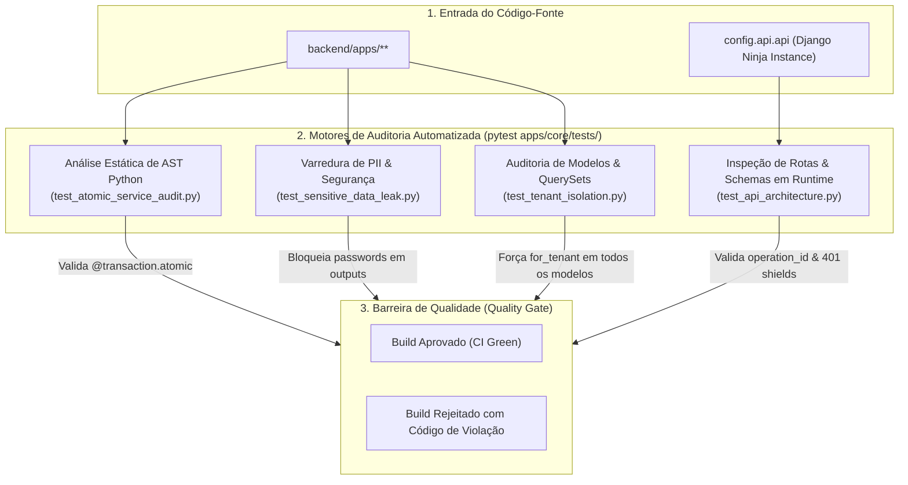

# Suíte de Guard-Rails Arquiteturais e Integridade Estática

> **Categoria:** Conceito Arquitetural
> **Relacionados:** [Índice de Guard-Rails](../../reference/architecture-standards/guard-rails/index.md) · [ADR-031: Comunicação Entre Módulos](../adr/031-inter-module-communication.md) · [Tenant Isolation Guard](../../reference/architecture-standards/guard-rails/tenant-isolation-guard.md) · [Atomic Service Audit Guard](../../reference/architecture-standards/guard-rails/atomic-service-audit-guard.md) · [Security Permissions Guard](../../reference/architecture-standards/guard-rails/security-permissions-guard.md) · [Pipeline de CI/CD](ci-cd-pipeline-flow.md) · [ADR-029: Modern Task Runner (Just)](../adr/029-modern-task-runner-just.md) · [Visão Geral do Sistema](system-overview.md)

---

## 1. Visão Geral e Filosofia dos Guard-Rails

A suíte localizada em `backend/apps/core/tests/` atua como a **barreira de integridade dinâmica e estática** do sistema.

Em vez de testar regras de negócio específicas de um domínio isolado, esses testes realizam **metaprogramação e análise de Árvore Sintática Abstrata (AST)** sobre toda a base de código (`backend/apps/`), convertendo as Decisões Arquiteturais (ADRs) em asserções executáveis pelo `pytest`.

### Por que Guard-Rails Automatizados?
1. **Prevenção de Erosão Arquitetural (*Architecture Drift*):** Impede que novas implementações quebrem convenções de projeto (ex: esquecer `operation_id` em um endpoint ou realizar escrita fora de transação).
2. **Auditoria de Segurança Contínua:** Bloqueia automaticamente vazamentos de PII, senhas ou quebras de isolamento multitenant antes do merge em staging ou produção.
3. **Feedback Imediato no Developer Loop:** Executados em menos de 3 segundos no comando local `just check-ci` (ou `just test` / `uv run poe test`).

---

## 2. Diagrama do Pipeline de Auditoria de Guard-Rails



---

## 3. Catálogo dos Principais Guard-Rails

### A. Auditoria de Operation IDs da API Ninja ([`test_api_architecture.py`](../../../backend/apps/core/tests/test_api_architecture.py))
Inspeciona todos os roteadores registrados na instância global do Django Ninja e assegura que 100% dos endpoints possuam um `operation_id` explícito e não vazio. Essa regra é crítica para a geração determinística dos hooks TypeScript no frontend via Orval:

```python
def test_all_routes_have_operation_id(self) -> None:
    missing_operation_ids: list[tuple[str, list[str]]] = []

    for prefix, router in api._routers:
        for path, path_op in router.path_operations.items():
            full_path = f"{prefix}{path}"
            for op in path_op.operations:
                if not op.operation_id or not str(op.operation_id).strip():
                    missing_operation_ids.append((full_path, op.methods))

    assert not missing_operation_ids, f"Rotas sem operation_id: {missing_operation_ids}"
```

### B. Auditoria Estática de Transações Atômicas via AST ([`test_atomic_service_audit.py`](../../../backend/apps/core/tests/test_atomic_service_audit.py))
Varre a árvore sintática (AST) de todos os arquivos em `apps/*/services/` e detecta métodos que invocam mutações no ORM (`save`, `create`, `update`, `delete`, `bulk_*`). Caso a função não esteja decorada com `@transaction.atomic` ou encapsulada em `with transaction.atomic():`, o teste falha:

```python
def _has_atomic_decorator(func_node: ast.FunctionDef | ast.AsyncFunctionDef) -> bool:
    """Verifica se a função possui o decorador @transaction.atomic ou @atomic."""
    for decorator in func_node.decorator_list:
        if _is_atomic_expr(decorator):
            return True
    return False
```

### C. Isolamento Multitenant (`test_tenant_isolation.py`)
- Valida que todos os modelos de domínio herdam de `TenantModel`.
- Audita se os Managers padrão são instâncias de `TenantManager`.
- Testa cenários de cruzamento de tenants para garantir que nenhum dado vaze entre contas.

### D. Blindagem Contra Vazamento de Dados Sensíveis (`test_sensitive_data_leak.py`)
- Inspeciona os Schemas de saída do Django Ninja para assegurar que campos como `password`, `token`, `secret_key` ou `hash` nunca sejam serializados para o cliente.

### E. Isolamento de Bounded Contexts com Import Linter ([ADR-031](../adr/031-inter-module-communication.md))
- Audita o isolamento de módulos (`apps.finances`, `apps.logistics`, `apps.scheduler`, `apps.weddings`), impedindo importações diretas de `models.py` ou `services.py` alheios.
- Força que toda comunicação síncrona transacional ocorra via fachadas explícitas (`apps.<contexto>.interfaces`).
- Executado via `just lint-imports`, `poe lint-imports` e verificado como quality gate obrigatório no GitHub Actions (`Import Linter Architectural Guard`).

---

## 4. Execução e Integração Contínua (CI/CD)

Os guard-rails arquiteturais rodam em dois momentos obrigatórios:
1. **Localmente:** `pytest backend/apps/core/tests/`, `just lint-imports` ou como parte do macro `poe check`.
2. **GitHub Actions:** No workflow `.github/workflows/ci-pr-validation.yml` em todo Pull Request aberto para `develop` ou `main`.
