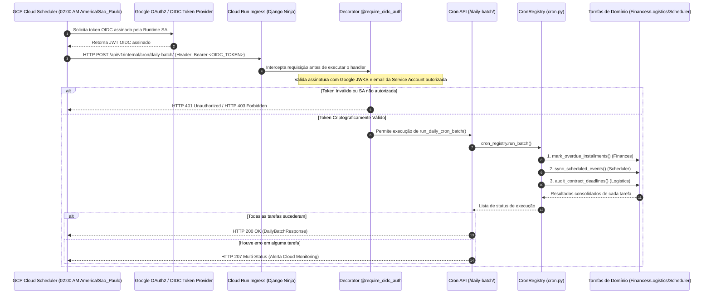

# Arquitetura de Tarefas Assíncronas, Crons & OIDC (`django.tasks`)

> **Categoria:** Conceito Arquitetural
> **Relacionados:** [ADR-017: Infraestrutura de Tarefas Assíncronas](../adr/017-async-task-infrastructure.md) · [ADR-005: Autenticação OIDC no Scheduler](../adr/005-oidc-scheduler.md) · [Visão Geral do Sistema](system-overview.md) · [Pipeline de CI/CD](ci-cd-pipeline-flow.md) · [Guia de Tarefas em Background](../../guides/backend/create-background-tasks.md) · [Guia de Crons](../../guides/backend/register-cron-tasks.md)

---

## 1. Visão Geral e Princípios Fundamentais

A infraestrutura de execução assíncrona e agendamentos periódicos é orientada por dois pilares:

1. **Zero Lock-In na Aplicação:** A camada de código Python não se acopla a drivers proprietários ou bibliotecas pesadas de fila. Consome a API unificada do padrão `django.tasks` (DEP 0014) e decorators padronizados.
2. **Zero Custo Ocioso 24/7 (Arquitetura Serverless):** No ambiente **Google Cloud Run**, a aplicação escala até **0 instâncias** na ausência de tráfego. Não existem instâncias Redis ou containers de workers permanentemente ativos em produção consumindo recursos ociosos.

---

## 2. Diagrama de Topologia e Segurança OIDC



---

## 3. Matriz Multi-Ambiente de Execução

| Ambiente | Backend de Execução (`TASKS["default"]`) | Fila de Mensagens / Broker | Mecanismo de Worker |
| :--- | :--- | :--- | :--- |
| **Desenvolvimento Local** | `HueyTasksBackend` | Valkey 8 / Redis (`db=0`) | Container dedicado (`python manage.py run_huey`) |
| **Testes (Pytest)** | `ImmediateBackend` | Memória local do processo | Execução síncrona imediata no mesmo thread |
| **Produção (Cloud Run)** | `CloudTasksBackend` / `DatabaseBackend` | On-Demand HTTP / Cloud Tasks | Disparo via GCP Cloud Scheduler com OIDC |

---

## 4. Implementação Técnica

### A. Endpoint de Disparo em Lote (`cron_api.py`)
O endpoint `/daily-batch/` é protegido pelo decorator `@require_oidc_auth` e orquestra a execução de todas as tarefas cadastradas no `CronRegistry`, respondendo com status `207 Multi-Status` em caso de falha parcial para alertar os monitores do GCP:

```python
--8<-- "backend/apps/core/cron_api.py:29:72"
```

### B. Decorator de Validação Criptográfica OIDC (`decorators.py`)
A autenticação extrai o token JWT do cabeçalho `Authorization: Bearer <token>`, valida as chaves públicas via Google JWKS e assegura que a requisição partiu exclusivamente da Service Account autorizada:

```python
--8<-- "backend/apps/core/decorators.py:15:57"
```

---

## 5. Infraestrutura como Código (Terraform)

O gatilho periódico é provisionado de forma imutável no arquivo `terraform/production/main.tf`:
- **Recurso:** `google_cloud_scheduler_job.daily_batch_cron`
- **Frequência:** `0 2 * * *` (Todos os dias às 02:00 da manhã)
- **Timezone:** `America/Sao_Paulo`
- **Autenticação:** Configurado com `oidc_token` vinculado à `google_service_account.runtime_sa.email`.
