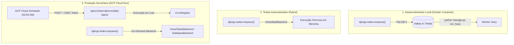

# Arquitetura de Tarefas Assíncronas e Agendamentos (`django.tasks`)

> **Módulo:** [system-overview](system-overview.md) | [ci-cd-pipeline-flow](ci-cd-pipeline-flow.md)
> **Código:** `backend/apps/core/cron.py` | `backend/config/settings/`
> **ADRs:** [ADR-017](../adr/017-async-task-infrastructure.md) | [ADR-005](../adr/005-oidc-scheduler.md)

---

## 1. Visão Geral e Princípios Arquiteturais

A infraestrutura de tarefas em segundo plano e agendamentos periódicos do sistema foi projetada para atender a dois pilares fundamentais:

1. **Zero Lock-In na Aplicação**: A camada de código Python não possui acoplamento direto com bibliotecas de filas (como Celery ou RQ) nem com provedores de nuvem específicos. O desenvolvimento consome **exclusivamente a API nativa `django.tasks` do Django 6.0 (DEP 0014)**.
2. **Zero Custo Ocioso 24/7 em Produção**: No ambiente serverless do **Google Cloud Run**, a infraestrutura escala até **zero instâncias** quando não há tráfego. Não existem containers de workers ou instâncias Redis mantidas ligadas 24 horas por dia consumindo recursos desnecessariamente.

---

## 2. Matriz Comparativa: Tarefas Agendadas vs Tarefas em Segundo Plano

| Característica | ⏰ Tarefas Agendadas (Crons / Daily Batch) | ⚡ Tarefas em Segundo Plano (Async / Background) |
| :--- | :--- | :--- |
| **Gatilho (*Trigger*)** | **Tempo (Relógio / Cron Schedule)**. Ex: "Todos os dias às 02:00 AM". | **Evento de Usuário ou Sistema**. Ex: "Usuário fez upload de contrato". |
| **Previsibilidade** | Horário fixo e pré-programado (Periódico). | Imprevisível, ocorre a qualquer momento sob demanda dos usuários. |
| **Origem do Disparo** | **GCP Cloud Scheduler** via requisição HTTP POST autenticada por OIDC. | **Código Python do ERP** via `minha_tarefa.enqueue(...)` dentro de endpoints/serviços. |
| **Exemplo no ERP** | Verificação noturna de parcelas vencidas (`mark_overdue_installments`). | Processamento assíncrono de OCR de PDFs ou geração de relatórios extensos. |
| **Guia Prático** | [register-cron-tasks](../../guides/backend/register-cron-tasks.md) | [create-background-tasks](../../guides/backend/create-background-tasks.md) |

---

## 3. Comportamento Multi-Ambiente

A backend de execução (`TASKS["default"]` no `settings.py`) adapta-se transparente e automaticamente a cada ambiente:

---

## 4. Arquitetura de Segurança de Crons (GCP Cloud Scheduler + OIDC)

Para disparar as tarefas agendadas diárias sem armazenar senhas ou chaves estáticas no código:

1. **Agendamento no GCP**: O Cloud Scheduler dispara um `HTTP POST` para o endpoint `/api/v1/internal/cron/daily-batch/` às 02:00 AM (`time_zone = "America/Sao_Paulo"`).
2. **Autenticação OIDC**: O GCP assina criptograficamente um token JWT com a Service Account do sistema (`runtime_sa_email`).
3. **Validação Criptográfica**: O decorator `@require_oidc_auth` valida a chave pública do Google JWKS e garante que apenas a Service Account autorizada execute o lote diário ([ADR-005](../adr/005-oidc-scheduler.md)).

---

## 5. Estratégia de Evolução em IaC (Terraform)

- **Provisionado Atualmente**: O Cloud Scheduler Job (`google_cloud_scheduler_job.daily_batch_cron`) está **100% declarado no Terraform** em `terraform/production/main.tf`.
- **Evolução sob Demanda**: Se a carga de tarefas concorrentes em background crescer (ex: centenas de uploads de contratos simultâneos), o recurso `google_cloud_tasks_queue` será instanciado no Terraform para desacoplamento extremo no GCP, **sem exigir alteração em nenhuma linha de código Python** da aplicação.

---

## 6. Documentação Relacionada

- **Guia How-To Crons:** [register-cron-tasks](../../guides/backend/register-cron-tasks.md)
- **Guia How-To Async Tasks:** [create-background-tasks](../../guides/backend/create-background-tasks.md)
- **Decisão Arquitetural:** [ADR-017](../adr/017-async-task-infrastructure.md)
- **Decisão OIDC:** [ADR-005](../adr/005-oidc-scheduler.md)
