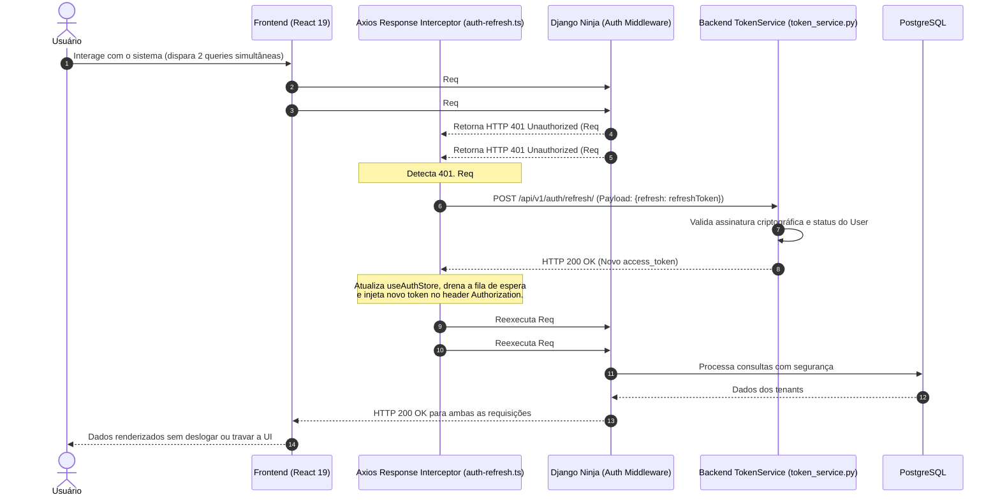

# Fluxo de Autenticação JWT, Refresh Transparente & OAuth2

> **Categoria:** Conceito Arquitetural
> **Relacionados:** [Estratégia de Multi-Tenancy](multi-tenancy-strategy.md) · [Domínio de Usuários](../domains/users-domain.md) · [Domínio Tenants](../domains/tenants-domain.md) · [Security Permissions Guard](../../reference/architecture-standards/guard-rails/security-permissions-guard.md)

---

## 1. Visão Geral e Arquitetura de Tokens

A camada de segurança adota uma arquitetura de **Tokens JWT Assinados** complementada por renovação transparente (*Silent Refresh*) no cliente e **Type Hinting Estrito** no backend Django Ninja.

- **Access Token (Vida Curta - 15 a 60 min):** Carrega os dados de autorização e o escopo multitenant (`user_id`, `company_id`, `email`, `role`).
- **Refresh Token (Vida Longa - 7 a 30 dias):** Utilizado exclusivamente para obter um novo par de tokens no endpoint `/api/v1/auth/refresh/`.
- **`AuthRequest` Type Boundary:** Subclasse de `HttpRequest` que informa ao Mypy que `request.user` é garantidamente uma instância concreta de `User`, eliminando verificações redundantes de `AnonymousUser` nas rotas autenticadas.

---

## 2. Diagrama Fullstack: Interceptor de Refresh com Fila Concorrente



---

## 3. Implementação e Mecanismos de Proteção

### A. Limite de Tipagem Estrita no Backend (`AuthRequest`)
No backend, todas as rotas protegidas utilizam `AuthRequest` na assinatura dos métodos do roteador. Isso garante compatibilidade com as regras do Mypy Strict sem exigir `cast()` manual:

```python
--8<-- "backend/apps/users/types.py:14:23"
```

### B. Interceptor com Fila Anti-Concorrência no Frontend (`auth-refresh.ts`)
Quando múltiplas requisições sofrem `401` em paralelo durante o carregamento de um painel, o interceptor do Axios cria um bloqueio (*mutex*) temporário. Apenas a primeira requisição aciona o endpoint `/api/v1/auth/refresh/`, enquanto as demais aguardam na fila assíncrona para serem reexecutadas com o novo token:

```typescript
--8<-- "frontend/src/api/interceptors/auth-refresh.ts:14:60"
```

---

## 4. Onboarding, Verificação e Redefinição de Senha

### Cadastro com Auto-Provisionamento de Tenant (`RegistrationService`)
1. **Transação Atômica:** O cadastro de um novo proprietário cria o `User` e a entidade `Company` em um bloco `@transaction.atomic`.
2. **Ativação Segura:** O usuário é gerado inicialmente como inativo (`is_active=False`, `is_email_verified=False`) e recebe um e-mail com token criptográfico de uso único para confirmação (`POST /api/v1/auth/verify-email/`).
3. **Google OAuth2 (`GoogleAuthService`):** No login social, o backend valida o `id_token` criptográfico via `GoogleOAuthProvider`. Se o usuário não existir, executa o auto-provisionamento atômico de conta e empresa, marcando o e-mail como já verificado.

### Recuperação de Senha Segura (`PasswordResetService`)
- O endpoint de solicitação (`/password-reset/request/`) possui *rate limiting* e responde HTTP 200 genérico mesmo se o e-mail não existir, prevenindo ataques de enumeração de contas (*User Enumeration*).

---

## 5. Diretrizes de Proteção de PII e Auditoria em Logs

Para manter a conformidade com as normas de privacidade (LGPD/GDPR) e evitar vazamento de credenciais nos logs do Cloud Run:
- **Mascaramento de E-mails (`_mask_email`):** Todos os eventos de log de auditoria ofuscam o e-mail do usuário (ex: `r*****l@domain.com`).
- **Fingerprinting de Tokens:** Tokens JWT nunca são impressos em texto puro nos logs; em vez disso, registra-se apenas os primeiros 12 caracteres do seu hash SHA-256 (`hashlib.sha256(token).hexdigest()[:12]`).
