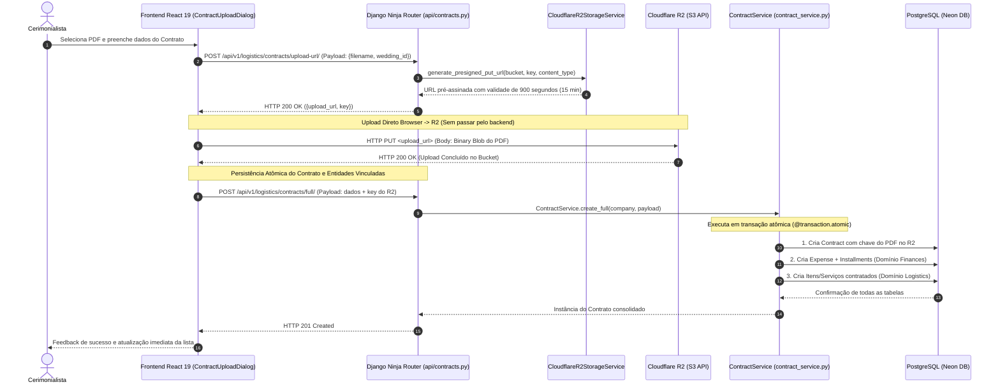

# Fluxo de Upload de Contratos PDF (Cloudflare R2 Direct Upload)

> **Categoria:** Conceito Arquitetural
> **Relacionados:** [ADR-004: URLs Pré-Assinadas](../adr/004-presigned-urls.md) · [ADR-020: Abstração do StorageService](../adr/020-storage-service-abstraction.md) · [Domínio de Logística](../domains/logistics-domain.md) · [Domínio de Finanças](../domains/finances-domain.md) · [Padrão Service Layer](service-layer-pattern.md)

---

## 1. Visão Geral e Racional Arquitetural

O upload de contratos e documentos jurídicos em PDF utiliza o armazenamento de objetos no **Cloudflare R2** via URLs pré-assinadas (*Presigned URLs*), desacoplando o tráfego pesado de arquivos binários do servidor de aplicação Python no Cloud Run.

### Benefícios da Abordagem Direct Upload:
1. **Zero Carga no Servidor Python:** O container do backend não recebe nem armazena streams de arquivos pesados (até 10 MB), poupando memória RAM e CPU.
2. **Zero Custos de Transferência (*Zero Egress Fees*):** O Cloudflare R2 não cobra taxa de saída de dados (diferente da AWS S3 ou GCP GCS).
3. **Compatibilidade S3 Nativa:** Integração via `boto3` com autenticação por chave de acesso padrão S3.

---

## 2. Diagrama Fullstack do Fluxo de Upload e Persistência Atômica



---

## 3. Implementação Técnica

### A. Geração de URLs Pré-Assinadas no Backend (`cloudflare_r2.py`)
O serviço de storage gera URLs assinadas criptograficamente com parâmetros de cabeçalho estritos (`Bucket`, `Key`, `ContentType`) e tempo de expiração de 15 minutos:

```python
--8<-- "backend/apps/core/services/storage/cloudflare_r2.py:75:120"
```

### B. Upload Direto pelo Frontend (`useContractUpload.ts`)
O hook do cliente executa o ciclo de vida completo: obtém a URL assinada, envia o arquivo via `PUT` diretamente para a nuvem e, em seguida, dispara a criação atômica dos registros de banco de dados:

```typescript
--8<-- "frontend/src/features/logistics/hooks/useContractUpload.ts:42:61"
```

---

## 4. Injeção de Dependência e Testabilidade (`set_storage_service`)

Para viabilizar testes unitários rápidos e sem dependência de credenciais reais da nuvem ou conexão à internet:
- A camada de serviço consome a abstração `StorageService` via protocolo.
- Nos testes (`test_services.py`), a suite injeta um `DummyStorageService` via `ContractService.set_storage_service(dummy_storage)`, permitindo validar a geração de URLs e persistência sem chamadas de rede externas.

---

## 5. Resiliência e Tolerância a Falhas

1. **Falha no Upload do PDF:** Se a requisição `PUT` para o Cloudflare R2 for interrompida, a chamada subsequente de criação no banco não é disparada, impedindo contratos órfãos sem arquivo.
2. **Falha na Transação do Banco:** Caso ocorra erro de integridade ao criar a despesa financeira ou as parcelas, o rollback do `@transaction.atomic` garante que nenhum registro do contrato permaneça no banco de dados.
3. **Expiração Segura:** A URL pré-assinada perde a validade após 900 segundos, impedindo o reuso não autorizado da URL temporária.
