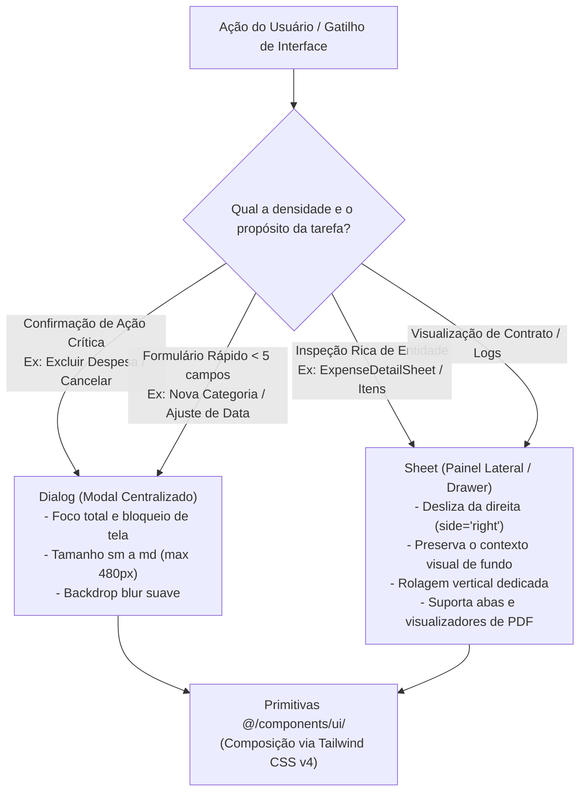

# Racional do Sistema de Design (Sim, Aceito! Prestige & Ergonomia)

> **Categoria:** Conceito Arquitetural
> **Relacionados:** [Padrão Smart/Dumb Components](smart-dumb-components.md) · [Referência Frontend](../../reference/frontend/index.md) · [Padrões de Documentação](../../reference/architecture-standards/documentation-standards.md) · [DESIGN.md](../../../DESIGN.md)

---

## 1. Ergonomia Visual e Redução de Fadiga Cognitiva

O sistema **Sim, Aceito!** foi projetado para cerimonialistas e planejadores de casamentos que operam o software intensivamente durante **6 a 10 horas diárias**. O design prioriza elegância visual, alto contraste e conforto ocular contínuo.

### Pilares Ergonômicos:
1. **Redução de Ofuscamento (*Anti-Glare Surfaces*):** Em vez de telas totalmente brancas (`#FFFFFF`) que causam ofuscamento e fadiga visual prolongada, o modo claro emprega fundos sutilmente coloridos (`#FAFAFB` e `#F5F3FF`). No modo escuro, utiliza `Surface Dark` (`#09090B`) combinado com cartões em `#18181B`.
2. **Psicologia da Aura Violeta (`#7C3AED`):** O tom violeta primário evoca sofisticação, criatividade e acolhimento emocional — característicos do mercado de casamentos — evitando o distanciamento frio dos azuis corporativos tradicionais ou a informalidade de paletas excessivamente saturadas.
3. **Precisão Numérica com `JetBrains Mono`:** Valores financeiros (BRL), percentuais de orçamento e datas são formatados obrigatoriamente com a fonte monoespaçada `JetBrains Mono Variable`, garantindo alinhamento vertical milimétrico em tabelas densas e eliminando oscilações visuais ao atualizar dados.

---

## 2. Diagrama da Matriz Decisória de UX: Dialog vs Sheet



---

## 3. Tokens do Sistema de Cores e Tipografia

Os tokens visuais normativos estão declarados no [DESIGN.md](../../../DESIGN.md) e mapeados nas variáveis CSS globais em `src/index.css`:

### A. Paleta Normativa (`DESIGN.md`)
```yaml
--8<-- "DESIGN.md:5:24"
```

### B. Variáveis CSS Globais (`frontend/src/index.css`)
```css
--8<-- "frontend/src/index.css:10:45"
```

---

## 4. Composição de Cards de KPI no Dashboard

Os cartões de métrica do Dashboard adotam uma anatomia híbrida para equilibrar síntese e profundidade:

```text
┌────────────────────────────────────────────────────────┐
│ TOTAL PAGO                            [ +12% vs meta ] │
│ R$ 45.280,00  (JetBrains Mono 24px Bold)               │
│ 8 parcelas quitadas de 12          [ Ver Detalhes ➔ ]  │
└────────────────────────────────────────────────────────┘
```

1. **Dado Principal:** Moeda BRL em destaque tipográfico com alta legibilidade monoespaçada.
2. **Badge de Estado Dinâmico:**
   - **`success` (Verde Pastel `#E0F2F1`):** Metas atingidas ou parcelas em dia.
   - **`warning` (Amarelo Âmbar `#FEF3C7`):** Vencimentos nos próximos 7 dias.
   - **`destructive` (Vermelho Rosado `#FFE4E6`):** Parcelas vencidas exigindo ação imediata.
3. **Acesso Direto:** Links rápidos para abrir a `Sheet` detalhada sem recarregar a página.

---

## 5. Regras Normativas para Desenvolvedores

- :material-check: **Compor Componentes shadcn/ui:** Sempre utilize os átomos de `@/components/ui/` estilizando-os através de classes utilitárias do Tailwind nos componentes de feature (`src/features/<feature>/components/`).
- :material-close: **Proibido Modificar Primitivas Base:** Nunca edite diretamente os arquivos em `src/components/ui/`.
- :material-check: **Tipografia Mono Obrigatória:** Use a classe `font-mono` para todos os valores de moeda (`R$`), datas e contadores numéricos.
- :material-close: **Proibido Inline CSS (`style={{}}`):** Utilize estritamente as classes do Tailwind CSS v4 configuradas no tema.
