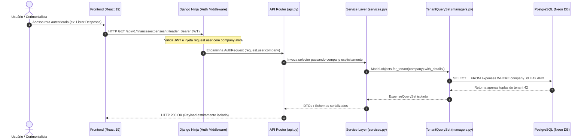

# Estratégia de Multi-Tenancy (Isolamento por Tenant)

> **Categoria:** Conceito Arquitetural
> **Relacionados:** [ADR-009: Multi-Tenancy](../adr/009-multitenancy.md) · [ADR-016: Multi-Tenancy Pragmático](../adr/016-pragmatic-multi-tenancy.md) · [ADR-019: Validação de Ownership](../adr/019-tenant-validation-service-layer.md) · [Domínio Tenants](../domains/tenants-domain.md) · [Tenant Isolation Guard](../../reference/architecture-standards/guard-rails/tenant-isolation-guard.md) · [Padrão Query Selectors](query-selectors-pattern.md)

---

## 1. Visão Geral e Racional Arquitetural

O **Wedding Management System** adota uma estratégia de **Multi-Tenancy Pragmático com Banco e Esquema Compartilhados** (*Shared Database, Shared Schema*). Cada assessoria, cerimonialista ou cliente individual opera dentro de uma organização lógica identificada pela entidade `Company`.

### Por que Shared Schema?
1. **Zero Sobrecarga Operacional e Custo Otimizado:** Dispensa provisionamento e gerenciamento de centenas de bancos de dados PostgreSQL ou esquemas separados no banco serverless (Neon DB).
2. **Migrações Atômicas e Rápidas:** A aplicação de migrações via Django ORM roda uma única vez por deploy, garantindo schema unificado e consistente em toda a base.
3. **Indexação Composta de Alta Performance:** O isolamento e a performance de leitura são assegurados por índices compostos `(company, uuid)` e `(company, id)` no nível de banco de dados.

---

## 2. Diagrama Fullstack do Ciclo de Isolamento Multitenant



---

## 3. Pilares da Blindagem Multitenant

### A. Herança de `TenantModel` e Índices Otimizados
Toda entidade de domínio pertence a uma `Company`. Em vez de redeclarar a chave estrangeira em cada tabela, todos os modelos herdam de `TenantModel` (`apps/tenants/models.py`), que por sua vez herda de `BaseModel` (`apps/core/models.py`).

- **Chave Estrangeira Protegida:** A coluna `company` vincula o registro à empresa com integridade referencial estrita.
- **Índice Composto B-Tree:** Garante que buscas por `uuid` filtradas pelo tenant utilizem varreduras de índice com custo $O(\log n)$.

```python
--8<-- "backend/apps/tenants/models.py:27:48"
```

### B. O `TenantQuerySet` e o `TenantManager`
O acesso a dados via ORM impede consultas globais desprotegidas. O `TenantManager` injeta o método `for_tenant(company)` que força o predicado SQL `WHERE company_id = ...`.

- É expressamente proibido o uso de `Model.objects.all()` sem o encadeamento prévio de `.for_tenant(company)` nas camadas de negócio.
- O método `for_tenant` retorna um `TenantQuerySet` encadeável e *lazy*.

```python
--8<-- "backend/apps/tenants/managers.py:14:32"
```

### C. Validação Estrita de Posse (`validate_tenant_ownership`)
Quando uma entidade já instanciada ou carregada em etapas anteriores é recebida por um serviço ou seletor, a função utilitária `validate_tenant_ownership` valida se o `company_id` da instância coincide com o tenant da sessão.

- **Proteção Contra IDOR (Insecure Direct Object Reference):** Se uma requisição tentar manipular um UUID existente que pertence a outra empresa, o sistema levanta `ObjectNotFoundError` (HTTP 404), ocultando a existência do registro de terceiros para evitar enumeração de recursos.

```python
--8<-- "backend/apps/core/tenant.py:12:40"
```

---

## 4. Matriz de Garantias e Guard-Rails

| Mecanismo de Defesa | Camada | Ação em Caso de Violação | Teste Automatizado |
| :--- | :--- | :--- | :--- |
| **`TenantModel`** | Banco de Dados / ORM | Impede persistência sem `company_id` | `apps/tenants/tests/test_models.py` |
| **`TenantQuerySet.for_tenant`** | Selectors / Managers | Restringe escopo do `SELECT` na cláusula `WHERE` | `apps/tenants/tests/test_managers.py` |
| **`validate_tenant_ownership`** | Services / Handlers | Lança `ObjectNotFoundError` (404 seguro) | `apps/core/tests/test_shortcuts.py` |
| **`tenant_isolation_guard`** | CI / Suíte de Guard-Rails | Falha o build caso queries sem tenant sejam encontradas | `apps/core/tests/test_tenant_isolation.py` |

---

## 5. Casos de Teste de Isolamento

A suíte em `backend/apps/tenants/tests/test_managers.py` e `backend/apps/core/tests/test_tenant_isolation.py` valida:

- **Isolamento de Listagem:** Dados criados para o `Tenant A` nunca são retornados em consultas executadas pelo `Tenant B`.
- **Isolamento de Detalhes:** Acesso a recursos de outro tenant resulta em 404 imediato.
- **Herança de Todos os Modelos:** Auditoria estática garante que 100% dos modelos de domínio herdam de `TenantModel`.
