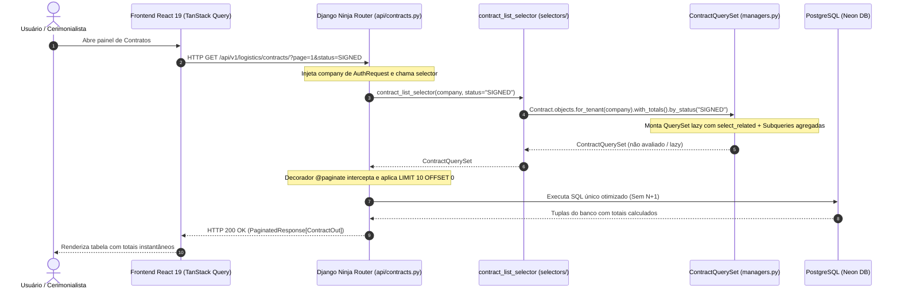

# Padrão Query Selectors & Custom QuerySets

> **Categoria:** Conceito Arquitetural
> **Relacionados:** [Padrão Service Layer](service-layer-pattern.md) · [Estratégia de Multi-Tenancy](multi-tenancy-strategy.md) · [Especificação Query Selectors](../../reference/architecture-standards/query-selectors-spec.md) · [Visão Geral do Sistema](system-overview.md)

---

## 1. Visão Geral e Separação CQRS-lite

O backend adota o padrão **Query Selectors** combinado com **Custom QuerySets (Managers)** para estabelecer uma separação formal entre operações de **Consulta (Queries)** e operações de **Modificação/Comando (Commands/Mutations)** — aplicando princípios de CQRS-lite (*Command-Query Responsibility Segregation*).

- **`selectors/` (Leitura Pura):** Funções utilitárias puras que montam e orquestram consultas de leitura, isoladas por tenant e otimizadas com anotações e técnicas anti-N+1 (`select_related`, `prefetch_related`, `only`, `defer`).
- **`services/` (Escrita e Mutações):** Classes e métodos dedicados exclusivamente a regras de negócio de mutação (`create`, `update`, `delete`), validação de invariantes e transações atômicas (`@transaction.atomic`).
- **`managers.py` (Custom QuerySets):** Blocos de construção granulares e reutilizáveis do ORM Django com métodos encadeáveis e avaliação *lazy*.

---

## 2. Diagrama Fullstack do Fluxo de Consulta



---

## 3. Diretrizes e Regras de Ouro

### A. Avaliação Preguiçosa (*Lazy Evaluation*) e Paginação Ninja
As funções de listagem (`*_list_selector`) retornam instâncias de `TenantQuerySet` especializado (ex: `ContractQuerySet`, `ExpenseQuerySet`) e **nunca** listas Python materializadas em memória (`list(qs)`).

Isso garante:
1. **Paginação Eficiente:** O decorador `@paginate` do Django Ninja adiciona automaticamente as cláusulas `LIMIT` e `OFFSET` na query SQL executada pelo banco de dados.
2. **Componibilidade:** Outros seletores ou endpoints podem encadear novos filtros (`.filter(...)`, `.order_by(...)`) sem disparar requisições intermediárias ao banco.

```python
--8<-- "backend/apps/finances/selectors/expense_selectors.py:22:46"
```

### B. Prevenção Ativa de Consultas N+1
Para manter o tempo de resposta abaixo de 50ms mesmo sob alta densidade de dados:
- **`select_related`:** Usado para relacionamentos `1:1` e `N:1` (Foreign Keys), gerando um `SQL JOIN` imediato (ex: carregar `supplier` e `wedding` junto do contrato).
- **`prefetch_related`:** Usado para relacionamentos `1:N` e `N:N` (ex: carregar parcelas de uma lista de despesas).
- **`Subquery` + `Coalesce`:** Encapsulado em métodos do `QuerySet` (como `.with_totals()`) para calcular somas ou contagens agregadas em um único comando SQL, sem explosão de linhas por joins cartesianos.

```python
--8<-- "backend/apps/logistics/managers.py:59:92"
```

### C. Busca Individual Segura (`*_get_selector`)
Os seletores de registro individual encapsulam a resolução segura por UUID dentro do escopo do tenant e retornam `ObjectNotFoundError` (HTTP 404) quando o recurso não existe ou pertence a outro tenant.

```python
--8<-- "backend/apps/logistics/selectors/contract_selectors.py:21:52"
```

---

## 4. Matriz Comparativa de Responsabilidades

| Responsabilidade | Custom QuerySet (`managers.py`) | Selector (`selectors/`) | Service (`services/`) |
| :--- | :--- | :--- | :--- |
| **Anotações SQL complexas** (`Subquery`, `Coalesce`) | :material-check-circle: Sim (`.with_totals()`) | :material-close-circle: Não (apenas consome) | :material-close-circle: Não |
| **Filtros de domínio reutilizáveis** (`.by_status()`) | :material-check-circle: Sim | :material-close-circle: Não (apenas consome) | :material-close-circle: Não |
| **Orquestração de consultas de tela** | :material-close-circle: Não | :material-check-circle: Sim (`*_list_selector`) | :material-close-circle: Não |
| **Resolução de instância com 404 seguro** | :material-close-circle: Não | :material-check-circle: Sim (`*_get_selector`) | :material-close-circle: Não |
| **Mutações no banco** (`save()`, `delete()`) | :material-close-circle: Proibido | :material-close-circle: Proibido | :material-check-circle: Sim |
| **Transações Atômicas** (`@transaction.atomic`) | :material-close-circle: Não | :material-close-circle: Não | :material-check-circle: Sim |
| **Lançamento de `BusinessRuleViolation`** | :material-close-circle: Não | :material-close-circle: Não | :material-check-circle: Sim |

---

## 5. Casos de Teste Automatizados

A suíte de testes de seletores (`apps/*/tests/test_selectors.py`) valida:
- Isolamento estrito entre tenants para listagens e detalhes.
- Exatidão dos cálculos anotados em `Subquery` e `Coalesce`.
- Otimização do número de queries executadas (`django_assert_num_queries`).
