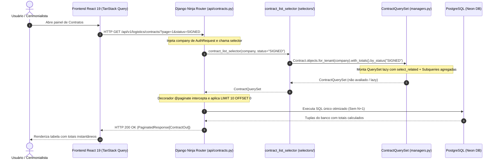

# Padrão Query Selectors & Custom QuerySets

> **Categoria:** Conceito Arquitetural
> **Relacionados:** [Padrão Service Layer](service-layer-pattern.md) · [Estratégia de Multi-Tenancy](multi-tenancy-strategy.md) · [Especificação Query Selectors](../../reference/architecture-standards/query-selectors-spec.md) · [Visão Geral do Sistema](system-overview.md)

---

## 1. Visão Geral e Separação CQRS-lite

O backend adota o padrão **Query Selectors** combinado com **Custom QuerySets (Managers)** para estabelecer uma separação formal entre operações de **Consulta (Queries)** e operações de **Modificação/Comando (Commands/Mutations)** — aplicando princípios de CQRS-lite (*Command-Query Responsibility Segregation*).

- **`selectors/` (Leitura Pura):** Funções utilitárias puras que montam e orquestram consultas de leitura, isoladas por tenant e otimizadas com anotações e técnicas anti-N+1 (`select_related`, `prefetch_related`, `only`, `defer`).
- **`services/` (Escrita e Mutações):** Classes e métodos dedicados exclusivamente a regras de negócio de mutação (`create`, `update`, `delete`), validação de invariantes e transações atômicas (`@transaction.atomic`).
- **`managers.py` (Custom QuerySets):** Blocos de construção granulares e reutilizáveis do ORM Django com métodos encadeáveis e avaliação *lazy*.

---

## 2. Diagrama Fullstack do Fluxo de Consulta



---

## 3. Diretrizes e Regras de Ouro

### A. Avaliação Preguiçosa (*Lazy Evaluation*) e Paginação Ninja
As funções de listagem (`*_list_selector`) retornam instâncias de `TenantQuerySet` especializado (ex: [`ExpenseQuerySet`](../../../backend/apps/finances/managers.py), [`ContractQuerySet`](../../../backend/apps/logistics/managers.py)) e **nunca** listas Python materializadas em memória (`list(qs)`).

Isso garante:
1. **Paginação Eficiente:** O decorador `@paginate` do Django Ninja adiciona automaticamente as cláusulas `LIMIT` e `OFFSET` na query SQL executada pelo banco de dados.
2. **Componibilidade:** Outros seletores ou endpoints podem encadear novos filtros (`.filter(...)`, `.order_by(...)`) sem disparar requisições intermediárias ao banco.

Exemplo canônico em [`expense_list_selector()`](../../../backend/apps/finances/selectors/expense_selectors.py):
```python
def expense_list_selector(
    *,
    company: Company,
    wedding_id: UUID | str | None = None,
    category_id: UUID | str | None = None,
) -> ExpenseQuerySet:
    qs: ExpenseQuerySet = Expense.objects.for_tenant(company).with_details()
    if wedding_id:
        qs = qs.for_wedding(wedding_id)
    if category_id:
        qs = qs.by_category(category_id)
    return qs  # Retorno lazy, avaliado apenas no momento da serialização HTTP
```

### B. Prevenção Ativa de Consultas N+1 e Isolamento de Domínio (ADR-031)
Para manter o tempo de resposta abaixo de 50ms mesmo sob alta densidade de dados:
- **`select_related`:** Usado para relacionamentos `1:1` e `N:1` (Foreign Keys), gerando um `SQL JOIN` imediato (ex: carregar `supplier`, `wedding` e `parent` junto do contrato).
- **`prefetch_related`:** Usado para relacionamentos `1:N` e `N:N` (ex: carregar itens e aditivos).
- **`Subquery` + `Coalesce` Intra-Domínio:** Encapsulado em métodos do `QuerySet` (como [`.with_totals()`](../../../backend/apps/logistics/managers.py)) para calcular contagens e somas agregadas em um único comando SQL, sem explosão de linhas por joins cartesianos.

> **Regra de Ouro (ADR-031):** Managers e Custom QuerySets cuidam **estritamente de tabelas do próprio Bounded Context**. No exemplo abaixo, `ContractQuerySet` manipula apenas a tabela de contratos (`self.model.objects`), anotando a contagem e soma de aditivos sem tocar tabelas financeiras. Subqueries e agregações multi-domínio (cruzando contratos com despesas e parcelas) pertencem **exclusivamente a `apps/reporting/selectors/summaries/`**.

```python
# apps/logistics/managers.py
class ContractQuerySet(TenantQuerySet["Contract"]):
    def with_totals(self) -> ContractQuerySet:
        return self.select_related("supplier", "wedding", "parent", "expense").annotate(
            supplier_name=F("supplier__name"),
            supplier_phone=F("supplier__phone"),
            supplier_email=F("supplier__email"),
            addendums_count=Coalesce(
                Subquery(
                    self.model.objects.filter(
                        company=OuterRef("company"),
                        parent=OuterRef("pk"),
                    )
                    .exclude(status=self.model.StatusChoices.CANCELED)
                    .values("parent")
                    .annotate(cnt=Count("id"))
                    .values("cnt")[:1]
                ),
                0,
            ),
            addendums_total_amount=Coalesce(
                Subquery(
                    self.model.objects.filter(
                        company=OuterRef("company"),
                        parent=OuterRef("pk"),
                    )
                    .exclude(status=self.model.StatusChoices.CANCELED)
                    .values("parent")
                    .annotate(s=Sum("total_amount"))
                    .values("s")[:1]
                ),
                Value(Decimal("0.00")),
            ),
        )
```

### C. Busca Individual Segura (`*_get_selector`)
Os seletores de registro individual encapsulam a resolução segura por UUID dentro do escopo do tenant e retornam `ObjectNotFoundError` (HTTP 404) quando o recurso não existe ou pertence a outro tenant:

Exemplo canônico em [`contract_get_selector()`](../../../backend/apps/logistics/selectors/contract_selectors.py):
```python
def contract_get_selector(company: Company, uuid: UUID | str) -> Contract:
    try:
        return Contract.objects.for_tenant(company).with_totals().get(uuid=uuid)
    except (Contract.DoesNotExist, ValueError, ValidationError) as e:
        raise ObjectNotFoundError(detail="Contrato não encontrado.") from e
```

---

## 4. Matriz Comparativa de Responsabilidades

| Responsabilidade | Custom QuerySet (`managers.py`) | Selector (`selectors/`) | Service (`services/`) |
| :--- | :--- | :--- | :--- |
| **Anotações SQL complexas** (`Subquery`, `Coalesce`) | :material-check-circle: Sim (`.with_totals()`) | :material-close-circle: Não (apenas consome) | :material-close-circle: Não |
| **Filtros de domínio reutilizáveis** (`.by_status()`) | :material-check-circle: Sim | :material-close-circle: Não (apenas consome) | :material-close-circle: Não |
| **Orquestração de consultas de tela** | :material-close-circle: Não | :material-check-circle: Sim (`*_list_selector`) | :material-close-circle: Não |
| **Resolução de instância com 404 seguro** | :material-close-circle: Não | :material-check-circle: Sim (`*_get_selector`) | :material-close-circle: Não |
| **Mutações no banco** (`save()`, `delete()`) | :material-close-circle: Proibido | :material-close-circle: Proibido | :material-check-circle: Sim |
| **Transações Atômicas** (`@transaction.atomic`) | :material-close-circle: Não | :material-close-circle: Não | :material-check-circle: Sim |
| **Lançamento de `BusinessRuleViolation`** | :material-close-circle: Não | :material-close-circle: Não | :material-check-circle: Sim |

---

## 5. Casos de Teste Automatizados

A suíte de testes de seletores (`apps/*/tests/test_selectors.py`) valida:
- Isolamento estrito entre tenants para listagens e detalhes.
- Exatidão dos cálculos anotados em `Subquery` e `Coalesce`.
- Otimização do número de queries executadas (`django_assert_num_queries`).
