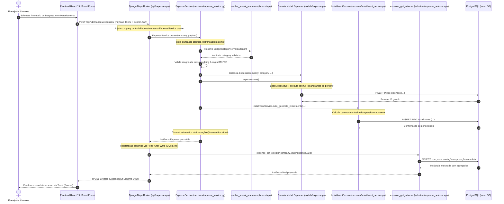
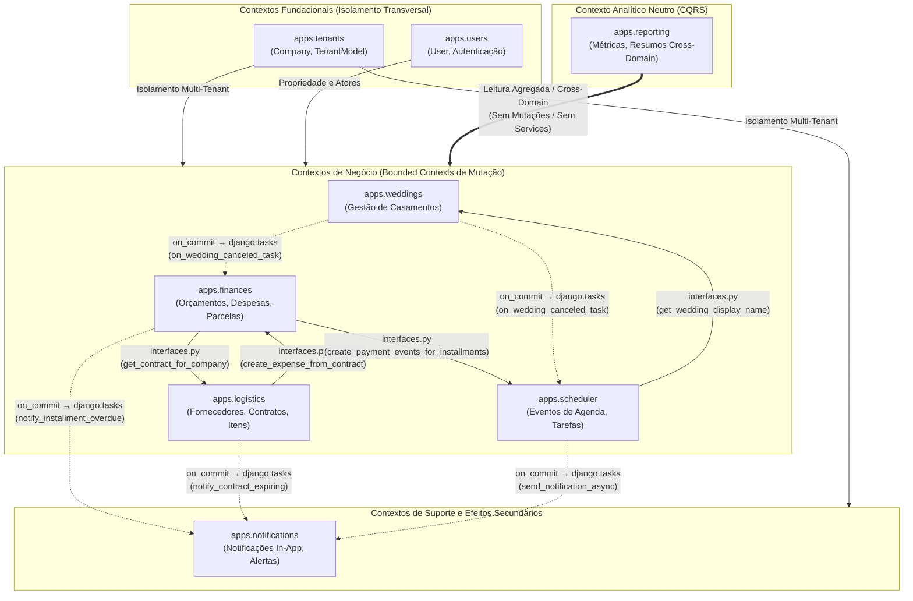

# Padrão Service Layer & Orquestração de Domínio

> **Categoria:** Conceito Arquitetural
> **Relacionados:** [ADR-006: Service Layer](../adr/006-service-layer.md) · [ADR-030: Rich Domain Model](../adr/030-rich-domain-model-service-layer.md) · [ADR-031: Comunicação Entre Módulos](../adr/031-inter-module-communication.md) · [ADR-011: BaseModel save() com full_clean()](../adr/011-basemodel-save-full-clean.md) · [Padrão Query Selectors](query-selectors-pattern.md) · [Estratégia de Multi-Tenancy](multi-tenancy-strategy.md) · [Atomic Service Audit Guard](../../reference/architecture-standards/guard-rails/atomic-service-audit-guard.md)

---

## 1. Visão Geral e Racional Arquitetural

A **Service Layer** é o núcleo de processamento de regras de negócio, validação de invariantes e orquestração de efeitos colaterais no backend.

O framework web (**Django Ninja**) atua estritamente como um adaptador de transporte HTTP (camada de entrada). Os controladores em `api.py` não contêm lógica de negócio, consultas ORM diretas nem regras de domínio; eles apenas deserializam schemas de entrada, injetam o contexto autenticado (`request.user.company`) e delegam a mutação para os métodos de serviço em `services/`.

Conforme estabelecido na [ADR-030](../adr/030-rich-domain-model-service-layer.md), a Service Layer atua primordialmente como orquestradora de **Casos de Uso (*Use Cases*)**: ela não monopoliza validações primitivas (responsabilidade dos schemas Pydantic na borda) nem regras intrínsecas à própria entidade (responsabilidade do Rich Domain Model em `models.py`), focando em delimitar a transação atômica, garantir isolamento multi-tenant e coordenar múltiplos agregados.

---

## 2. Diagrama de Sequência Fullstack (Comando de Mutação & Read-After-Write)



---

## 3. Diretrizes e Invariantes da Service Layer

### A. CQRS-lite: Separação Estrita de Leitura e Escrita
- **`selectors/` (Queries / Leitura):** Funções puras dedicadas exclusivamente a buscar e projetar dados. Retornam instâncias de modelos ou `TenantQuerySet` encadeáveis e *lazy*. Não realizam `save()`, `delete()` nem alteram estado do banco.
- **`services/` (Commands / Mutações):** Classes ou funções com responsabilidade exclusiva sobre escrita (`create`, `update`, `delete`, `transition`), validação cruzada entre agregados, bloqueios concorrentes (`select_for_update`) e disparo de eventos.

### B. Transações Atômicas Obrigatórias (`@transaction.atomic`)
Qualquer mutação que envolva múltiplas tabelas ou múltiplos registros ORM deve ser decorada com `@transaction.atomic`. Em caso de exceção de validação ou erro de banco em qualquer ponto do fluxo, a transação é revertida integralmente (*rollback*), impedindo estados inconsistentes.

### C. Validação de Invariantes via `full_clean()` no `save()`
Conforme estabelecido na [ADR-011](../adr/011-basemodel-save-full-clean.md), todos os modelos herdando de [`BaseModel`](../../../backend/apps/core/models.py) executam `self.full_clean()` dentro de `save()`, prevenindo que chamadas no nível de serviço contornem os validadores dos campos ou do método `clean()`.

```python
def save(self, *args: Any, skip_clean: bool = False, **kwargs: Any) -> None:
    """Garante a execução das validações do clean() antes de persistir (ADR-011)."""
    if not skip_clean:
        self.full_clean()
    super().save(*args, **kwargs)
```

### D. Responsabilidades em 3 Níveis (ADR-030)
Para evitar que a Service Layer se torne inchada e procedural, as validações e comportamentos distribuem-se em 3 níveis claros:
1. **Nível 1 (Entrada / Schemas Pydantic):** Tipos primitivos, tamanhos de strings (`min_length`/`max_length`), sanitização (`str_strip_whitespace=True`) e limites numéricos na borda da API.
2. **Nível 2 (Invariantes de Domínio / Models):** Métodos de ciclo de vida da entidade (`complete()`, `cancel()`, `reopen()`), máquina de estados (`ALLOWED_TRANSITIONS`) e validações de integridade no `clean()`.
3. **Nível 3 (Orquestração do Caso de Uso / Services):** Transação atômica (`@transaction.atomic`), validação de isolamento multi-tenant (`company`), coordenação de outros agregados e serviços.

### E. Padrão Read-After-Write nos Routers
Mutações executadas pela Service Layer (`create`, `update`, `transition`) alteram o banco de dados e retornam a instância afetada. Entretanto, **os routers HTTP nunca retornam essa instância crua diretamente na resposta**.

Em vez disso, o router executa o padrão **Read-After-Write**:
```python
# apps/meu_modulo/api.py
created = MyService.create(company=company, payload=payload)
return 201, my_get_selector(company=company, uuid=created.uuid)
```

**Benefícios Arquiteturais:**
1. **Consistência de Contrato:** Garante que o objeto retornado contenha exatamente as mesmas anotações SQL, campos agregados (`total_budget`, `overdue_installments`, etc.) e relacionamentos otimizados (`select_related`/`prefetch_related`) que a rota `GET /{uuid}/` provê.
2. **Desacoplamento de Estados em Memória:** Evita vazamento de atributos internos ou referências transitórias em memória geradas durante o ciclo de escrita do ORM.
3. **Cache e Invalidação Previsíveis:** O cliente frontend (TanStack Query) recebe a representação canônica exata do recurso, facilitando atualizações de cache ou invalidação direta de chaves de query.

---

## 4. Implementação Canônica: Orquestração de Caso de Uso

A orquestração de criação de despesas ilustra a aplicação prática das diretrizes da Service Layer:

- **Orquestrador de Serviço:** [`ExpenseService.create()`](../../../backend/apps/finances/services/expense_service.py)
- **Geração de Parcelas:** [`InstallmentService.auto_generate_installments()`](../../../backend/apps/finances/services/installment_service.py)
- **Entidade Rica de Domínio:** [`Expense`](../../../backend/apps/finances/models/expense.py)

```python
@staticmethod
@transaction.atomic
def create(company: Company, payload: ExpenseIn) -> Expense:
    # 1. Resolução segura de dependências com isolamento multi-tenant
    data = payload.model_dump(exclude_unset=True)
    category = resolve_tenant_resource(BudgetCategory, company, data.pop("category", None), ...)
    contract = resolve_tenant_resource(Contract, company, data.pop("contract", None), ...) if "contract" in data else None

    # 2. Validação trans-domínio (BR-F02: valor idêntico ao contrato)
    if contract and data.get("actual_amount") != contract.total_amount:
        raise BusinessRuleViolation("BR-F02: Valor da despesa diverge do contrato.", code="br_f02_violation")

    # 3. Persistência da entidade (executa full_clean() do BaseModel)
    expense = Expense(company=company, wedding=category.wedding, category=category, contract=contract, **data)
    expense.save()

    # 4. Efeito colateral coordenado: geração de parcelas em transação atômica
    InstallmentService.auto_generate_installments(company=company, expense=expense, num_installments=..., first_due_date=...)
    return expense
```

---

## 5. Tratamento Padronizado de Exceções de Domínio

A Service Layer não retorna códigos HTTP ou respostas customizadas; ela lança exceções de domínio tipadas:

| Exceção de Domínio | Significado | Status HTTP Envelopeado |
| :--- | :--- | :--- |
| **`ObjectNotFoundError`** | Recurso inexistente ou pertencente a outro tenant (IDOR) | `404 Not Found` |
| **`BusinessRuleViolation`** | Violação de regra de negócio funcional (ex: BR-F02, saldo inválido) | `400 Bad Request` |
| **`DomainIntegrityError`** | Inconsistência de integridade relacional entre agregados | `422 Unprocessable Entity` |
| **`PermissionDeniedError`** | Usuário sem nível de acesso para a operação | `403 Forbidden` |

Essas exceções são capturadas pelos *Exception Handlers* globais registrados na instância do Django Ninja (`config/api.py`), garantindo que o frontend receba sempre o envelope padronizado de erro (`error_code`, `message`, `details`).

---

## 6. Auditoria Estática e Testes Automatizados

A conformidade da Service Layer é auditada continuamente:
1. **Auditoria AST de Transações (`test_atomic_service_audit.py`):** Analisa a árvore sintática (AST) do Python para verificar se todos os métodos de escrita em `services/` possuem `@transaction.atomic` ou `with transaction.atomic():`.
2. **Testes Unitários de Domínio (`apps/finances/tests/expenses/test_services.py`):** Cobrem 100% dos caminhos de sucesso e cenários de exceção esperados.

---

## 7. Comunicação Entre Bounded Contexts via Fachadas Públicas (`interfaces.py`)

Em conformidade com a [ADR-031](../adr/031-inter-module-communication.md), os serviços de um Bounded Context **nunca importam diretamente models ou services de outros módulos**:

1. **Operações Síncronas:** Se um serviço necessita acionar funcionalidades de outro domínio (ex.: `ContractService` criando despesa financeira, ou `InstallmentService` agendando eventos de calendário), a invocação ocorre exclusivamente através do arquivo `interfaces.py` do domínio de destino (`apps.<contexto>.interfaces`).
2. **Efeitos Colaterais Assíncronos:** Mutações complexas com múltiplos efeitos colaterais (ex.: cancelamento de casamentos) utilizam tarefas assíncronas coordenadas disparadas após a confirmação da transação via `transaction.on_commit(lambda: task.enqueue(...))`.
3. **Barreira Arquitetural:** O `import-linter` audita continuamente no CI/CD a proibição de imports cruzados diretos entre módulos. Para instruções de implementação, consulte o [Guia de Comunicação Entre Módulos](../../guides/backend/inter-module-communication-guide.md).

---

## 8. Bounded Context Map & Topologia de Comunicação

O ecossistema backend segue uma topologia de **Monólito Modular** com fronteiras arquiteturais estritamente delimitadas e auditadas. A comunicação entre contextos ocorre por dois canais formais:
1. **Síncrono Transacional:** Exclusivamente através de fachadas públicas (`apps.<contexto>.interfaces`).
2. **Assíncrono Reativo / Efeitos Secundários:** Via tarefas em segundo plano (`django.tasks`) despachadas pós-commit (`transaction.on_commit`).



### Invariantes de Isolamento do Bounded Context Map

1. **Pureza CQRS do Reporting:** `apps.reporting` nunca importa classes de serviço de escrita (`services/`), garantindo que consultas analíticas sejam estritamente idempotentes e livres de efeitos colaterais.
2. **Fundação Imutável:** `apps.tenants` e `apps.users` não possuem dependências de nenhum Bounded Context de negócio, evitando ciclos no grafo de módulos.
3. **Despacho Pós-Commit para Notificações:** Nenhum domínio de negócio grava diretamente na tabela de `apps.notifications` dentro da transação principal. O despacho ocorre de forma não-bloqueante e resiliente a rollbacks.
