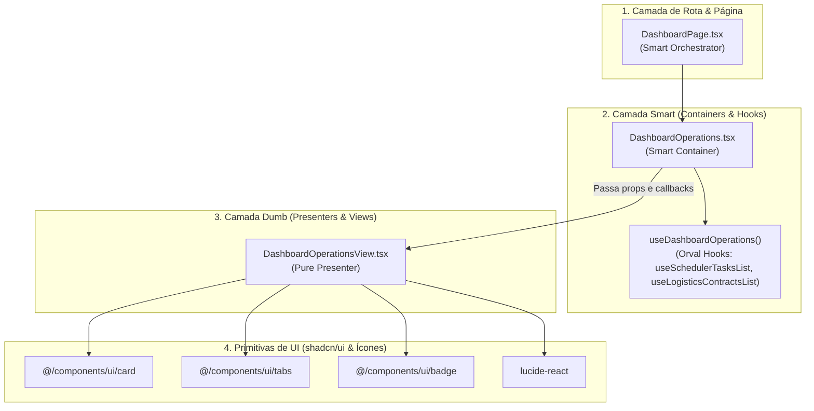

# Padrão Smart/Dumb Components (Container vs Presenter)

> **Categoria:** Conceito Arquitetural
> **Relacionados:** [ADR-024: Padrão Smart/Dumb no Frontend](../adr/024-padrao-smart-dumb-desacoplamento-componentes-frontend.md) · [Referência Frontend](../../reference/frontend/index.md) · [Especificação de Testes Frontend](../../reference/testing/frontend-testing-spec.md) · [Racional do Sistema de Design](design-system-rationale.md)

---

## 1. Visão Geral e Princípio de Desacoplamento

Para garantir alta manutenibilidade, isolamento de efeitos colaterais e velocidade de execução nos testes unitários com **Vitest + React Testing Library**, o frontend em React 19 estrutura sua interface em duas categorias funcionais complementares:

1. **Smart Components (Containers):** Responsáveis pela integração com a infraestrutura da aplicação (hooks do Orval/TanStack Query, Zustand stores, React Router e gerenciamento de estado local).
2. **Dumb Components (Presenters / Views):** Componentes visuais puros que recebem dados formatados e callbacks via `props` fortemente tipadas, sem dependência direta de rede ou bibliotecas de estado global.
3. **UI Primitives (`src/components/ui/`):** Átomos do **shadcn/ui** gerenciados via CLI, que **nunca** devem ser alterados diretamente com regras de negócio.

---

## 2. Diagrama de Hierarquia e Fluxo de Dados



---

## 3. Matriz Estrutural de Responsabilidades

| Dimensão | Smart Components (Containers) | Dumb Components (Presenters/Views) | UI Primitives (`src/components/ui/`) |
| :--- | :--- | :--- | :--- |
| **Localização** | `src/features/<modulo>/pages/` ou `components/` | `src/features/<modulo>/components/*View.tsx` | `src/components/ui/` |
| **Acesso a Hooks Orval** | :material-check-circle: Sim (`use*List`, `use*Create`) | :material-close-circle: Proibido | :material-close-circle: Proibido |
| **Zustand / React Router** | :material-check-circle: Sim (`useAuthStore`, `useNavigate`) | :material-close-circle: Proibido (recebe callbacks) | :material-close-circle: Proibido |
| **Efeitos de Rede** | :material-check-circle: Sim (dispara queries/mutações) | :material-close-circle: Nenhum (função pura) | :material-close-circle: Nenhum |
| **Estilização Tailwind** | Apenas layouts de alto nível e wrappers | :material-check-circle: Estilização densa e responsiva | Classes utilitárias padronizadas |
| **Estratégia de Testes** | Integração com `registerMockHook` ou MSW | Testes unitários puros, rápidos e síncronos | Testes unitários do próprio shadcn |

---

## 4. Implementação no Código-Fonte Real

### A. Smart Container (`DashboardOperations.tsx`)
O container consome o hook agregador de operações e conecta as ações de navegação do `react-router-dom`:

```tsx
--8<-- "frontend/src/features/dashboard/components/DashboardOperations.tsx:1:36"
```

### B. Dumb Presenter Interface (`DashboardOperationsView.tsx`)
A View declara estritamente o contrato de dados que necessita para renderizar a interface, sem conhecer a origem dos dados:

```tsx
--8<-- "frontend/src/features/dashboard/components/DashboardOperationsView.tsx:22:50"
```

---

## 5. Benefícios para a Suíte de Testes (Vitest)

A separação Smart/Dumb viabiliza a execução da suíte de testes com `isolate: false` em alta velocidade:

1. **Testes de Presenter Instantâneos:** `DashboardOperationsView` pode ser testado renderizando cenários com mocks em memória (estados vazio, carregamento, sucesso e erro) sem a necessidade de instanciar `QueryClientProvider` ou interceptar requisições HTTP.
2. **Testes de Container Isolados:** `DashboardOperations` valida a integração dos callbacks e o redirecionamento de rotas mockando apenas o hook correspondente via `test-setup.ts`.
