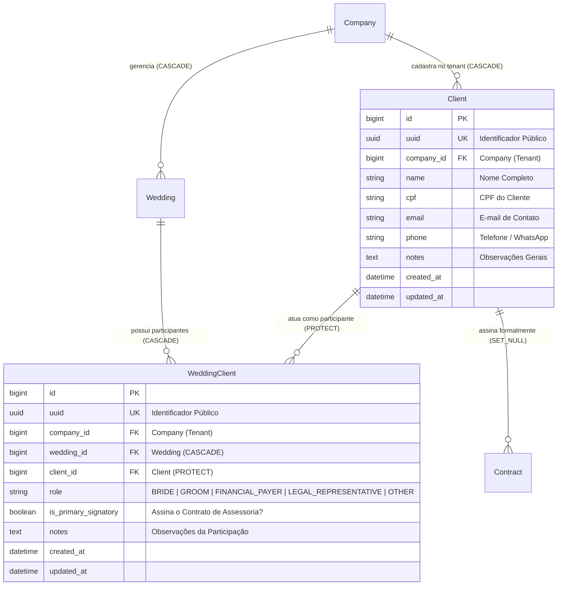

# Domínio de Clientes & Participantes (Clients)

> **Categoria:** Domínios de Arquitetura (Bounded Contexts)
> **Relacionados:** [Catálogo Canônico de Regras](../business-rules/index.md) · [Domínio de Casamentos](weddings-domain.md) · [Domínio de Contratos](contracts-domain.md) · [ADR-016: Multi-Tenancy Pragmático](../adr/016-pragmatic-multi-tenancy.md) · [ADR-030: Rich Domain Model](../adr/030-rich-domain-model-service-layer.md) · [ADR-031: Comunicação Entre Módulos](../adr/031-inter-module-communication.md)

O **Domínio de Clientes (`apps.clients`)** centraliza a gestão cadastral de pessoas físicas vinculadas à assessoria cerimonial no tenant (`Company`). Em conjunto com o modelo de associação N:N `WeddingClient` (participantes do evento), o módulo desacopla a identidade e os contatos dos clientes do ciclo de vida dos casamentos, permitindo mapear noivos, contratantes financeiros, signatários legais e outros envolvidos com flexibilidade e rastreabilidade jurídica.

---

## 1. Visão de Negócio & Capacidades Operacionais

Em cerimônias de casamento modernas, a configuração de partes interessadas é dinâmica: os contratantes que custeiam a celebração nem sempre são exclusivamente os noivos (ex.: pais dos noivos, padrinhos ou representantes legais). Além disso, clientes que contratam a assessoria podem participar de múltiplos eventos ou necessitar de atualização de dados de contato sem impactar a imutabilidade histórica do evento.

### Principais Capacidades Operacionais
- **Cadastro Centralizado de Clientes (`Client`):** Armazena os dados pessoais básicos (nome completo, CPF, e-mail, telefone e anotações internas) sob isolamento lógico por tenant.
- **Associação Flexível N:N (`WeddingClient`):** Vincula clientes a um ou múltiplos casamentos sob papéis específicos (`BRIDE`, `GROOM`, `FINANCIAL_PAYER`, `LEGAL_REPRESENTATIVE`, `OTHER`), permitindo que a mesma pessoa atue, por exemplo, como noiva e como pagadora financeira simultaneamente.
- **Rastreabilidade de Signatário Principal (`is_primary_signatory`):** Identifica explicitamente o responsável jurídico pela assinatura do contrato de honorários da assessoria cerimonial e demais instrumentos legais.
- **Conformidade com a LGPD:** Tratamento padronizado de sanitização e proteção de dados cadastrais sensíveis.

---

## 2. Modelo de Dados & Diagrama ERD

### Invariantes de Persistência & Integridade

| Entidade / Campo | Regra de Domínio | Comportamento e Validação |
| :--- | :--- | :--- |
| **`Client.name`** | **Identificação Obrigatória** | Higienização de espaços e validação de não-vazio no `clean()`. |
| **`Client.email`** | **Normalização** | Conversão automática para minúsculas (`strip().lower()`). |
| **`Client.cpf`** | **Formato e Limite** | Limite defensivo de até 14 caracteres com sanitização estrutural. |
| **`WeddingClient`** | **Unicidade de Papel** | Restrição de unicidade composta (`unique_together = [("wedding", "client", "role")]`), impedindo duplicidade do mesmo papel para um cliente no mesmo evento. |
| **`WeddingClient`** | **Isolamento de Tenant** | Validação no `clean()` assegura que `wedding.company_id == client.company_id`. Violações disparam `ValidationError("Este cliente pertence a outra organização.")`. |
| **`Client.on_delete`** | **Proteção Referencial** | Um cliente com participações ativas em casamentos é protegido contra exclusão acidental (`on_delete=models.PROTECT`). |

---

## 3. Matriz Consolidada de Regras de Negócio (SSOT)

| Código Canônico | Regra / Especificação | Escopo / Responsabilidade | Entidades Envolvidas | Nota Detalhada |
| :--- | :--- | :--- | :--- | :--- |
| **`BR-CLI-01`** | **Isolamento Multi-Tenant de Clientes** | Clientes cadastrados pertencem estritamente à assessoria (`Company`), filtrados via `for_tenant(company)`. | `Client`, `Company` | [Estratégia Multi-Tenancy](../concepts/multi-tenancy-strategy.md) |
| **`BR-CLI-02`** | **Paridade de Tenant na Associação** | A associação de um cliente a um casamento exige que ambos pertençam à mesma empresa assessora. | `WeddingClient`, `Client`, `Wedding` | [Rich Domain Model](../adr/030-rich-domain-model-service-layer.md) |
| **`BR-CLI-03`** | **Signatário Principal Único** | Ao marcar um participante como signatário principal (`is_primary_signatory=True`), a interface e o serviço coordenam a vinculação contratual. | `WeddingClient`, `Contract` | [Domínio de Contratos](contracts-domain.md) |
| **`BR-CLI-04`** | **Proteção de Exclusão com Histórico** | Bloqueio de deleção de clientes que possuam contratos ou papéis formalizados em casamentos. | `Client`, `WeddingClient` | [Domínio de Casamentos](weddings-domain.md) |

---

## 4. Arquitetura Fullstack do Módulo

O módulo segue o padrão **Rich Domain Model & Service Layer (ADR-030)**:

### Backend (`backend/apps/clients/` e `backend/apps/weddings/`)
- **Modelos de Domínio:**
  - `Client`: Encapsula sanitização, mutação semântica de contatos (`update_contact_info`) e validação de formato.
  - `WeddingClient`: Encapsula governança de papéis no casamento e método semântico `mark_as_primary_signatory()`.
- **Service Layer:**
  - `ClientService`: Orquestra cadastro, atualização de contato e exclusão com tratamento de proteção referencial.
  - `WeddingService`: Coordena inclusão, alteração e remoção de participantes vinculados ao casamento.
- **Seletores CQRS:**
  - `client_list_selector`: Busca otimizada de clientes por nome, CPF ou e-mail dentro do tenant.
  - `client_get_selector`: Recuperação individual por UUID público.
- **Schemas Pydantic:**
  - `ClientIn`, `ClientPatchIn`, `ClientOut`, `WeddingParticipantIn`, `WeddingParticipantOut` com tipagem estrita e `str_strip_whitespace=True`.

### Frontend (`frontend/src/features/clients/` e `frontend/src/features/weddings/components/`)
- **Smart Components:** `WeddingParticipantsSection`, `AddParticipantDialog` integrados aos hooks Orval.
- **Dumb Components:** Tabelas e cards de participantes apresentando badges de papéis e indicador de signatário principal.

---

## 5. Integrações & Interfaces Públicas (ADR-031)

- **Com o Domínio de Casamentos (`apps.weddings`):** Associação direta via relação N:N `WeddingClient`, permitindo à assessoria consultar rapidamente os contatos de noivos e responsáveis financeiros.
- **Com o Domínio de Contratações (`apps.contracts`):** Contratos de honorários de assessoria (`contract_type="PLANNER"`) vinculam-se ao `Client` cadastrado como signatário principal daquele casamento.

---

## 6. Aprofundamento e Referências

- [Domínio de Casamentos & Cerimônias](weddings-domain.md)
- [Domínio de Contratos & Instrumentos Jurídicos](contracts-domain.md)
- [ADR-016: Multi-Tenancy Pragmático](../adr/016-pragmatic-multi-tenancy.md)
- [ADR-030: Rich Domain Model](../adr/030-rich-domain-model-service-layer.md)
