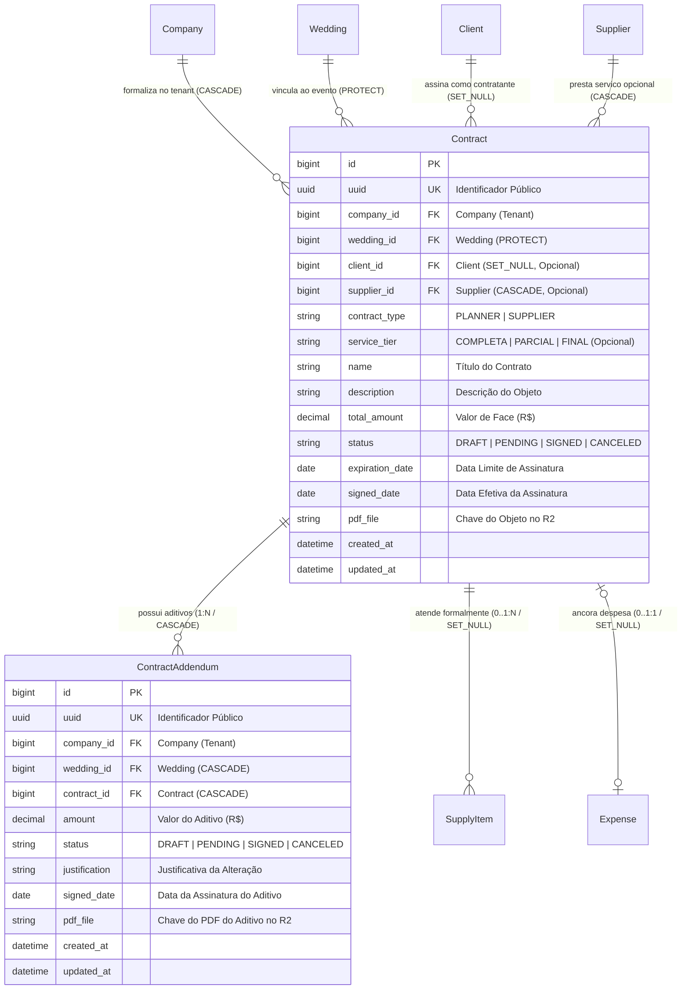
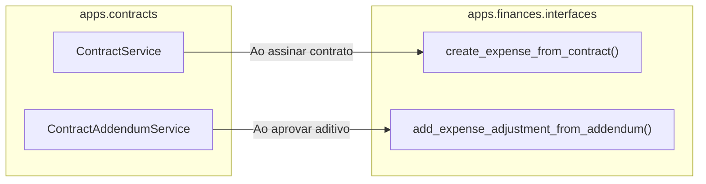

# Domínio de Contratações & Instrumentos Jurídicos (Contracts)

> **Categoria:** Domínios de Arquitetura (Bounded Contexts)
> **Relacionados:** [Catálogo Canônico de Regras](../business-rules/index.md) · [Máquina de Estados de Contratos](../business-rules/logistics/contract-state-machine.md) · [Hierarquia e Aditivos](../business-rules/logistics/contract-parent-child-hierarchy.md) · [Domínio de Fornecedores](suppliers-domain.md) · [Domínio de Clientes](clients-domain.md) · [Domínio Financeiro](finances-domain.md) · [ADR-003: Storage Cloudflare R2](../adr/003-why-r2.md) · [ADR-004: Presigned URLs](../adr/004-presigned-urls.md) · [ADR-030: Rich Domain Model](../adr/030-rich-domain-model-service-layer.md) · [ADR-031: Comunicação Entre Módulos](../adr/031-inter-module-communication.md)

O **Domínio de Contratações (`apps.contracts`)** centraliza a gestão jurídica, formalização documental e acompanhamento de aditivos de todos os acordos comerciais vinculados aos casamentos. Desacoplado da logística física de suprimentos (`apps.logistics`), este Bounded Context unifica sob um único modelo a governança dos contratos de fornecedores externos e dos honorários da própria assessoria cerimonial.

---

## 1. Visão de Negócio & Capacidades Operacionais

A organização de um casamento exige segurança jurídica estrita entre três partes: os noivos (contratantes), a assessoria cerimonial (prestadora de consultoria) e dezenas de fornecedores terceirizados. Historicamente, minutas em papel ou PDFs dispersos em e-mails e aplicativos de mensagem provocavam disputas sobre reajustes de valores, extensão de horários e escopo de entregas.

### Principais Capacidades Operacionais
- **Unificação de Contratos (`contract_type`):** Um modelo consistente para gerenciar tanto os honorários da assessoria cerimonial (`PLANNER`) quanto os contratos com prestadores logísticos externos (`SUPPLIER`).
- **Ciclo de Vida Formal (`DRAFT` $\to$ `PENDING` $\to$ `SIGNED` $\to$ `CANCELED`):** Apenas contratos formalmente assinados transitam para o estado ativo e desencadeiam despesas financeiras correspondentes.
- **Entidade Dedicada de Aditivos (`ContractAddendum`):** Reajustes de preço, acréscimos de escopo e horas extras são registrados como aditivos filhos vinculados em relação 1:N estrita, eliminando auto-relacionamentos recursivos complexos.
- **Custódia Digital no Cloudflare R2 via Presigned URLs (ADR-004):** O upload seguro de documentos em PDF de grande porte é realizado diretamente do navegador do usuário para o bucket R2, garantindo custo zero de egresso e alívio de memória no backend Django.

---

## 2. Modelo de Dados & Diagrama ERD

### Invariantes de Persistência & Integridade

| Entidade / Campo | Regra de Domínio | Comportamento e Validação |
| :--- | :--- | :--- |
| **`Contract`** | **Tipagem (`contract_type`)** | `PLANNER` exige vínculo com `client` e opcionalmente `service_tier`. `SUPPLIER` exige associação a um `supplier` cadastrado no tenant. |
| **`Contract.status`** | **Guarda de Assinatura** | A transição para `SIGNED` (`contract.sign()`) exige compulsoriamente `total_amount > 0`, `signed_date` definido e `pdf_file` anexado. |
| **`ContractAddendum`** | **Relação 1:N Acíclica** | Cada aditivo pertence obrigatoriamente a um único contrato-pai. Deleção do contrato propaga em cascata para seus aditivos. |
| **`effective_amount`** | **Cálculo Cumulativo** | O contrato calcula dinamicamente: \(V_{\text{efetivo}} = V_{\text{base}} + \sum_{\text{SIGNED}} V_{\text{aditivos}}\). |

---

## 3. Matriz Consolidada de Regras de Negócio (SSOT)

| Código Canônico | Regra / Especificação | Escopo / Responsabilidade | Entidades Envolvidas | Nota Detalhada |
| :--- | :--- | :--- | :--- | :--- |
| **`BR-L01`** | **Máquina de Estados de Contratos** | Ciclo de vida (`DRAFT` $\to$ `PENDING` $\to$ `SIGNED` $\to$ `CANCELED`). Proibido assinar sem PDF ou valor. | `Contract` | [contract-state-machine.md](../business-rules/logistics/contract-state-machine.md) |
| **`BR-L02`** | **Hierarquia e Termos Aditivos** | Aditivos em entidade dedicada 1:N, com soma em cascata no valor efetivo do contrato. | `ContractAddendum`, `Contract` | [contract-parent-child-hierarchy.md](../business-rules/logistics/contract-parent-child-hierarchy.md) |
| **`BR-F02`** | **Conformidade Financeira com Contrato** | Contrato assinado ancora atomicamente despesa (`Expense`) de mesmo valor em finanças. | `Contract`, `Expense` | [financial-integrity-rules.md](../business-rules/finances/financial-integrity-rules.md) |
| **`BR-C04`** | **Limite Defensivo de Upload R2** | PDFs limitados a 50 MB, validação de mimetype `application/pdf` e expiração de URL assinada em 15 minutos. | `Contract`, `StorageService` | [core-domain.md](core-domain.md) |

---

## 4. Arquitetura Fullstack do Módulo

O módulo segue rigorosamente a **ADR-030** e **ADR-031**:

### Backend (`backend/apps/contracts/`)
- **Modelos Ricos (`models/`):**
  - `Contract`: Herda `TenantModel`, `WeddingOwnedMixin` e `SignableDocumentMixin`. Encapsula métodos semânticos `sign()`, `cancel()` e cálculos de aditivos.
  - `ContractAddendum`: Entidade dedicada de termos aditivos com ciclo de vida e cálculo financeiro.
- **Service Layer (`services/`):**
  - `ContractService`: Orquestra criação de contratos, upload presigned no Cloudflare R2, formalização de assinatura e disparo atômico de despesa em `apps.finances`.
  - `ContractAddendumService`: Orquestra emissão de termos aditivos e comunicação síncrona com `apps.finances` para ajuste do compromisso.
- **Seletores CQRS (`selectors/`):**
  - `contract_list_selector`: Consultas otimizadas com filtros por casamento, tipo e status.
  - `contract_get_selector`: Lookup por UUID com prefetch de aditivos e validação de tenant.
- **Schemas Pydantic (`schemas/`):**
  - DTOs estritos com validação de tipos, datas e limites para contratos e aditivos.

### Frontend (`frontend/src/features/contracts/`)
- **Smart Components:** Formulários de contratação, upload de minutas digitais e listagem de contratos integrados com hooks do TanStack Query gerados pelo Orval.
- **Dumb Components:** Tabelas de contratos, visualizadores de aditivos e badges de status reativos.

---

## 5. Integrações & Interfaces Públicas (ADR-031)

Toda a interação transacional com outros contextos opera exclusivamente por interfaces formais:

- `apps.finances.interfaces.create_expense_from_contract(company, payload, contract_uuid)`: Garante consistência ACID entre o instrumento jurídico e a projeção orçamentária.
- `apps.finances.interfaces.add_expense_adjustment_from_addendum(company, contract_uuid, addendum_amount)`: Incrementa a despesa ao formalizar um termo aditivo.
- `apps.contracts.interfaces.get_contract_for_company(company, contract_uuid)`: Interface pública para consulta de dados contratuais por outros módulos.

---

## 6. Aprofundamento e Referências

- [Máquina de Estados de Contratos](../business-rules/logistics/contract-state-machine.md)
- [Hierarquia e Termos Aditivos](../business-rules/logistics/contract-parent-child-hierarchy.md)
- [Fluxo de Upload de Contratos no Cloudflare R2](../concepts/contract-pdf-upload-r2-flow.md)
- [ADR-004: Presigned URLs no Cloudflare R2](../adr/004-presigned-urls.md)
- [ADR-030: Rich Domain Model](../adr/030-rich-domain-model-service-layer.md)
- [ADR-031: Comunicação Entre Módulos](../adr/031-inter-module-communication.md)
